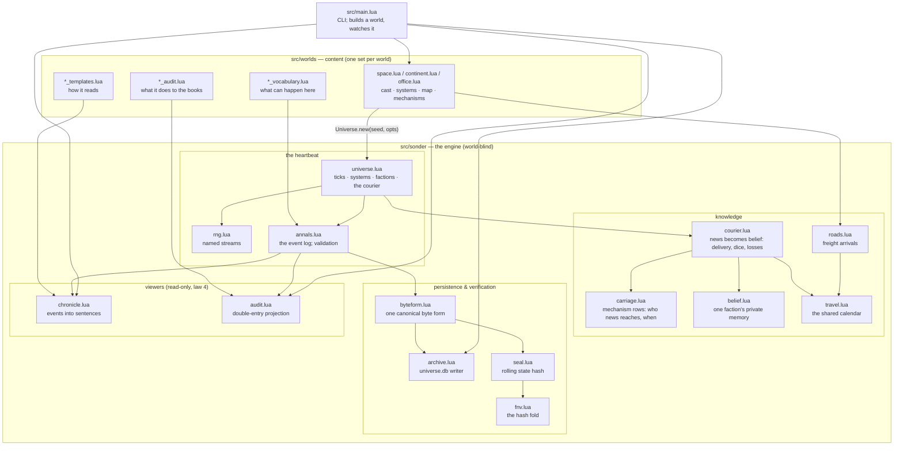
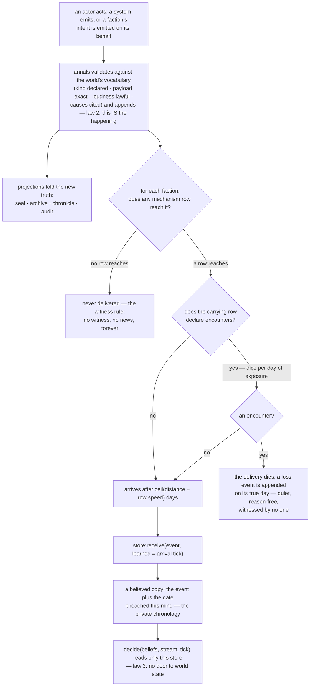

# Architecture — the system, mapped

*The current shape of the machine, maintained as living
documentation (card 166). Posts explain how each piece was earned,
pinned at their tags; this page says what stands today and how it
fits together. If this page and a post disagree, this page is
describing now and the post is describing then — both are right.*

Sonder is a deterministic universe simulator: one engine
(`src/sonder/`), many worlds (`src/worlds/`), and a hard line
between them (ADR 0004). The engine knows nothing about grain,
salaries, or war; a world is content — a vocabulary, a cast, maps
and mechanisms, sentences and audit legs — that the engine hosts.
Everything below serves the four laws: determinism; everything is
an event; agents act on beliefs, never truth; the core is headless.

## The module map



Reading the line: a world *supplies* (vocabulary, cast, systems,
map, mechanisms, templates, audit legs, its own golden seal); the
engine *hosts*, identically for every world. The engine demands
exactly one vocabulary entry of every world — `universe.genesis` —
because the engine emits it. Everything on the right half is a
projection of the annals: the chronicle, the audit, the seal, the
archive, and every belief store are five folds over one log.

## The tick, in order

Order is physics here: systems and factions run in registration
order, arrays are walked by index, and no `pairs()` iteration sits
near an outcome. One `Universe:step()`:

```mermaid
sequenceDiagram
    participant U as universe.step()
    participant L as losses calendar
    participant Sys as systems (in order)
    participant F as each faction (in order)
    participant Car as carriage
    participant St as its belief store
    U->>L: dawn — losses due today become events<br/>(quiet, at the row's named place)
    U->>Sys: each system runs: fn(universe, its stream, tick)<br/>systems see truth and emit directly
    loop factions, in registration order
        U->>F: the courier delivers what is due today<br/>(store:receive stamps learned = now)
        U->>Car: for each new event: arrival(e, name, home)?
        Car-->>U: never (nil) · today · a future tick · or an encounter row
        U->>U: encounter rows roll the dice at departure<br/>(rng.courier: one chance per day of exposure)
        U->>St: deliveries land now or go on the calendar;<br/>losses go on the losses calendar for their true day
        U->>F: decide(beliefs, its stream, tick) → intents
        F-->>U: intents are emitted through full validation
    end
```

The load-bearing details: an event a faction's own actions produce
is seen by that faction on a later scan (its cursor has already
passed) — self-knowledge arrives at distance zero, one tick late,
which is why every world's books fold from *believed* events and
stay exact. A lost delivery's fate is sealed at departure, but the
loss event lands on its true day. And the courier's dice ride a
reserved stream (`rng.courier`) so no world actor's draws ever
shift because the roads got dangerous.

## The life of an event

From an act to a belief — the full path, in its current (card 151)
form:



Three arrows deserve emphasis because they are refusals. **Never
delivered** is not "delayed": out of every row's coverage means the
news does not exist for that faction, at any future tick. **The
loss is reason-free**: the universe records that a letter died, not
why — causes arrive when the encounter engine (card 165) can
generate them as facts. And **decide() has no door**: decision code
receives a belief store, a stream, and the tick; there is no
expression in that function that can reach truth.

## Where things stand, per world

| | space | continent (Harrow) | office (Bellwether) |
|---|---|---|---|
| map | named distances across the void | adjacency graph with interior (Floyd–Warshall) | the org chart |
| carriage | field row (rung 1, declared) | **earshot + letters (rung 2 pilot)** | field row (rung 1, declared) |
| encounters | none | letters: 1-in-50 per rider-day, loss only | none |
| economy | closed; the exchange | closed; bilateral letters, no exchange | **open**: revenue in, salaries and rent out |
| golden seal | `3475639d8f49678b` (seed 1893 × 500) | `c6dc5ef5b428aa85` (seed 7 × 200; re-cut at card 151) | `10fc9a5781a44136` (seed 7 × 200) |
| migration debt | card 163 (hulls, the Fleet, audit's explainer) | — | card 164 (what is earshot in a building?) |

## Reading on

- The database a run writes: [`universe-file.md`](universe-file.md)
- The engine's public surface: [`api.md`](api.md)
- Verifying a universe: [`verification.md`](verification.md)
- Why the line between engine and world sits where it does:
  [`adr/0004-the-world-interface.md`](adr/0004-the-world-interface.md)
- What carries news and how fast:
  [`adr/0005-the-carrier-taxonomy.md`](adr/0005-the-carrier-taxonomy.md)
