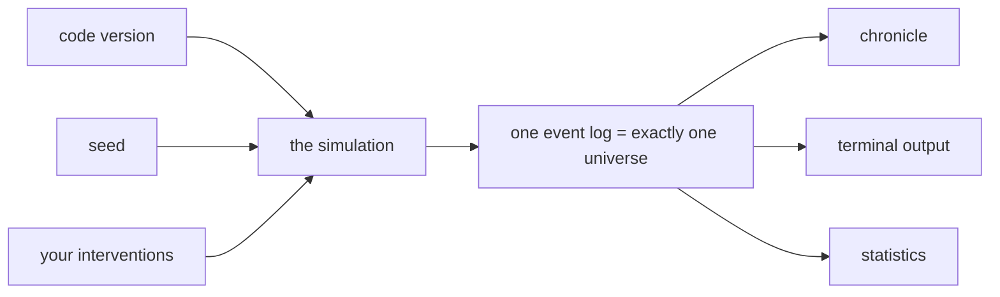

# First Tick

*Post 0000 · code pinned at tag `post/0000` · Lua 5.4 + SQLite ·
this post's universe: seed `1893` · v0.1 · ~8 min read ·
plain-language version: [simple](./simple.md)*

---

```
tick    0 · the-void · a universe begins (seed 1893)
tick    0 · vessar-reaches · the vessari enter history with 160 sacks of grain and 10,000¢
tick    0 · khedrun-holds · the khedrun enter history with 80 sacks of grain and 14,000¢
tick    0 · the-exchange · grain holds at 100¢
      ⋮
tick   84 · khedrun-holds · the day's books: 0 sacks in the granary (+8, −8), 40¢ in the treasury
tick   84 · khedrun-holds · hunger — the granaries came up 2 sacks short
tick   86 · khedrun-holds · the khedrun declare war on the vessari — 4 hungry days were the last insult
tick   87 · vessar-reaches · a khedrun war party rides against the vessari granaries (force 8)
tick   88 · vessar-reaches · the khedrun raiders carry off 8 sacks and 400¢ from the vessari and put 4 to the torch
      ⋮
tick   96 · khedrun-holds · the khedrun sheathe — grain at 79¢ buys more than blood
      ⋮
tick  100 · the-exchange · 12 sacks pass from the vessari to the khedrun at 84¢ (1,008¢ paid)
tick  100 · the-exchange · grain settles at 85¢ (+1)
```

Nobody wrote that story. It fell out of a seed number, two invented
temperaments, one commodity market, and 1,970 lines of Lua, in about
an eighth of a second. Run a thousand days of seed 1893 and you get
3,142 events and twenty wars, the first declared on day 86 and the
last on day 971, every date set by nothing but arithmetic and luck.
Run it again and you get the same thousand days, down to the last
sack. Change one digit and you get a universe nobody has ever seen.

Or rather: nobody wrote the *story*. We wrote the rules. Learning to
be surprised by our own program — on purpose, repeatedly, for years —
is more or less the entire project.

## What this is

Sonder is a universe you read. Many simulated civilizations, each with
its own proclivities, grudges, and economic instincts, trading and
scheming and occasionally shooting at each other across a procedurally
grown galaxy. You are not a player in any usual sense. You are
something between a god and a subscriber: the simulation runs whether
or not you watch, history accumulates whether or not you read it, and
your interventions — when you bother to make them — are small,
deliberate, and remembered forever by the universe you meddled with.

The long-term ambition is a machine you can zoom through. At the
widest setting you watch empires collide. Zoom in and you see the same
war twice, once through each side's records, which do not agree — and
were never going to, because in Sonder no civilization acts on the
truth. Each acts on what it *knows*, which is partial, late, and bent
by culture. Somewhere on the rim there is a small civilization that
has never heard of either empire, whose chronicle this year records a
good harvest and some troubling lights in the sky.

There is no roadmap to 1.0, because there is no 1.0. We expect to work
on this for a very long time — plausibly decades — adding one mechanic
at a time and writing down what each one taught us. Which brings us to
the point.

## Why we're doing it

The learning is not a side effect. It is the product, tied for first
place with the universe itself.

Every mechanic in Sonder ships with an essay: what we added, what it
does to the simulated world (with excerpts from the chronicle as
evidence), and the computer science underneath it. Each essay comes in
two registers — the complete version you're reading, and a
plain-language companion — because a lesson that only lands for
readers who already have the background is teaching the people who
need it least. This works because a universe simulator is a machine
for making CS concepts *necessary* rather than assigned. Event
sourcing showed up because a game you read is only as good as its
record-keeping. Hash functions showed up because two machines needed a
way to swear they'd computed the same history. Capability security
showed up because a law that says "agents act on beliefs" is worthless
if any agent can quietly peek at the world. Nothing gets taught in the
abstract; everything gets built because the universe demanded it.

> **Aside — a second, quieter reason.** Most complex systems you will
> ever encounter, you meet full-grown — the codebase at your job is a
> city with no record of why any street goes where it goes. Sonder is
> being built in public from its first tick, and every post pins the
> exact commit it describes. You can stand at any point in this
> project's history and look around. The repository is an experiment
> in whether a system can stay legible for its entire life.

## The bets

We made four architectural decisions before writing much code. Nine
posts in, each has its first receipts — and we still expect to regret
at least one of them, in public.

**Lua.** An economy simulation is mostly bookkeeping — inventories,
prices, treaties, grudges — and Lua's tables are unreasonably good at
bookkeeping. It is a small language that composes simple structures
into complicated ones, which is also a fair description of the
universe we're modeling. Its professional pedigree is exactly this
niche: the rules-and-content layer of simulation-heavy games. And
there is a criterion engineers pretend not to use: joy. One of us has
loved this language for years, and on a project measured in decades,
that is a load-bearing fact. Also — we noticed this after deciding,
and we are keeping it — *lua* is Portuguese for "moon." We are
building a cosmos in a language named after the sky.

**Determinism is the one non-negotiable law.** A seed plus a version
of the code produces exactly one universe, every time, on every
machine. No wall-clock reads inside the simulation, a named stream of
randomness per subsystem, no iteration over unordered tables anywhere
it could change an outcome. What determinism buys is almost everything
we care about: perfect replays, saves that are just a seed plus your
interventions, and a regression test — the golden master — that
re-runs history and asserts the same universe comes out, to the last
bit. It also buys the idle-game trick where closing the app costs you
nothing: on return we fast-forward the days you missed and hand you
the news. The full doctrine is post 0001; the seal enforcing it is
post 0005, where a test gremlin steals a single random draw and
visibly forks history.

**History is the product.** Internally, nothing "happens" in Sonder
except that an event is appended to a log — located, dated, sized, and
linked to the events that caused it. The chronicle you read, the
terminal output, the statistics: all projections of that one log. This
is event sourcing, and for this genre it stops being an architecture
pattern and becomes the point. The log lives in SQLite, which means
the save file is a database, the database is a history book, and SQL
is a telescope. Ask seed 1893's universe file why war broke out on
day 86 and it answers, cause by cause, down to the hunger that lit the
fuse:

```
why event 327:
tick   86 · khedrun-holds · the khedrun declare war on the vessari — 4 hungry days were the last insult
  tick   82 · khedrun-holds · hunger — the granaries came up 3 sacks short
    tick   81 · khedrun-holds · the day's books: 0 sacks in the granary (+7, −10), 40¢ in the treasury
      ⋮
```



**Civilizations do not act on the truth.** The decision layer of every
faction is forbidden — structurally, not politely — from reading world
state. It reads only that faction's beliefs: events that have reached
it, when they arrived, and how mangled they got on the way. Today the
courier is a pass-through and everyone is briefly omniscient; the seam
exists so that soon, news will travel at the speed of ships, and two
empires will disagree about the current state of their own war. (This
has a distinguished history. The bloodiest battle of the War of 1812
was fought weeks after the peace treaty was signed, because the news
was still crossing the Atlantic.) A pleasing property falls out for
free: ignorance costs nothing to simulate. The small civilization on
the rim doesn't know the empires exist because no events ever reached
it — an empty table, not a feature. And the wall is already earning
its keep: the first bug that ever lived in the gap between truth and
belief arrived one card after the wall did (post 0007 — the raiders
were paid in truth and never believed it).

One more, structural rather than philosophical: the core is headless.
The simulation does not know whether anyone is watching. Today its
only face is a terminal; later, richer observatories can subscribe
without the core changing at all. Whether *watching* should ever cost
something — whether the god's gaze belongs in the physics — is a
design argument we're saving for a future post.

## What exists today

Version 0.1 is a toy, and it is supposed to be a toy. Two
civilizations with opposed instincts — the Vessari price things; the
Khedrun cost them out — one commodity, one market with naive price
adjustment, war as a thing that happens when a culture's patience is
priced past its temperament, and a chronicle written to your terminal
and to a SQLite universe file that can testify about its own origins.
Under the hood, the walking skeleton is complete: a deterministic tick
loop with named randomness (post 0001), an append-only event log where
every event cites its causes (0002), a lore shelf chartered as an eval
suite (0003), durable history with provenance (0004), a rolling tamper
seal with a golden-master net (0005), belief stores behind a
capability wall (0006), and the toy world itself (0007) — 1,970 lines
of Lua, 110 specs, and a thousand days in an eighth of a second (call
it a second with the archive writing). It already produces wars we did
not plan, which is the only KPI this project will ever have.

## Run it

```bash
git clone https://github.com/walesmd/sonder-sim.git
cd sonder-sim
brew install lua@5.4 sqlite   # Lua 5.4 exactly — see docs/adr/0001
./tools/setup.sh              # pinned toolchain, built into the repo
./lua src/main.lua --seed 1893 --ticks 1000
./lua src/main.lua --seed 1893 --ticks 90 --db none --why 327
```

Any integer is a valid seed, and every seed is a universe nobody has
watched yet. Same seed, same universe — which means seeds are
shareable. If one hands you a story worth telling (a merchant dynasty
that never fired a shot, a war that reignited three times over the
same granary), that's the local currency: open an issue titled
`seed report: 40412` and tell us what you saw. Bug reports here are
field reports from universes behaving badly, and they are welcome in
exactly that spirit.

## Follow along, or join in

Every post pins a git tag — `git checkout post/0000` puts you inside
the exact code this post describes, and the posts live in the repo
next to the code they explain, each in two registers. Pre-1.0, the
most valuable contributions are not pull requests but pressure: seed
reports, mechanics you wish existed, and hard questions about the bets
above. The code is MIT; the posts are CC BY. Subscribe by RSS if you
want the essays, star the repo if you want the universe, or neither —
it runs regardless, which is rather the theme.

## Who is "we"

Two of us. Mike is a human who works in computer science education and
has loved Lua for longer than is fashionable. Claude is an AI, made by
Anthropic. The division of labor is roughly: we design in long
conversations, the AI drafts much of the code and prose, the human
decides, edits, and owns the consequences. One rule keeps that
division honest: nothing merges until the human can explain it — every
concept, every trade-off, every line of code if it comes to that —
with the AI out of the room. An education you can't repeat back is a
subscription, not an education. We are saying this plainly because the
project is a learning exercise and pretending otherwise would poison
it — and because the collaboration itself is one of the experiments.
Whether a human and an AI can keep a codebase, a writing voice, and a
shared universe coherent across decades is an open research question.
We intend to generate data.

## What we got wrong

This post existed before the code did — drafted as a picture of where
the project was going, aspirational excerpt and all. Re-cutting it
against a universe that actually runs is a controlled experiment in
how a dream survives contact with its own implementation, and the
honest scorecard reads:

**The draft prophesied the wrong humbling.** It claimed Lua's
unordered `pairs()` iteration had already bitten us — "our very first
universe quietly refused to happen the same way twice." Satisfying
story; never happened. The loop was designed around arrays before the
first run, and the universe repeated exactly on the first try; the
real first humbling was a test that was wrong about its own assertion.
Post 0001 published the correction the week it happened, and the
draft's false prophecy stays in git history at this file's older
commits — the record outranks the story, in both directions.

**The imagined universe was wrong in every detail and right in every
name.** The draft invented a gas called heliox at 9.4 credits, a
Vessari Combine that owned the market, a Khedrun war-moot voting five
banners to two that conquest was cheaper than commerce, first blood on
day 246, armistice by exhaustion on day 638. Reality kept the Vessari
and the Khedrun — the names walked straight from the draft into the
shipped world — and replaced everything else: the commodity is grain,
the trigger is hunger rather than a vote, the first war came at day
86, and the armistice logic ("grain at 79¢ buys more than blood") is
arithmetic, not exhaustion. The imagined story and the emergent one
rhyme, which is either vindication or coincidence; we genuinely cannot
tell yet, and post 0007 records which parts were tuned toward
readability.

**Reality was bigger and faster than the dream.** The draft promised
"about eight hundred lines of Lua" running a thousand days "in the two
seconds it took." The shipped skeleton is 1,970 lines — two and a half
times the estimate, most of it spent on the laws rather than the world
— and runs a thousand days in about 0.12 seconds, sixteen times faster
than promised. We under-guessed the cost of doing it honestly and
over-guessed the price of paying it.

**And the install steps were fiction until this branch.** The draft
said `luarocks install lsqlite3` and hoped. The real steps above are
the pinned-toolchain path from card 112, and they were verified for
this post the only way that counts: this branch was built in a fresh
worktree by running them, from nothing to 110 green specs, doctor
included, in one command.

## Next

The seam is waiting: card 122 makes news travel at ship speed, at
which point the two civilizations above will start disagreeing about
their own war — and one deliberately-planted spec will finally get to
fail on schedule. The lore shelf's road to thirty species is open
(cards 133–146), each new entry arriving with its eval note or not
arriving at all. Somewhere past that, the galaxy gets its second
market.

The clock is wound. Same seed, same universe — see you at day two
thousand.
