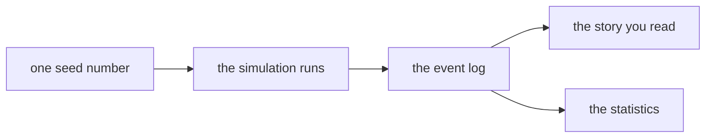

# First Tick

*Post 0000 · the simple version — plain language, same facts · the complete essay: [complete.md](./complete.md)*

---

*A note before we start: this post is a draft, written before the code existed. The story and details below describe where the project is headed, not what is finished. It will be re-cut when version 0.1 ships.*

On day 214 of a universe that has never existed, the price of a gas went up, and someone decided a war would be cheaper than the bill. Here is the universe's own record:

```
day 214   heliox closes at 9.4 credits — up 21% this season. The
          Vessari Combine cites "market conditions." The market
          conditions are that the Vessari Combine owns the market.

day 231   the Khedrun war-moot votes, five banners to two, that it
          is cheaper to take the Heliox Reach than to keep buying it.

day 246   first blood at Anchor Station Nine. Three hulls lost.

day 638   armistice — of exhaustion, not agreement.

day 1000  run complete. Vessari treasury at 44% of day one.
          Five of nine Khedrun banners remain.
```

Walk through it line by line. Day 214: a gas called heliox now costs 9.4 credits, 21% more than before, because the Vessari, a trading power, own the whole market and blame "conditions" that are really just themselves. Day 231: the warlike Khedrun vote in council, five to two, that fighting for the gas is cheaper than buying it. Day 246: the war starts; three ships are destroyed. Day 638: both sides stop, not because they agree, but because they are exhausted. Day 1000: the run ends. The traders have 44% of the money they started with, and only five of the Khedrun's nine clans are left.

Nobody wrote that story. We wrote *rules* — like the rulebook of a board game — and the computer played out a thousand days in about two seconds, using roughly eight hundred lines of code. The story fell out of the rules. Learning to be surprised by our own program, on purpose, for years, is basically the whole project.

## What this is

Sonder is a **simulation** — a program that imitates a world and lets it run. Many invented civilizations trade, scheme, and sometimes fight across a computer-grown galaxy. You are not a player — more like a subscriber to a newspaper from a universe that keeps going whether or not you read it.

Every universe grows from a **seed** — one starting number that decides everything, the way a recipe decides a cake. This post's universe grew from seed 1893. Same seed, same universe, every time, on any computer — down to the last destroyed ship. Change one digit and you get a universe nobody has ever seen. That rule is called **determinism**: the same inputs always produce the same outputs. A whole universe can be shared by texting a friend one number, and saving is nearly free — the save file is just your seed plus anything you personally changed.

## History is the product

Inside the program, nothing happens unless it is written into one big log, like a diary with very strict habits. Every entry records when it happened, where, how big it was, and which earlier entries caused it. Everything you read — the war story above, the statistics — is copied out of that log. Computer scientists call this **event sourcing**: the log *is* the real data, and everything else is a view of it.



For a game you mostly read, good record-keeping is not a feature — it is the point. The log lives in a real database, so you can ask it questions like "how many wars started over shortages?"

## Nobody acts on the truth

Here is our favorite rule: no civilization in Sonder gets to see the truth. Each acts only on the news that has reached it — and news travels like mail on ships: late, and sometimes garbled. Two empires can disagree about the state of their own war. This happens in human history too: the bloodiest battle of the War of 1812 was fought weeks *after* the peace treaty was signed, because the news was still crossing the Atlantic.

A bonus comes free. Somewhere on the rim of the galaxy is a tiny civilization that has never heard of either empire. Simulating its ignorance costs nothing — no news ever arrived, so its knowledge is just an empty list. This year its records show a good harvest and some troubling lights in the sky.

## What we got wrong

We broke our own most important rule within hours. Our programming language, Lua, has a tool that walks through a list in whatever order it feels like — like pulling names from a hat. We used it somewhere the order mattered, so our very first universe quietly came out different every time we ran it. Same seed, different history: exactly the thing we promised could never happen. The fix, and the lesson, became the next post.

## Why, and who

The learning is not a side effect — it is the product, tied with the universe itself. Every new mechanic ships with an essay explaining the computer science it forced us to learn — nothing is taught in the abstract; the universe has to demand it first.

"We" is two: Mike, a human who works in computer science education, and Claude, an AI. The AI drafts much of the code and writing; the human decides, edits, and owns the consequences. One rule keeps that honest: nothing counts until Mike can explain every piece of it with the AI out of the room. An education you can't repeat back isn't an education — it's a subscription.

The clock is wound. Same seed, same universe — see you at day two thousand.
