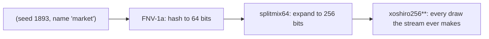

# Ticks & Determinism

*Post 0001 · code pinned at tag `post/0001` · Lua 5.4 · this post's
universe: seed `1893` · ~10 min read · plain-language version:
[simple](./simple.md)*

*Previously: post 0000 promised saves that are just a seed plus your
interventions, perfect replays, and a fast-forward for the days you
missed. This post builds the heartbeat that makes those promises
keepable.*

---

```
$ ./lua src/main.lua --seed 1893 --ticks 10
universe 1893 — 10 ticks
tick    1   market drift -1   war muster 4
tick    2   market drift +3   war muster 2
tick    3   market drift -1   war muster 2
tick    4   market drift -1   war muster 1
tick    5   market drift +1   war muster 6
tick    6   market drift -1   war muster 2
tick    7   market drift +1   war muster 2
tick    8   market drift -3   war muster 6
tick    9   market drift -3   war muster 9
tick   10   market drift -2   war muster 2
fingerprint c8b4fc573b49bf66
```

Run that command again and you get the same ten lines and the same
fingerprint. Run it next year: same. Run it on your machine: same —
and if it isn't, that is a bug, we mean it, please file it.

Honesty about what you're looking at: there is no market and there is
no war. Those are two placeholder organs wired to the new heartbeat,
drawing random numbers where their decisions will someday go. The
numbers mean nothing yet. What means something is that they are the
*same numbers every time* — and that the `fingerprint` line at the
bottom, which folds every draw of the run into one value, comes out
`c8b4fc573b49bf66` on every machine that will ever run seed 1893.
Change one digit — seed 1894 — and you get `2be4bcacedf8cc33`, a
universe nobody asked for until just now.

This post is about why that guarantee is the foundation everything
else gets built on, and what it took to make a language give it to us.

## Why determinism is the first law

Post 0000 made promises: saves that are just a seed plus your
interventions. Perfect replays. A regression test that re-runs a
thousand years of history and asserts the same universe comes out.
Closing the app costing you nothing, because we can fast-forward the
days you missed.

Every one of those is the same promise wearing different clothes:
**a `(code version, seed, intervention log)` triple defines exactly one
universe, bit for bit, on every machine.** Not "statistically similar."
Not "the same wars, roughly." The same universe, down to the last hull.

That guarantee has enemies, and they all look innocent:

- **The wall clock.** One `os.time()` call anywhere in the simulation
  and the universe depends on when you ran it.
- **Unordered iteration.** Lua's `pairs()` walks a table in whatever
  order the hash internals please. Process civilizations in `pairs()`
  order and two runs can process them differently — same rules, same
  seed, different history.
- **Floating point.** Accumulate `0.1` enough times across enough
  hardware and library versions and the pennies drift.
- **Shared randomness.** The subtlest one, and the reason this card
  exists. It gets its own section.

The defenses, in order: the sim has no clock but the tick counter;
outcome-affecting loops run over arrays, by index; every quantity that
touches an outcome is a Lua 5.4 integer (money will be cents, matter
will be discrete units); and every subsystem gets its own named stream
of randomness. The tick loop that enforces the first two fits in a
dozen lines:

```lua
function Universe:step()
   self.tick = self.tick + 1
   for i = 1, #self.systems do
      local system = self.systems[i]
      system.fn(self, self.rng:stream(system.name), self.tick)
   end
end
```

Systems run every tick, in the order they were registered, each handed
exactly one source of chance: its own stream. That signature is the
whole social contract. Nothing hands a system the wall clock, because
there isn't one to hand.

## Shared randomness, or: how the market declares war

Here is the failure mode that shaped this card's design.

Imagine one global random stream — which is exactly what Lua's built-in
`math.random` is. The market draws from it, then the war machine draws
from it, tick after tick, interleaved. Now ship a small feature: the
market checks one extra price fluctuation per tick. One extra draw.

Every draw the war machine makes, forever after, is now a different
number — it's reading one position further down the same shared
sequence. Seed 1893, which last month produced a tense armistice at
day 638, now produces a Khedrun conquest, because *the market got
chattier*. Your saved universe is gone. The regression test fails and
the diff implicates everything at once. The bug report is
irreproducible unless the reporter's code version matches to the
commit.

The same disaster, and its cure, in one picture:

```mermaid
graph TB
    subgraph shared_before ["One shared stream, before the feature"]
        direction LR
        a1["draw 1: market"] --> a2["draw 2: war"] --> a3["draw 3: market"] --> a4["draw 4: war"] --> a5["draw 5: market"] --> a6["draw 6: war"]
    end
    subgraph shared_after ["Same shared stream, market checks one extra price"]
        direction LR
        b1["draw 1: market"] --> b2["draw 2: market (the extra draw)"] --> b3["draw 3: war (was draw 2)"] --> b4["draw 4: market"] --> b5["draw 5: war (was draw 4)"] --> b6["draw 6: market"]
    end
    subgraph named_streams ["Named streams: rng.market and rng.war"]
        direction LR
        m1["market draw 1"] --> m2["market draw 2"] --> m3["market draw 3 (extra draws land here)"]
        w1["war draw 1"] --> w2["war draw 2"] --> w3["war draw 3 (untouched)"]
    end
```



In the shared stream, every war draw after the change reads a
different number, because it sits one position further down. In the
named streams, the market's extra draw lands in the market's own
sequence and the war sequence never learns the feature shipped.

So the second law of the heartbeat: **a new feature must never shift
another subsystem's draws.** And we wanted that structurally — true by
construction, not by code review vigilance.

The construction: every stream is derived from `(universe seed, stream
name)` and *nothing else*. When the war machine asks for `rng.war`, the
generator's starting state is computed from `1893` and the string
`"war"`. The market's chattiness cannot appear anywhere in that
computation, so it cannot matter. Concretely, for this post's universe:

```
(1893, "market")
  → hashed together          0xfd959b6eb92bb149
  → expanded to 256 bits     0xd339e512781132b7 0xafe7febe36e1fc52
                             0x4dcdc958cbe6067d 0xf218642849ebf06a
  → first draw               0xe3e3b7d2dcad36ef
```

Those numbers are frozen for eternity. A subsystem we add in 2031 will
get its own hash, its own 256 bits, its own eternal sequence — and
seed 1893's market will not move by one bit.

Which raises the question Mike asked when reviewing this design: *if we
pin the Lua version anyway, why not just use `math.random`?* It's a
good question with a better answer: `math.random`'s problem isn't its
randomness — it's actually the same excellent algorithm we ended up
using — it's the **interface**. Lua gives you exactly one global
stream. You can't instantiate a second one, so named streams are
impossible. You can't read its state, so checkpoints and
resume-from-snapshot are impossible. You can't copy it, so forking an
intervention branch mid-flight is impossible. And it's global, so a
test framework or a stray debug line anywhere in the process shifts the
sim's draws. We didn't reject the math; we rejected the plumbing.

## The CS underneath: what a random number generator actually is

A pseudo-random number generator is two things stapled together: a
piece of **state** that marches forward by a fixed rule, and an
**output function** that scrambles the state into the number you see.
All the design freedom lives in how fancy each half is. We use two
generators, one simple and one serious, each in the seat it was
designed for.

**splitmix64 is a counter plus a hash.** The state is one 64-bit
integer. The march rule is embarrassing: add a constant. The output
function does the real work — three rounds of xor-shift-multiply that
smear every input bit across every output bit:

```lua
local function splitmix64(s)
   s = s + 0x9e3779b97f4a7c15
   local z = s
   z = (z ~ (z >> 30)) * 0xbf58476d1ce4e5b9
   z = (z ~ (z >> 27)) * 0x94d049bb133111eb
   return s, z ~ (z >> 31)
end
```

That is the entire generator, and it passes the industry's statistical
torture suites. A counter that counts and a hash that lies about it.

**xoshiro256\*\* is a shift register plus a scrambler.** The state is
four 64-bit integers — 256 bits — and the march rule genuinely stirs
them: xors, shifts, a rotation, every word touching the others. This is
the algorithm inside Lua 5.4's own `math.random`; we carry our own copy
(≈25 lines, `src/sonder/rng.lua`) so the state is ours to hold, save,
and fork.

Why not just use the simple one everywhere? Two fingerprints, both
invisible in a hello-world and both real on a decades horizon:

- **Every splitmix64 seed is an offset on the same loop.** There is one
  cycle of 2^64 values and seeding just picks your starting point on
  it, which makes "streams never influence each other" a probability
  argument (a very good one) instead of a structural one. xoshiro's
  2^256 states make independently-seeded streams disjoint for all
  practical eternity.
- **splitmix64 never repeats an output** — it's a bijection of its
  counter, so each 64-bit value appears exactly once per cycle. True
  randomness repeats: by the birthday paradox you expect a collision
  after about 2^32 ≈ 4 billion draws. A civilization sim grinding for
  years is one of the few hobby projects that gets there. "Too perfect
  to be random" is a real statistical tell.

And why not xoshiro alone? Because 256 bits of state have to come from
somewhere, and a 64-bit seed doesn't stretch that far by itself. Feed
xoshiro lazy state and it opens badly — this is real output, starting
from state `{1, 2, 3, 4}`:

```
0x0000000000002d00
0x0000000000000000      ← the second draw is literally zero
0x000000005a007080
0x10e0000000009d80
```

A generator this good needs its state well mixed before its output
looks random. The recommended fix, from xoshiro's own authors, is to
run the seed through splitmix64 and take four outputs as the starting
state. So the final architecture: **FNV-1a** (a classic string hash)
crunches `(seed, "market")` into 64 bits, **splitmix64** expands those
into 256, **xoshiro256\*\*** draws from there. The counter-hash seeds
the shift register; each algorithm sits where its designers intended.



Two Lua-specific notes, one load-bearing and one delightful. The
load-bearing one: all of this arithmetic — the multiplies, the shifts,
the adds — silently exceeds 64 bits, and Lua 5.4 integers *wrap
around* exactly like the C `uint64_t` these algorithms were written
for. That behavior is why ADR 0001 pinned Lua 5.4, and
`tools/doctor.lua` checks the property (not the version — versions are
proxies) on every machine.

> **Aside — the signed-print curiosity.** The delightful one: half our
> draws print as negative numbers, because Lua shows you the signed
> view of the same 64 bits. The bits are what we test.

One more trap worth naming, because nearly everyone falls into it once:
turning a 64-bit draw into a die roll with `draw % 6`. The 2^64
possible draws don't divide evenly into 6 buckets, so some faces come
up (very slightly) more often — *modulo bias*. Tiny, but we're
promising bit-identical universes for decades; "tiny" compounds. The
fix in `Stream:int(lo, hi)` is mask-and-reject: mask the draw down to
the smallest power-of-two range covering the span, and if it still
overshoots, throw it away and draw again. Every value in range ends up
exactly equally likely, at an average cost of well under two draws.

## Eighteen quintillion universes, give or take a coin flip

A seed is a 64-bit integer, so there are 2^64 of them:
**18,446,744,073,709,551,616** possible universes per version of the
code. If that number looks oddly familiar, you may have played
Minecraft — it names its worlds with 64-bit seeds too, so its catalog
is exactly the same size, and its players are useful for scale.
Minecraft has some 200 million active players, and a practiced one can
beat a world in about half an hour. If every single one of them played
around the clock — two worlds an hour, forty-eight a day, no sleep, no
day jobs — the community would clear about 3.5 trillion worlds a year,
and would need roughly **5.3 million years** to see them all. Nobody
is running out of seeds.

> **Aside — seeds vs. distinct universes.** One honest asterisk: 2^64
> is the number of *seeds*, which is an upper bound on the number of
> *distinct universes*, not a guarantee. Each stream's starting state
> comes from hashing `(seed, name)`, and a hash is not a bijection —
> two different seeds can, in principle, collide to the same market
> stream. By the birthday paradox you'd actually expect on the order
> of 2^63 seed pairs to share *some one* stream. But sharing one
> stream isn't sharing a universe: a duplicate pair would have to
> collide on **every** stream at once, and each name is an independent
> roll. With today's two streams, the expected number of
> fully-duplicate pairs across the entire seed space is about 0.5 — a
> coin flip that even one exists. At three subsystems it's effectively
> zero, and every system we add drives it further down. So: at most
> 2^64 universes, and almost certainly exactly that — where "almost
> certainly" is a probability argument, not a proof, because we chose
> a hash rather than a bijection. We can afford to lose one universe
> to a coin flip.

## Trust, but verify against C

The scary part of "write your own PRNG" was never the math — Blackman,
Vigna, and thirty years of analysis did the math. The scary part is our
*transcription* of it. One transposed shift constant and we'd have a
generator that looks random, passes casual inspection, and is quietly
wrong on every machine in a way we'd discover years too late.

So the repo carries a second, independent implementation:
`tests/golden/reference.c` — the authors' public-domain C, verbatim,
plus our derivation rule. It prints the expected outputs; our test
suite asserts the Lua port matches, bit for bit, from the raw
generators up through the full derivation of `(1893, "market")`. For
the two to agree, a transcription error would have to be mirrored in
both languages' versions of the same line. Twenty-three specs run in
about a hundredth of a second, and the golden numbers are regenerable
by anyone with a C compiler:

```
cc -o /tmp/sonder-ref tests/golden/reference.c && /tmp/sonder-ref
```

This is also the honest version of the claim "same on every machine."
We've run this on exactly one computer. The cross-machine guarantee
currently rests on the C oracle agreeing with the Lua port about
arithmetic that both languages define exactly — which is a strong
argument, but an argument is not a second machine. If your fingerprint
for seed 1893 differs, you will have found our first real determinism
bug, and we will name a release after you.

## What we got wrong

**Post 0000 prophesied the wrong humbling.** Written before any code
existed, it claimed `pairs()` had already bitten us — "our very first
universe quietly refused to happen the same way twice." Satisfying
story; didn't happen. We designed the loop around arrays before the
first run, and the universe happened the same way twice on the first
try. We're leaving the prophecy in post 0000's draft and correcting it
here, because the record matters more than the story — and because
reality supplied a better humbling anyway:

**The first bug of the simulation era was in a test.** xoshiro has one
poisoned state: all four words zero, from which it emits zeros forever.
No real seed derivation can reach it (probability 2^-256), but a law
deserves a guard, not a probability, so the constructor swaps the
all-zero state for a fixed constant. Our test asserted the guard worked
by checking the first draw wasn't zero. It failed. Not because the
guard was broken — because xoshiro's output function reads only *one*
of the four state words, and that word was still zero; the guarded
state produces a zero first draw *by design* and escapes on the next
step. The test was asserting a promise the guard never made. The code
survived its first failing test unchanged; the test didn't. Lesson
kept: a failing test is a claim meeting a mechanism, and either one
can be the wrong one.

**We also un-installed our own toolchain.** The previous card's
toolchain work lived in a git worktree; deleting the worktree deleted
the (gitignored) tools with it. The consolation prize: this checkout got the true
fresh-machine experience, and setup rebuilt everything to green in one
command. An accidental re-proof of the previous card's done-when.

## Next

The heartbeat ticks, but nothing is written down: when a draw moves a
price, that fact currently evaporates. Post 0002 is the event log —
the annals — where *nothing happens except an append*, and history
becomes a database you can point a telescope at.

Same seed, same universe. Check our fingerprint.
