# Ticks & Determinism

*Post 0001 · the simple version — plain language, same facts · the
complete essay: [complete.md](./complete.md)*

---

*Previously: post 0000 promised a universe you could save as a single
number and replay perfectly — this post builds the machinery that
keeps that promise.*

Here is a command, and what our program prints when you run it:

```
$ ./lua src/main.lua --seed 1893 --ticks 10
universe 1893 — 10 ticks
tick    1   market drift -1   war muster 4
tick    2   market drift +3   war muster 2
tick    3   market drift -1   war muster 2
...
tick   10   market drift -2   war muster 2
fingerprint c8b4fc573b49bf66
```

Now run it again. You get the same ten lines and the same fingerprint.
Run it next year: same. Run it on your computer instead of ours: same
— and if it isn't, that is a bug, we mean it, please report it.

Let's walk through it. The command says: start from the number 1893
and simulate ten ticks. A **tick** is one beat of
simulated time, like one turn in a board game. The starting number is
called a **seed**, because a whole universe grows out of it. Each tick
line shows two placeholder parts — a "market" and a "war" machine —
each pulling one random number. Honestly: there is no real market and
no real war yet; the numbers mean nothing. The last line is the
**fingerprint**: one short code that folds together every random
number the run produced. Change the seed to 1894 and you get a
completely different universe that nobody had ever seen before.

Same input, same output, every time, on every machine. That property
is called **determinism**, and it is our project's first law, because
every big promise depends on it. Saving a universe? Just save the
seed. Replaying history perfectly? Re-run the seed. Checking a code
change didn't secretly break the world? Run the same seed before and
after, and compare fingerprints.

But wait — how can *random* numbers be repeatable? Because computers
don't roll dice. They use a **pseudo-random number generator**: a
recipe that starts from the seed and produces numbers that *look*
random but are completely determined by where you started. Like a deck of
cards shuffled in one exact, repeatable way: same shuffle, same deals,
forever.

Determinism has sneaky enemies. If the program ever checks the real
clock, the result depends on *when* you ran it — so our simulator has
no clock at all, only its tick counter. If the program processes
things in an order the computer picks unpredictably, two runs can
differ — so we always process in a fixed order. But the sneakiest
enemy deserves its own story.

Imagine the market and the war machine drawing from **one shared
deck** of random numbers, taking turns. Now we add a tiny feature: the
market checks one extra price per tick — one extra card drawn. Every
card the war machine draws after that is now a *different card*,
because it is reading one position further down the same shared deck:

```mermaid
graph TB
    subgraph before ["One shared deck: taking turns"]
        direction LR
        a1["card 1: market"] --> a2["card 2: war"] --> a3["card 3: market"] --> a4["card 4: war"] --> a5["card 5: market"]
    end
    subgraph after ["Shared deck, market takes one extra card"]
        direction LR
        b1["card 1: market"] --> b2["card 2: market (the extra card)"] --> b3["card 3: war (used to get card 2)"] --> b4["card 4: market"] --> b5["card 5: war (used to get card 4)"]
    end
    subgraph fix ["Our fix: every part gets its own deck"]
        direction LR
        m1["market card 1"] --> m2["market card 2"] --> m3["market card 3 (extra cards land here)"]
        w1["war card 1"] --> w2["war card 2"] --> w3["war card 3 (never moves)"]
    end
```



A saved universe that used to end in a peace treaty now ends in a
conquest, just because *the market got chattier*.

So we made a second rule: a new feature must never shift another
part's random numbers. And we made it true by construction, not by
hoping everyone stays careful. Every part of the simulator gets its
**own deck**, shuffled using exactly two things: the universe's seed
and that part's name. The market's deck comes from (1893, "market");
the war deck from (1893, "war"). The market's chattiness appears
nowhere in the war deck's recipe, so it *cannot* matter. Even a part
we add in 2031 gets its own deck, and seed 1893's market will not move
by one bit.

Turning a seed and a name into a shuffled deck uses a **hash**: a
function that crunches any input into a scrambled, fixed-size number,
the same way every time. We also wrote our own generator instead of
using our language's built-in one — not because ours has better math
(it is the *same* algorithm), but because the built-in one only gives
you a single shared deck that you cannot duplicate, save, or copy. We
rejected the plumbing, not the math. And because we copied the
algorithm out by hand, our tests compare our copy against the original
authors' version, written in a different language, number for number —
a typo in ours would make them disagree.

How many universes are there? A seed can be any of about 18.4
quintillion numbers — 18,446,744,073,709,551,616, written out.
Minecraft names its worlds with the same size of number, so its
players are useful for scale: even if all 200 million of them played
around the clock, finishing two worlds an hour, seeing every world
would take roughly 5.3 million years. Nobody is running out of seeds.

Now, what we got wrong. Post 0000 was written before any code existed,
and it predicted that a certain ordering bug had already bitten us. It
hadn't — we designed around it, and the universe repeated perfectly on
the first try. We are leaving the wrong prophecy in that post and
correcting it here, because the record matters more than the story.
The first *real* bug was in a test. Our generator has one poisoned
starting state that would make it print zeros forever, so the code
guards against it by swapping in a safe state. Our test checked the
guard by asserting the first number drawn wasn't zero — and the test
failed. The guard was fine: the safe state happens to produce a zero
on its very first draw *by design*, then behaves normally. The test
was demanding a promise the guard never made. We fixed the test and
left the code alone. Lesson kept: when a test fails, either the code
or the test can be the wrong one. (We also deleted our own tools along
with a work folder; one rebuild command proved our setup steps
worked.)

One thing the heartbeat cannot do yet: remember. When a number moves a
price, that fact evaporates the moment the tick ends. The next post
builds the event log — the permanent record where history gets written
down.

Same seed, same universe. Check our fingerprint.
