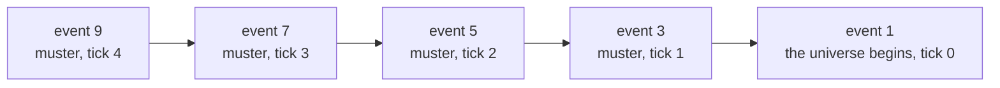

# The Event Log

*Post 0002 · the simple version — plain language, same facts · the
complete essay: [complete.md](./complete.md)*

---

*Previously: post 0001 gave the universe a heartbeat — a ticking clock,
and a seed number that makes the same universe come out, identical,
every single time.*

Ask most computer programs why something happened, and there is no
answer: the moment passed, the reason is gone. Sonder's universes are
different. Sonder grows simulated universes from a *seed* — a starting
number that decides everything, so the same seed produces the same
universe every time. This post's universe grows from seed 1893, and as
of this update you can point at anything that ever happened in it and
ask *why*. The universe answers, cause by cause, all the way back to
the moment it was born.

Here is a run, and the new question at the end of it:

```
$ ./lua src/main.lua --seed 1893 --ticks 5 --why 9
universe 1893 — 5 ticks
tick    0 · the-void · a universe begins (seed 1893)
tick    1 · the-void · the market drifts -1
tick    1 · the-void · the war office musters 4 levies
...
tick    4 · the-void · the war office musters 1 levy
...
why event 9:
tick    4 · the-void · the war office musters 1 levy
  tick    3 · the-void · the war office musters 2 levies
    tick    2 · the-void · the war office musters 2 levies
      tick    1 · the-void · the war office musters 4 levies
        tick    0 · the-void · a universe begins (seed 1893)
```

Walk through it. The first line starts the program: use seed 1893, run
5 ticks (turns of the clock, like rounds in a board game), then
explain event number 9. Nothing really lives here yet: a placeholder
market wobbles prices randomly, and a placeholder war office gathers
random numbers of soldiers ("levies" are drafted troops; "the-void"
means there are no places yet). The bottom half is the new part. We
asked why event 9 — the tick-4 muster — happened, and got back a
ladder: each rung is the event that caused the rung above it, stepping
back to the very first event, the one that needs no cause. As a
picture, each arrow meaning "was caused by":



## Nothing happens except a write in the book

Before this update, when something happened the program printed it on
screen and immediately forgot it. Close the program, and history had
never happened. Now every happening is an **event** — a small record —
added to the end of a permanent list called the annals (an old word
for a year-by-year history book). Programmers call this a **log**: add
to the end only; never erase, never rewrite.

The rule is absolute: nothing happens in the universe except adding an
event to the log. The feed above is not the simulation
talking — it is a separate reader turning log entries into sentences
after the fact. Delete the reader entirely and seed 1893 still
produces the exact same universe, silently.

Every event carries the same labeled facts: which tick, what kind of
thing happened, where, how big, who could see it, the details, and —
most important — its **causes**.

## Every event must cite a cause

Causes are required. Every event must point at one or more earlier
events that caused it. Markets don't just move; wars don't just start.
Our placeholders do this honestly: each price drift cites the previous
drift, each muster the previous muster, and the first of each cites
the birth of the universe. That birth event, called genesis, is the
only event allowed an empty cause list, and the log enforces that it
happens exactly once, first.

One tiny rule does a lot of work: a cause must be the number of an
event *already in the log*. Events are numbered by position — the
first one written is event 1 — so a cause can only point backwards in
time. An event can't cite itself, can't cite the future, and cause
chains can never loop in a circle. That is why the "why" ladder always
reaches the bottom. The whole trick is about fifteen lines of code
following those pointers.

## Strict writer, forgiving reader

The two sides of the log get opposite rules, on purpose.

The **writer is strict**. You can never erase a log entry, so a badly
written event would be corrupted history forever. The writer checks
everything — wrong kind, missing fact, wrong type of number — and
refuses with a loud error instead of writing garbage. Because the same
seed always does the same thing, any such bug crashes on the very
first run, on the programmer's machine, not years later inside
someone's universe.

The **reader is forgiving**. Someday, readers built now will meet logs
written by future versions of the program, full of event kinds they
have never heard of. A reader that crashes on unknown kinds would make
every old tool useless against every new log. So when the reader meets
a stranger, it prints a plain description from the shared basic facts
and moves on. Writes are forever; readers age.

## This idea has a name

Storing every change as a permanent list of events, and computing
everything you look at *from* that list, is called **event sourcing**.
Banks have run on it for centuries: a bank does not just store your
balance, it stores every transaction since your account opened, and
your balance is what you get by adding them all up. If the teller's
screen and the ledger disagree, the ledger wins. Git, the tool
programmers use to track code, works the same way — saved snapshots,
each pointing at its parents, just like our events pointing at their
causes.

## What we got wrong

Two confessions. First, while arguing for forgiving readers, Claude
wrote a sentence that was exactly backwards, and it confused Mike.
Rightly so: old logs don't contain young event kinds; readers meet
*logs* younger than themselves. A confusing explanation is a bug, and
you have to find out whether the bug lives in the words or in the
idea. Second, every event carries a size number, and genesis — the
universe itself — got size 0, because nothing has defined a size scale
yet. The biggest event in history wears the smallest possible number.
It reads absurd, and we wrote it down on purpose: later we have to
either fix it or defend it.

## Next

The log currently lives only in the computer's memory. Close the
terminal and history evaporates — odd, for a thing this post kept
calling the permanent record. Next step: save it into a real database
file that also records its own origins, so that a log found on a beach
can testify about where it came from.
