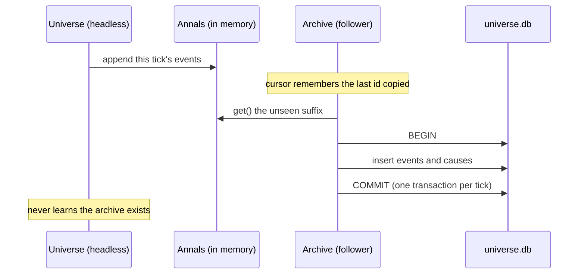
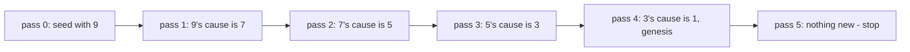

# The History Book

*Post 0004 · code pinned at tag `post/0004` · Lua 5.4 + SQLite ·
this post's universe: seed `1893` · ~10 min read ·
plain-language version: [simple](./simple.md)*

*Previously: post 0002 built the annals — the append-only event log,
with cause links and a `--why` flag that walks them — as an array in
RAM, and confessed in its closing lines that closing the terminal
erased history.*

---

```
$ ./lua src/main.lua --seed 1893 --ticks 200 | tail -2
fingerprint df4d5b9f9f01cc4f
annals archived to out/universe-20260726-183006-seed1893-dev-1.db (401 events)

$ sqlite3 out/universe-*.db "SELECT key, value FROM provenance"
config|{}
engine_version|dev-1
git_commit|435c8d0
interventions|[]
lua_version|Lua 5.4
schema_version|1
seed|1893
sqlite_version|3.53.3

$ sqlite3 out/universe-*.db "
    WITH RECURSIVE why(id) AS (
       SELECT 9
       UNION
       SELECT c.cause_id FROM causes c JOIN why ON c.event_id = why.id
    )
    SELECT a.id, a.tick, a.kind, a.payload
    FROM annals a JOIN why USING (id) ORDER BY a.id DESC"
9|4|war.muster|{"muster":1}
7|3|war.muster|{"muster":2}
5|2|war.muster|{"muster":2}
3|1|war.muster|{"muster":4}
1|0|universe.genesis|{"seed":1893}
```

Post 0002 ended on a confession: the annals — the permanent record,
the log every reader is required to trust — was an array in RAM, and
closing the terminal erased history. That's fixed. A run now leaves
behind a file, and the second query above is the proof it's the same
history: ask the *file* why event 9 happened and it produces the
exact ladder post 0002's `--why 9` printed — muster 1, muster 2,
muster 2, muster 4, genesis — same events, same ids, sworn to by a
different witness. The terminal program isn't even running anymore.

The first query is the part that had to ship now or never. Every
universe file opens with a `provenance` table: which engine wrote it,
at which git commit, from which seed, under which vocabulary version,
on which SQLite. A log found on a beach can testify about its own
origins. Files without that testimony are unreproducible the moment
they leave the machine that made them — and you cannot add testimony
retroactively to files already in the wild, which is why provenance
is on the day-one list next to much flashier things.

## Persistence is just another spectator

The design question with the longest shadow: where does the database
code *live*? The obvious move is to teach the annals to write SQLite
itself — it's the log, the database is the log, surely they're the
same object. But then the core knows about files, every spec pays the
disk tax, and law 4 (the sim never knows whether anyone is watching)
gets a carve-out for one special watcher.

Instead, the archive is a **follower** — structurally identical to
the chronicle from post 0002. It holds a cursor over `annals:get()`,
and when asked, copies everything it hasn't seen yet:

```lua
local archive = Archive.create(path, u.annals, provenance)
archive:sync()   -- copy the new suffix, in one transaction
archive:close()  -- final sync, let go of the file
```

The sim runs bit-identically with or without it — not because the
archive is polite, but because it has no way in; it reads copies
through the same window every other viewer uses. Law 4 turns out to
double as a persistence seam: "the core is headless" and "the core
doesn't know about disks" are the same sentence.

One decision hides in that little `sync()`: *when* to call it.
Per-event would open a transaction 401 times for the run above;
once-at-exit would mean a crash at tick 199 loses everything. We sync
at every tick boundary — one transaction per tick, so a crash costs
at most the current tick and can never tear an event in half. The
durability quantum is the sim's own quantum of time, which is the
kind of sentence you hope falls out of a design rather than being
forced into one.



## The schema: three tables, no apologies

```sql
CREATE TABLE annals (
   id         INTEGER PRIMARY KEY,  -- the event's position, same as in memory
   tick       INTEGER NOT NULL,
   kind       TEXT    NOT NULL,
   location   TEXT    NOT NULL,
   magnitude  INTEGER NOT NULL,
   visibility TEXT    NOT NULL,
   payload    TEXT    NOT NULL      -- canonical JSON, fields in declaration order
);

CREATE TABLE causes (
   event_id INTEGER NOT NULL REFERENCES annals(id),
   ord      INTEGER NOT NULL,
   cause_id INTEGER NOT NULL REFERENCES annals(id),
   PRIMARY KEY (event_id, ord)
) WITHOUT ROWID;
```

Post 0002 promised that position-as-identity "survives into card 115
as the database rowid," and here it is keeping the promise: event n's
`id` is n in memory and n on disk, no mapping table, no translation
layer. The envelope fields become columns one-for-one — the
vocabulary constrained payloads to flat, ordered, integer-or-string
fields precisely so this moment would be boring.

**Causes get real rows**, not a JSON array, and the excerpt shows
why: a recursive common table expression walks the cause DAG *inside
the database*. That `WITH RECURSIVE` query is `--why` reimplemented
by SQLite's query engine against pure data — the reasoning survives
the death of the program that wrote it. This is the card's done-when
("SQL can answer questions the terminal feed can't") made concrete:
the feed can tell you the war office mustered 9 levies at tick 9; it
cannot tell you the market's net drift over 200 ticks is +24 without
you reading 200 lines. `SELECT sum(json_extract(payload, '$.drift'))`
can.

**Payloads become canonical JSON** written by our own encoder —
about fifteen lines that walk the vocabulary's declaration order and
escape totally. Not dkjson, though it's sitting right there in
`lua_modules/`: a library's key order is not ours to promise things
about, and we need the same payload to be the same *bytes* on every
machine, because card 116 is going to hash this file's contents and
two universes that differ only in key order must not hash apart.
Determinism doesn't stop at the values; it goes all the way down to
the commas.

**And the file itself is append-only.** Four triggers:

```sql
CREATE TRIGGER annals_no_update BEFORE UPDATE ON annals
BEGIN SELECT RAISE(ABORT, 'annals is append-only'); END;
```

— likewise `DELETE`, likewise both on `causes`. Post 0002 made the
in-memory log append-only by structure (copies out, never rows); this
is the same principle for the on-disk half. The Lua code being
well-behaved protects nothing once the file is on someone else's
laptop — but these triggers travel *inside the file*. Open a universe
in a raw `sqlite3` shell, try to quietly improve history, and the
database itself says no. Laws get structure; history gets triggers.

## Provenance at birth, and what's deliberately missing

Eight rows, written before the first event lands. Four are **host
facts the archive refuses to invent** — engine version, git commit,
seed, config — supplied by the caller, because only the host knows
them and the core is never allowed to go looking (no shelling out
anywhere near sim code; `main.lua`, on the viewer side of the law-4
line, runs `git describe --always --dirty` legally). Four the archive
can see itself: the vocabulary's `schema_version` (post 0002 admitted
it bought nothing yet; now it buys two files knowing whether they
speak the same dialect), the SQLite and Lua versions, and
`interventions = []`.

That empty list is a deliberate shape. Canon — a universe nobody has
meddled with — has an intervention log with nothing in it, and a
reader should learn that from a row that says `[]`, not from a
missing key that might mean "no interventions" or might mean "written
before we recorded them." Card 121 makes interventions real; the slot
where they'll go has existed since the first universe file ever
written.

Two absences are load-bearing. **`config` is `{}`** — there is no
configuration yet, and writing `{}` honestly beats inventing
something to fill the column (card 118, which adds actual knobs, will
put real shape here). And **there is no timestamp anywhere in the
file.** A created-at row would be the only nondeterministic bytes in
an otherwise reproducible artifact — two runs of the same triple
should produce databases that diff empty, and they do. The wall
clock's one appearance is in the *filename* — `out/universe-20260726-
183006-seed1893-dev-1.db`, so a development session's runs sort like
a lab notebook — and that's the whole trick: the name is the host's
note-to-self; the bytes are the universe's. Identical runs produce
identical databases under different names.

(Also small but worth a sentence: `sqlite_version|3.53.3` is ADR 0002
keeping a promise. The rocks are pinned but the SQLite library floats
with the machine, so every universe records the one that wrote it.)

## The CS underneath: the log meets the ledger machine

SQLite is not a file format; it's a transaction machine, and the
letters to know are **ACID** — atomicity, consistency, isolation,
durability. The one doing visible work in this card is atomicity:
`sync()` wraps each tick's events in `BEGIN … COMMIT`, and SQLite
guarantees all-or-nothing — kill the process mid-write and the file
contains either the whole tick or none of it, never half an event or
an event whose `causes` rows didn't land. Durability is the other
half of the bargain: `COMMIT` doesn't return until the bytes can
survive a crash. That guarantee is bought with `fsync`, which is
*expensive* — the disk must actually confirm — and it's why
batch-per-tick beats commit-per-event: the fixed cost of durability
is paid once per tick, not once per happening. Databases at scale
call the same trick group commit.

> **Aside — logs all the way down.** How SQLite delivers atomicity
> is the pleasing part: underneath, it keeps a journal — by default a
> rollback journal, in its more famous mode a **write-ahead log**.
> Every database you've ever used writes its WAL first and treats its
> tables as, formally, a materialized view of that log. Post 0002
> called this "event sourcing in the basement." So watch what this
> card actually did: our source of truth is an append-only event log,
> which we persist by handing it to an engine that persists
> *everything* via its own internal append-only log. It's logs all
> the way down — the difference is that SQLite hides its log as an
> implementation detail, while Sonder's log *is the product*, with a
> query engine attached.

And the query engine is the payoff. **Recursive CTEs** (SQL:1999,
SQLite since 2014) make SQL Turing-complete-ish enough to walk
graphs: the `why` query seeds itself with event 9, joins `causes`
against its own result, and repeats until nothing new appears — a
fixpoint. For event 9 the walk looks like this:



The README calls SQL a telescope; recursive CTEs are the
mount that lets it track a moving argument.

> **Aside — why the walk must stop.** `UNION`'s
> duplicate-elimination is the visited-set that makes termination
> guaranteed on any finite graph, cycles included. Ours can't have
> cycles (post 0002's only-the-past-causes-the-present rule makes the
> log a DAG by construction), so the recursion is also just *correct*
> forensics: strictly backwards in time, genesis the only fixed
> point.

## What we got wrong

**Claude designed the flag backwards, and the card had already said
so.** The done-when reads "a run writes universe.db"; Claude shipped
archiving as opt-in `--db PATH`, reasoning that a determinism demo
shouldn't silently drop files. Mike flipped it: every bare run now
archives itself into the gitignored `out/`, because during
development, browsing the tables *is* the education — the entire
point of a history book is that you can pick it up. The opt-in
instinct wasn't crazy; it was answering a question the card hadn't
asked. `--db none` remains for runs that should leave no trace.

**`os.tmpname()` pre-creates the file on macOS.** The spec suite's
fresh-path helper collided with our own refuse-to-overwrite rule
before any test logic ran — `Archive.create` errored on a path that
"didn't exist yet" because the function that invented the name had
already touched the disk. The helper now deletes what `tmpname` made,
and the collision goes on record as the refusal working exactly as
designed, against us first.

**The files came out byte-identical, and we're promising less than
that.** Two 50-tick runs of seed 1893 produce databases `cmp` can't
tell apart — raw bytes, not just contents. Tempting to advertise;
wrong to. SQLite's page layout happens to be deterministic for
identical operation sequences on one library version, but no one
guarantees it across versions, and a promise you can't keep across a
Homebrew upgrade isn't a promise. The spec compares logical dumps —
every table, every row, deterministic order. The claim that matters
is *same history*, not *same pages*.

**And a process bug, jointly owned.** Claude built the card, verified
it, and committed — before Mike had looked at a line. Editors show
new-and-modified highlights as a diff against the last commit, so
committing erased exactly the markers Mike reviews with; the working
agreement's "Mike interrogates the code until he owns it" had been
quietly inverted into "Mike interrogates the commit." New standing
rule: nothing gets committed until Mike says so. The laws get
structure; apparently the workflow needs some too.

## Next

The universe file can now testify about its origins — but nothing yet
checks that two universes claiming the same origins actually lived
the same history. Card 116 is that check: a rolling state hash,
checkpointed every N ticks into the file this card built, and a
golden-master replay test — same seed, N years, same hash, on every
machine, forever. The history book gets a tamper seal.

Same seed, same history — now on disk. Ask the file why.
