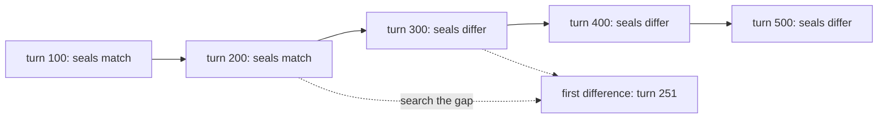

# The Tamper Seal

*Post 0005 · the simple version — plain language, same facts · the complete essay: [complete.md](./complete.md)*

---

*Previously: the last post gave our simulated universe's history a permanent home — a database file that stores every event — and promised that file a tamper seal.*

Five hundred turns of simulated history, boiled down to sixteen characters: `27e3e0a8080e04f8`. That little code is this post's whole subject. It works like the wax seals people once pressed onto letters — if the wax arrived broken, you knew the letter had been opened. Ours is a seal for an entire universe. And to prove the seal actually works, we built a troublemaker whose only job is to break it.

First, the background. Our universe simulator makes one strict promise: give it the same starting number — the *seed* — and it plays out the exact same history, down to the last detail, on any computer. It keeps that history as a log: a diary where everything that happens gets one entry, and nothing "happens" unless it's written down. One short run — seed 1893, 500 turns — produced 1,001 entries.

So how do you prove two runs told the same story? Not by reading two 1,001-line diaries side by side. Our answer is a **hash**: a short code computed from data, designed so that changing even one tiny piece of the input scrambles the whole code. We feed every diary entry, in order, through the hashing math, and out comes the seal. Run seed 1893 for 500 turns and the seal is `27e3e0a8080e04f8`. Run it again: same code. Run it on your machine: same code, or one of us has a bug.

We turned that into the project's first **golden-master test** — a test that records a system's exact output once (the "golden master," named after the master disc records were pressed from) and fails loudly if the output ever changes. Our test says: seed 1893, 500 turns, must seal to exactly that constant. Every feature we add from now on lands inside that net. Change history by even one random number, and the net says so.

There's a catch with golden-master tests, though: when one fails, it tells you *something* changed but not *what*. So the universe file also keeps a trail of **checkpoints** — every 100 turns, a saved row holding the turn number, how many events had happened by then, and the seal of everything so far. The last row, at turn 500 with all 1,001 events, seals the entire run.

Why keep the trail? Because if two runs disagree, the checkpoints tell you *when* they split. Suppose they match at turn 200 but differ at turn 300. Check the middle, at 250. Match? The split is after 250. Differ? It's before. Keep halving and you land on the exact turn in just a few steps. Computer scientists call this trick **binary search**, and it turns "read two histories line by line" into a handful of comparisons.



One question was surprisingly tricky: when is it *safe* to write a checkpoint? The turn-100 checkpoint means "everything through turn 100" — but while events are still streaming in, how do you know turn 100 won't produce one more? You don't — until an event stamped turn 101 shows up. Time never flows backwards in the log, so that later event is proof turn 100 is finished. Big data-streaming systems face the same question and call this signal a **watermark**. We found the rule on our own, then learned it already had a name.

Now, the troublemaker. To prove the seal catches tampering, we sabotaged our own universe on purpose, with a tiny bit of test code we call the **gremlin**:

```lua
u:add_system("gremlin", function(universe, _, tick)
   if tick == 250 then
      universe.rng:stream("market"):int(-3, 3)
   end
end)
```

In plain words: we add a fake part to the universe named "gremlin." It does nothing — except at turn 250, when it grabs one random number between -3 and 3 from the market's private supply of random numbers and throws it away. Nobody ever looks at that number.

That's enough to change everything. Every random number the market draws after turn 250 shifts by one position. Prices wander a different path. History rewrites itself, and the seal comes out different. One stolen random number is a different universe. Better yet, the checkpoints prove the split has a first moment: the clean run and the gremlin run agree through turn 250 and differ from 251 on.

One honest note: the seal is built for catching *accidents* — a bug, a bad port to a new machine, a shifted random draw — not a determined cheater who edits the file and recomputes the code. That's called tamper-*evidence*, not tamper-proofing, and we say so out loud.

## What we got wrong

The hashing math turned out to be copy-pasted in three different places in our code, and it took a human review to say so. Two copies might be coincidence; three is a pattern. We moved the math into one shared file and rebuilt all three users on it — then proved the cleanup was safe by checking against a separate reference copy we deliberately did *not* touch. A referee who shares code with the players can't be trusted to call the game.

The turn-500 checkpoint almost didn't exist. It needed an event from turn 501 as its proof-of-doneness, and in a 500-turn run none ever comes. A second rule — always write a final seal when the file closes — happened to catch it. We designed both rules before noticing they meet exactly at the last turn. That's luck, not skill, and we're counting it as such.

And nothing broke, which makes us suspicious. Our last two features each started with a failing test. This one ran 79 tests, all green, on the first try — twice. Either designing on paper first really works, or the next feature owes us two bugs. We're publishing that prediction so it can embarrass us.

## Next

Two simulated civilizations are coming, and before they arrive, the universe owes them a wall between what a civilization *believes* and what is actually *true*. The seal will be watching the whole time.

Same seed, same history, same sixteen characters. Now go flip a bit.
