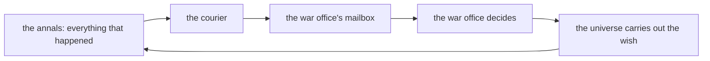

# Truth & Belief

*Post 0006 · the simple version — plain language, same facts · the
complete essay: [complete.md](./complete.md)*

---

*Previously: our tiny universe has a market whose price drifts and a
war office that raises soldiers, and last post we sealed its history
so that any change to it shows up like a broken wax seal.*

For four posts, the market and the war office lived side by side and
ignored each other completely. The market's price drifted up and down
at random. The war office raised groups of soldiers — called
**levies** — at random. Two neighbors, one universe, not one word
exchanged. This week, one of them started reading the news.

Run the simulator now (this post's universe starts from the chosen
number, or **seed**, 1893 — same seed, same history, every time) and
the feed reads like a rumor mill. At tick 2 the market lurches up by
3, and the war office panics and musters eight levies. When the
market settles to wobbles of plus or minus 1, the musters relax too. And if you ask the simulator *why* event 11
happened, it answers like a detective: the muster happened because of
a market drift, which happened because of the drift before it, all
the way back to tick 0, "a universe begins."

The load-bearing word in that story is *believes*. The war office
never read the market — only what it had been *told* about the
market. That difference is the whole card.

## A mailbox, not a window

The war office never looks at the real market. It looks at its own
**belief store** — think of it as a private mailbox of news it has
received. A **courier** (the mail carrier of the simulation) delivers
copies of events into that mailbox. When the war office decides what
to do, the mailbox is the *only* thing it is allowed to read.

Why? Because that is how real civilizations work.
Nobody acts on the truth. Everybody acts on what they have heard, and
what you have heard can be late, incomplete, or bent — like a game
of telephone. Right now the courier is instant: news lands the same
tick it happens. Later (card 122 on our project board), news will
take time to cross space and degrade on the way. We build the
mailbox now so nothing has to be rewritten then.



Notice what is *not* in the picture: no arrow from the war office
straight to the world.

## Making cheating impossible, not just forbidden

We could have written a rule: "war office code, please don't peek at
the world." But polite rules get broken. Instead we made peeking
*impossible*. Here is the actual code that registers the war office
(this is Lua, the language the project is written in):

```lua
u:add_faction("war", function(beliefs, stream, tick)
   local drift = beliefs:latest("market.drift")
   if not drift then
      return {} -- ignorance is free: nothing heard, nothing mustered
   end
   local muster = drift.magnitude * 2 + stream:int(0, 3)
   return { { kind = "war.muster", ..., causes = { drift.id } } }
end)
```

In plain words: the first line adds a decision-maker — a **faction**
— named "war," and hands its decision function exactly three things:
`beliefs` (the mailbox), `stream` (its own personal dice), and `tick`
(what day it is). The next line asks the mailbox for the newest news
about the market drifting. If no such letter ever arrived, the
function does nothing at all — no letter, no soldiers. Otherwise it
musters twice the drift it heard about, plus a small roll of its own
dice. And the `return` at the end does not *do* anything to the
world: it hands back a wish — "I intend to muster" — and the universe
carries the wish out, checking it like everything else. The
`causes = { drift.id }` part cites its source, like a bibliography
entry.

The trick is the argument list. The function was never handed the
world, so there is no line of code it could even write that touches
the world. It is like a card game: you cannot cheat with a card you
were never dealt. This
idea has a real name in computer science — **capability-based
security**: instead of guarding every door with rules and checks, you
simply never hand out the keys.

The mailbox cannot cheat either. It starts empty, holds only what the
courier delivered, and keeps no secret pointer back to the real
world. It literally does not know where the truth lives.

One bonus comes free: ignorance costs nothing. A faction that
has heard nothing about something stores *nothing* about it — not
even a question mark. One of our tests proves it: a war office in a
universe with no market runs fifty ticks and emits zero events.
Someday the galaxy will produce ten thousand events per tick, and a
small civilization on the rim that has heard of forty of them will
pay memory for exactly forty.

## What we got wrong

We admit our mistakes in every post. Three from this card:

First, last post we predicted this card would owe us two bugs. Two
tests did fail — but on purpose: they were the alarm bell correctly
noticing that history under seed 1893 had legitimately changed.
Prophecy technically fulfilled, materially dodged. The suspicion
carries forward to card 118.

Second, we discovered one word, *canon*, was quietly naming two
unrelated things — like a class with two kids named Sam. In our
vocabulary, *canon* means the untouched timeline; a code file from an
earlier card was also named `canon.lua` for an unrelated reason. The
file lost the coin flip and is now `byteform.lua`, and we
started a glossary (`docs/glossary.md`) so every project word means
exactly one thing.

Third, we wrote one test that we *plan* to break. It checks that news
arrives the same tick it happens. When card 122 teaches couriers to
be slow, that test will fail, on purpose, and its failure will be the
visible moment this universe stops knowing everything instantly.

## What's next

Card 118 builds the toy world: two civilizations with opposite
personalities — one loves trade, one loves war — one commodity, and
one market with simple price adjustment. Two factions, two mailboxes,
and the first universe whose history records somebody actually
*trading*.

The war office read the news. Now you can ask it which article.
