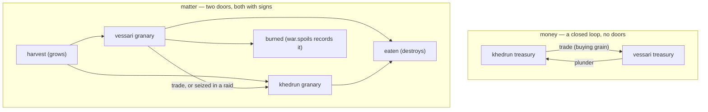

# Double Entry

*Post 0010 · code pinned at tag `post/0010` · Lua 5.4 + SQLite ·
this post's universe: seed `1893` · ~8 min read ·
plain-language version: [simple](./simple.md)*

*Previously: post 0007 gave the universe an economy — grain, cents,
trade one way, plunder the other — and kept it honest with a fold
buried in a spec file. Post 0000's re-cut promised a double-entry
audit the moment the economy existed.*

---

```
$ ./lua src/main.lua --seed 1893 --ticks 1000 --db none --audit | tail -2
audit: 24,000¢ founded, 24,000¢ held; 240 sacks founded, +18,938 harvested, −17,651 eaten, −746 burned, 781 held
audit: the books balance
```

A thousand days of seed 1893: twenty wars, hundreds of trades,
thousands of harvests and meals and raids — and at the end, every
cent is exactly where the founding events say it must be, and every
sack of grain is accounted for through precisely two doors, both of
them carrying signs. That second line is not a pleasantry. It is the
verdict of an independent auditor that refolds the entire history
from the log alone, trusting nothing but founding events and
arithmetic, and it exits angry (code 1) when the books don't balance.

This is card 120, and it shipped on a schedule the constitution set
years in advance: "a double-entry audit once the economy exists —
every credit leaving one treasury must arrive in another; total
matter is conserved unless explicitly mined or burned." The economy
arrived in post 0007. The audit is two cards late by the card's own
"promote this the moment the toy market lands," and the mistakes
section owns that.

## From a spec's basement to the standing library

Post 0007 already had this audit in miniature: a fold, local to
`toyworld_spec.lua`, that walked the annals into per-civ books and
demanded every self-reported tally match. It caught the best bug of
the project so far (the plunder that moved in truth but not in
belief). It was also forty lines of load-bearing verification living
in a test file's basement, invisible to everything else.

Card 120 promotes it: `src/sonder/audit.lua` is now a **projection**
like the chronicle, the archive, and the seal — a pure function from
a prefix of the log to a report, computable by anyone holding the
events. The spec suite computes it. `main.lua --audit` computes it. A
stranger holding your universe file computes it. Same log, same
report, byte for byte — which is why even the audit's internal sweep
for negative balances iterates civilizations in founding order,
never `pairs()`.

The report keeps two kinds of bad news deliberately apart:

- **Violations** are arithmetic that cannot be right in *any*
  universe: value conjured or vanished, a treasury driven negative, a
  trade whose total isn't units × price, conservation broken across
  the whole history. These are zero forever, in every era, or
  something is deeply wrong.
- **Mismatches** are a civ's self-reported tally disagreeing with the
  independent fold. Today this is always a bug — with a pass-through
  courier, a civ can be neither lying nor misinformed. But card 122
  is coming, and when news starts taking years to cross the void,
  belief drifting from truth stops being the crime and becomes the
  *product*. The specs pin mismatches to zero in their own assertion
  so that 122 relaxes exactly one line — and violations, never.

That separation is the whole reason this card ran before 122 rather
than after: the net has to know the difference between "the books are
wrong" and "somebody hasn't heard yet" *before* the universe starts
producing the second kind on purpose.

## Two conservation laws, two kinds of door

Money in Sonder has **no doors at all**. No event mints a cent after
founding; none destroys one. Trades move cents from buyer to seller;
plunder moves them from target to raider; the audit's final check is
brutally simple: sum every treasury and compare it to the founding
endowments. 24,000¢ went in at tick 0. 24,000¢ is there at tick
1,000, redistributed by a thousand days of commerce and violence.

Matter has exactly **two doors, both recorded events**. Harvests grow
grain into the world — `civ.tally` carries the day's `harvested`
count. Eating and the torch destroy it — `eaten` in the same tally,
`burned` in `war.spoils`, which post 0007's vocabulary annotated as
"the one lawful way matter leaves the world (law 1 permits it because
this event records it)." So the grain identity reads: founded +
harvested − eaten − burned = held, and for seed 1893's thousand days:
240 + 18,938 − 17,651 − 746 = 781. Everything else — trades, seized
spoils — only *moves* sacks between granaries, so it appears in
neither identity.



One asymmetry deserves its sentence, because it was implicit in post
0007 and is documented now: a tally is **half record, half claim**.
Its `harvested` and `eaten` fields are the day's only physical record
— nothing else in the universe knows what the fields gave — so the
fold trusts them. Its `stock` and `cents` fields are the civ's claim
about its own books, so the fold checks them. Trust the physics,
audit the self-reports.

## The counterfeiter

The annals is strict at the door — but it checks *grammar*, not
*arithmetic*. A `market.trade` with `units = 5, price = 80, total =
0` has every field typed and declared; `emit` admits it without
blinking, and now history says somebody got five sacks for free.
Nothing in laws 1 through 4 notices. This is precisely the audit's
jurisdiction, and the spec suite proves it the way post 0005 proved
the seal: with a saboteur. The **counterfeiter** is a spec-added
system — the gremlin pattern, aimed at money — that forges exactly
such an event mid-run. The audit names it: `trade total 0¢ is not 5
units × 80¢`. A second forgery buys one sack for ten million cents
and drives a treasury negative; the audit names that too. Grammar at
the door, accounting at the telescope.

And the coverage is total by construction: every kind in the
vocabulary must appear in the audit's classification table — `false`
for classified-and-neutral, a function for ledger legs — and a spec
walks the vocabulary asserting so. You cannot add a kind and forget
to teach the auditor, for the same reason you can't forget to teach
the chronicle a sentence: an unclassified kind can't safely default
to "touches nothing," because the day someone adds `asteroid.mined`
and the audit shrugs is the day conservation quietly stops meaning
anything. Foreign kinds from other eras' logs land in
`report.unclassified` instead of crashing the fold — writes are
forever, readers age.

## The CS underneath: five hundred years of assert

Double-entry bookkeeping is usually dated to Luca Pacioli's 1494
treatise, codifying what Venetian merchants had practiced for
generations: every movement of value is recorded twice — a debit in
one account, a credit in another — so the totals must balance, and an
error anywhere reveals itself as an imbalance *somewhere*. It is,
with five centuries of hindsight, an integrity constraint: redundancy
added to a record specifically so that corruption becomes detectable.
The seal (post 0005) answers "is this the same history?"; the audit
answers "is this history *possible*?" — different nets, same
philosophy of paranoia.

The physics half is a **conservation law**: pick a quantity, declare
the complete set of operations allowed to change it, and assert that
everything else leaves it fixed. The power comes from the *complete
set* clause, which is why the classification table refuses to default
— in programming-language terms it's an exhaustiveness check, the
poor man's version of a compiler proving you handled every variant of
a sum type. Post 0007 put it as "matter leaves through a door with a
sign on it"; the audit is the guard who counts the doors.

And the audit is a **property**, not an example: "money is conserved"
must hold for every seed, every run length, every future world — the
spec samples three seeds today, but the claim quantifies over all of
them, the same shape as post 0003's laws-versus-shelf distinction.
The counterfeiter is the example that keeps the property honest.

## What we got wrong

**The card shipped two cards late, against its own instructions.**
"Promote this the moment the toy market lands" — the market landed in
card 118, and cards 147 and 148 (both voice-and-docs work that jumped
the queue) ran first. Nothing broke in the gap, but the gap existed,
and the constitution's schedule lost to the queue-jumpers twice. The
consolation is that the audit's design got better for arriving after
148: the violations/mismatches split is card 122's seam, and we only
saw it clearly because the sequencing conversation happened out loud.

**The determinism spec's first draft audited an unrun universe.** A
careless `u:run(200) or fallback` chain would have compared a
thousand-day fold against a three-event one. Caught at desk-check
before the first run — which continues the tradition of cards 113 and
114 (the first red is always test-side) while denying it a terminal
appearance. We are counting desk-check catches as the tradition
maturing, not escaping.

**The first `--audit` print said "money conserved" before checking.**
The summary line asserted its conclusion in prose while the
violations that would contradict it printed *below*. A viewer that
narrates a verdict it hasn't reached is a small lie with the
chronicle's voice, exactly the kind this project can't afford; the
verdict line now prints only when the books actually balance.

**117 specs, green on the first full run, again.** Post 0005
published the suspicion; post 0006 dodged it; card 118 paid it; this
card dodged it again. The pattern seems to be that cards whose
hardest decisions get settled in the notebook before any code exists
(what to classify, what to trust, what to check) produce their bugs
at the desk instead of the terminal. We'd like that to be a law; two
data points is a coincidence with good posture.

## Next

Card 122 — the reason this card ran now. News learns to travel:
distance between named places, a courier that delivers late, and two
civilizations discovering each other on a date nobody scheduled. The
audit is ready for it: violations stay zero forever, mismatches stop
being bugs and start being *the point*, and one spec planted in card
117 finally gets to fail on schedule.

Same seed, same books, balanced to the cent. Try to counterfeit it.
