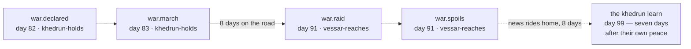

# News at Ship Speed

*Post 0011 · code pinned at tag `post/0011` · Lua 5.4 + SQLite ·
this post's universe: seed `1893` · ~13 min read ·
plain-language version: [simple](./simple.md)*

*Previously: post 0006 built the belief store and promised that when
news learned to travel, the courier would be replaced "without any
decide() noticing." Post 0010 built the double-entry audit and set
one assertion aside, labeled: card 122 will relax exactly this line.
This is card 122.*

---

Here is a war, as the civilization that started it lived it:

```
$ ./lua src/main.lua --seed 1893 --ticks 120 --db none --believes khedrun
tick   83 ← tick   82 · khedrun-holds · the khedrun declare war on the vessari — 4 hungry days were the last insult
tick   84 ← tick   83 · khedrun-holds · a khedrun war party rides out against the vessari (force 12)
tick   85 ← tick   84 · khedrun-holds · a khedrun war party rides out against the vessari (force 11)
   ...eight more departures...
tick   93 ← tick   92 · khedrun-holds · the khedrun sheathe — grain at 56¢ buys more than blood
```

And here is the same war, from the other end of the road:

```
$ ./lua src/main.lua --seed 1893 --ticks 120 --db none --believes vessari
tick   90 ← tick   82 · khedrun-holds · the khedrun declare war on the vessari — 4 hungry days were the last insult
tick   91 ← tick   83 · khedrun-holds · a khedrun war party rides out against the vessari (force 12)
tick   91 ← tick   91 · vessar-reaches · a khedrun war party falls on the vessari granaries (force 12)
tick   92 ← tick   84 · khedrun-holds · a khedrun war party rides out against the vessari (force 11)
tick   92 ← tick   92 · vessar-reaches · a khedrun war party falls on the vessari granaries (force 11)
```

Every line carries two dates now: when this mind learned it ← when
it happened. Read the Khedrun's war first. It is all departures.
They declare, they send a party a day for ten days, and they sign
the peace — and in their entire feed there is not one raid, not one
sack of spoils, because the news of what their parties did is still
on the road home. They ended a war without ever hearing whether
they were winning it. The first word of their own victories reaches
`khedrun-holds` on day 99, seven days after their peace.

Now read the Vessari's. They learn of the war on day 90 — eight
days after it was declared, one day before the first sword. From
then on, every morning delivers a matched pair: the stale news of a
war party that rode out eight days ago, arriving the same tick that
very party falls on their granaries. The warning arrives with the
sword. Not as a figure of speech — as two adjacent lines in a
newspaper.

Same seed. Same universe. Run it three ways — plain, `--believes
vessari`, `--believes khedrun` — and you get three different
fingerprints and one identical seal, `a3b626e777c0eaff`, because
the fingerprint hashes the *view* and the seal hashes the *state*.
Three pictures, one universe. That is the whole card, and the rest
of this post is how it works and what it broke.

## Distance is a table, and a door

The toy world's map is nine lines of content:

```lua
local DISTANCES = {
   ["vessar-reaches"] = { ["the-exchange"] = 3, ["khedrun-holds"] = 8 },
   ["khedrun-holds"] = { ["the-exchange"] = 5 },
}
```


Distances are measured in days at channel speed 1 — a time-flavored
unit the way a light-year is one: a reference speed baked into a
measure of separation, not a promise about any particular journey.
The exchange sits exactly on the road between the two civilizations
(3 + 5 = 8), which is why the Khedrun, five days out, are always
the worse-informed trader — their prices arrive staler, and their
wars are declared on older grievances.

The engine never sees this table. It sees a function —
`distance(from, to, tick)` — declared by the world, consulted by
the courier once per event, at the event's departure. The tick
parameter is ignored today, because this map stands still. It is
passed anyway. That unused argument is a door we deliberately left
unlocked: the day the map starts moving — planets in orbit,
galaxies turning, a fleet whose home is a set of trajectories — a
new provider walks through it and the courier never hears about
the renovation. Distance is a *name-to-name* question, and the map
decides where names are. A hull that sails is still an address.

One doctrine got itself written down during this design, and it
will outlive the card: **nothing arrives that nothing carried.**
Today's courier is a field — news simply radiates, delayed by
distance, no vehicle, no failure modes — and that is a licensed
engineering shortcut, not the universe's physics. Data travels on
things: ships, transmissions, systems. The field is the degenerate
mechanism — a universal broadcast with no emitter — and the cards
that retire it (carriers that can be *somebody*, degradation,
goods that stop teleporting) are already on the board. A
civilization with genuinely field-like communication stays
lore-possible. It has to be earned in-world, not handed out free
by the engine.

## The courier keeps a promise

Card 117 built the belief seam and left a comment on the
pass-through loop: *card 122 replaces exactly this loop with
distance, delay, and loss — nothing downstream of the store will
notice.* Promises like that are cheap to write and expensive to
keep, so we made the keeping measurable. The new courier delivers
every event to every faction `ceil(distance ÷ channel_speed)` ticks
after it happens — and before the toy world's map was wired in, we
ran the entire suite with the new courier at distance zero. The
golden seal did not move. Bit-for-bit, the same 1,589 events, the
same sixteen hex digits: the seam swap shifted not one RNG draw.
Then the map went in, and history re-cut — loudly, on purpose, with
a ledger entry.

Two things about the courier's internals are worth owning. First,
delay is computed in integer arithmetic — `(d + speed - 1) //
speed` — because a delay decides outcomes and law 1 tolerates no
floats near one. Second, each believed copy is stamped with the
tick it was handed over: the event stays a photograph, and the
stamp is the date written on the back. That one small field —
`learned` — turned out to be the card's most load-bearing decision,
in a way we did not plan (see the mistakes section; we never get
through a card without one).

## The stamp that claimed too much

The design conversation had seven questions. The fourth asked what
the `visibility` stamp — `public`, `regional`, `secret`, stamped on
every event since card 114 and consumed by nothing — should *mean*
under distance. An entire apparatus got designed in a morning:
delivery entitlements, a radius parameter, a rule about raiders
carrying news home, a new `actor` field on the envelope.

Mike rejected the premise before lunch. Visibility, he argued, is
not a state information holds — it is the behavior of whoever holds
the information. Two spies talking is secret only while the spies
keep it; if one tells someone, it is no longer secret, *and the
datum never changed*. In an event-sourced universe that argument is
devastating, because nothing here changes without an append. Who
may come to know a thing cannot be a field on the thing.

So the stamp died and a better one was born. What an event can
honestly carry is how loudly the act was performed — the Death Star
is loud, thirteen colonists in a basement are quiet — chosen by the
actor *as part of acting*, a physical fact of the occurrence ever
after. Everything downstream is someone's behavior: ongoing secrecy
is holders declining to retell; disclosure is a new event,
cause-linked to the old one, never a mutation of it. `visibility`
became `loudness`, its values became `loud` / `local` / `quiet`,
the vocabulary bumped to v3, and the golden seal re-cut to
`af26f37ad52c3762` — the first re-cut in the project's history
where history itself didn't change, only our name for one fact
of it.

The old philosophical chestnut got a precise answer along the way.
If a planet is destroyed and no one is around to see it: the annals
records it (law 2 — truth is observer-independent), no belief store
gains a row (law 3 — for everyone inside the universe, it simply
didn't happen), and whether anyone *cares* is the player's job
(law 4 — the chronicle projects truth, so the observer can mourn a
planet no civilization will miss). The tree falls. It makes a
sound. Nobody hears it. You do.

## Armies take the road

Declaring a war and a war arriving are different events, with
space and time between them. The old toy let a raid land on Vessari
soil the same tick the Khedrun decided to ride — an army beating
its own declaration by a week. Now the faction emits `war.march` at
its own gates, and the battle system — physics, entitled to the
map — delivers `war.raid` at the target when the road runs out,
spoils the same morning:



And there is no recall. A party launched is launched — it cannot be
reached any faster than it travels — so when the Khedrun signed
their peace on day 92, six parties were still on the road, and
raids kept falling through day 98. The war that ended before its
last battle, on the first try, from pure physics. (A war party that
can *hear* a peace declaration mid-march and turn around — or stage
nearby, in case the talks go sideways — is a future card: things in
motion becoming addressable actors. The Marrow Fleet has been
arguing for that one all along.)

One caution went on the record the same hour: in a one-speed
universe the warning arrives with the sword *necessarily*, and
that must not harden into doctrine. Spies, allied civilizations
with faster hulls, better channels — early warning is a
differential-speed phenomenon, and it becomes possible exactly when
mechanisms with different speeds exist. The toy's single speed is
the placeholder, not the law.

The exchange got the same honesty on the cheaper half: an order
posted at `vessar-reaches` now spends three days on the road before
the exchange can see it, and matches the morning after it arrives.
The full round trip — price posted, price heard, offer sent, offer
matched, trade news home — takes ten days where it used to take
two. (The *goods* still teleport at settlement. That is a licensed
fake with its own card, and it produced this card's best wrinkle:
spoils grain arrives home instantly in truth while the news of it
rides back at road speed, so the Khedrun spend a week starving
beside full granaries they don't know they own. When goods stop
teleporting, the party, the grain, and the news will arrive home
together, and the wrinkle heals by construction.)

## Drift becomes the product

Post 0010's audit kept two lists structurally apart: violations
(arithmetic that cannot be right in any universe) and mismatches (a
civ's self-reported tally disagreeing with the independent fold).
Under an instant courier, mismatches were always bugs — a civ could
be neither lying nor misinformed. One spec asserted them to zero,
with a comment promising card 122 would relax exactly that line.

The relaxation is not a shrug — it is an identity. Hand the audit
the road (`Audit.of(annals, { distance, channel_speed })`, the same
map the courier reads) and it replays what was still in flight at
the moment of every tally, then holds each mismatch to:

**reported + in-flight = audited, to the cent.**

A tally written while a trade's news is still riding is honestly
stale, and the audit can now say *precisely how* stale. Over 300
days of seed 1893: zero violations, 296 mismatches, 296 explained.
Over a thousand days, across other seeds: the same, everywhere.
That identity held on its first run, and it is worth pausing on
what that means: it is a whole-system cross-check. An off-by-one
anywhere — the courier's bucket schedule, the bookkeeping
watermark, the exchange's arrival math — would have broken
exactness *somewhere* in thousands of tallies. Accounting turned
out to be the best integration test we own.

The audit's taxonomy now has three bins, and the third is new:
violations (impossible arithmetic — still zero, forever), explained
mismatches (ignorance — the product), and **unexplained**
mismatches: drift no road accounts for. A new spec forges a
grammatically-valid tally claiming 9,999 sacks; the annals admits
it (grammar at the door), it trips no violation (nothing impossible
happened), and it lands in `unexplained` — the audit tells
ignorance from *deceit* by arithmetic. Without the road, the report
returns `unexplained = nil`, never an empty list. Unchecked is not
clean.

## The CS underneath

**The courier is a calendar queue.** The textbook reflex for "N
delayed deliveries" is a priority queue — a heap keyed on arrival
time, `O(log n)` per event. But look at what the courier actually
asks: never "what arrives *next*?", only "what arrives *now*?" —
once per tick, for a tick that only ever increases. That question
has a cheaper shape: an array of buckets keyed by arrival tick.
Scheduling is `append to bucket[arrival]`; delivery is `drain
bucket[now]`; both `O(1)`. Operating systems schedule timers this
way (timing wheels), and it has a property here that matters more
than speed: the bucket table is indexed directly and never
iterated, so `pairs()` — whose order Lua leaves unspecified — never
gets near an outcome. Determinism prefers data structures with no
opinions about order. Within a tick, buckets drain before the
bookmark scans, which keeps same-tick deliveries in event-id
order — old news first, by construction rather than by sort.

**Ceilings in integers.** `math.ceil(d / speed)` computes a float
and rounds it, and floats near outcomes are banned by law 1 — not
because they're inexact at these sizes, but because "at these
sizes" is a promise that rots. `(d + speed - 1) // speed` is the
same ceiling in pure integer arithmetic, bit-identical on every
machine Lua 5.4 runs on. One idiom, applied at the three places
anything crosses the map: news, war parties, order slips.

**Point-in-time knowledge is free.** "Show me what the Vessari
believed on day 89" sounds like a feature that wants snapshots —
state copied every tick, storage growing with curiosity. It costs
one filter. A belief store is a projection of deliveries, each
stamped with its arrival tick, so *every past state of the store is
still inside it*: `chronology(as_of)` walks the diary and keeps
rows with `learned <= as_of`. This is the event-sourcing dividend,
paid a second time — law 2 already made world-state a projection of
the annals; the `learned` stamp makes belief-state a projection
too. Any universe file plus the map can reconstruct any mind at any
tick, forever. (Day 89: the Vessari know nothing of a war eight
days old. Day 90: they know. The gap between those two queries is
the whole card.)

## What we got wrong

**The stamp, first and worst.** Card 114 named a field `visibility`
and this card spent a morning building machinery on that name —
entitlement rules, a radius, an actor field — before Mike pointed
out the name described a thing that cannot exist: who-may-know is
not event state. The machinery went in the bin the same day. What
survived is honest: an act's loudness at its origin, and the lesson
that a wrong *word* in a schema quietly designs your future
mistakes for you. We now ask of every field name: what does this
claim to know?

**The frozen treasury.** The toy's bookkeeping filtered "trades
since my last tally" *by event id* — and delayed news carries an
old id, so the moment news finally arrived, the filter dropped it
forever. The Khedrun's believed treasury sat frozen at 14,000¢ for
sixty days while phantom hunger tripped real wars: an early
"slow-news war" we briefly celebrated was actually a bookkeeping
artifact. An adversarial review caught it by reproducing the frozen
books. The fix is the pleasing kind: judge "has my tally absorbed
this?" by the courier's `learned` stamp — the field we added for
the believes viewer — because when you learned a thing, not what
id it carries, is what your books can answer for. The viewer's
plumbing turned out to be the bookkeeper's too.

**We almost mourned the price wars.** Slow news changed the toy's
war ecology wholesale: across eight seeds and eight thousand days,
every war is now hunger-fused — the day-86 price war that post 0000
made this project's front-door excerpt is extinct, because prices
can no longer sustain seven believed days above the Khedrun's
temperament before somebody stops trading. The first instinct was
to re-tune the temperaments until the old drama came back. Mike's
ruling, now doctrine: the physics wins, and **the toy universe
doesn't measure itself against past instantiations of itself.**
Golden masters pin determinism; acceptance specs guard coherence
(wars happen and end, discipline holds, money balances); neither
exists to preserve particular dramas. The day-86 war is not lost —
`post/0000`'s tag keeps that universe computable forever. The live
world just owes it nothing.

**And one honest disclosure about the feed you just read.** The
Vessari hold their grain while they believe a war is on — prudence
at the pace of news, exactly as designed. It is also, currently,
invisible: hunger wars only ignite after low prices have already
closed the market, so the belief windows sit inside longer price
closures, and the spec that guards the behavior says so in its own
comments. It stands guard for a richer ecology — more civilizations,
more speeds, trade that doesn't wait for one exchange — which is to
say, for the cards this card seeded.

Nine of them, for the record: carriers that can be somebody,
degradation, cultural interpretation, goods that travel, exchanges
in the plural, counterfeiting as content the audit sees but never
forbids, reception — loudness in the ear of the hearer — and war
parties that can hear a peace. The courier we built this week is
the smallest honest version of a thing the rest of the decade gets
to complicate.

The dictionary that named this project defines *sonder* as the
realization that each passerby has an inner life as vivid as your
own. As of card 122, that is a command-line flag. `--believes
vessari` is one passerby's newspaper — late, partial, and
completely coherent from the inside — and for the first time, the
universe and its inhabitants genuinely do not know the same things.

*Fingerprints for the curious: seed 1893, 60 ticks — plain
`e981c4a4d4d82020`, vessari `9e417fba7201d473`, khedrun
`359655d213049ff8`. One seal under all three: `0004c84f3ec4ba0b`.*
