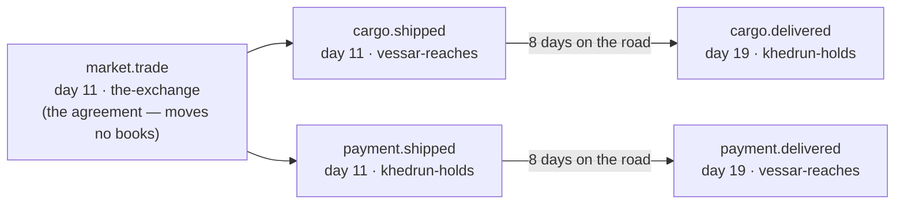

# Nothing Teleports

*Post 0012 · code pinned at tag `post/0012` · Lua 5.4 + SQLite ·
this post's universe: seed `1893` · ~12 min read ·
plain-language version: [simple](./simple.md)*

*Previously: post 0011 made news travel — every event reaches every
faction days late, and the audit certifies that belief drifts from
truth by exactly the news still in flight. It also licensed two
fakes, on the record: goods teleported at settlement, and a war
party's plunder arrived home the instant the raid resolved. This is
card 153, where the licenses expire.*

---

Here is a grain merchant's ledger, three entries, sixteen days:

```
$ ./lua src/main.lua --seed 1893 --ticks 40 --db none --believes vessari
tick   11 ← tick   11 · vessar-reaches · the vessari dispatch 12 grain to the khedrun
tick   19 ← tick   19 · vessar-reaches · 1176¢ from the khedrun reach the vessari
tick   27 ← tick   19 · khedrun-holds  · 12 grain from the vessari reach the khedrun
```

Read the dates. On day 11 the Vessari ship twelve sacks — they know
it instantly, because it happened at their own gates. On day 19 the
payment lands in their treasury — instantly known too, same reason.
And on day 27 they finally learn that their grain *arrived* — eight
days after it actually did (`tick 27 ← tick 19`), sixteen days
after they shipped it, and a full week after they'd already been
paid for it. In between, that shipment simply isn't anywhere a mind
can see: not in their granary, not in the buyer's, its fate a blank
line in the ledger. It is *on the road* — and as of this card, the
road is a real place where real things spend real days.

## One scheduler, because we'd already written it three times

The design conversation opened with Mike's instinct: a warrior
traveling, news traveling, and a crate of grain traveling are the
same thing — only the technology enabling the travel differs. The
pushback he asked for sharpened it into layers, but the timing
question answered itself with a code smell: the *transit* pattern —
schedule a thing for an arrival tick, drain deterministically —
already existed in three dialects. The courier's pending buckets.
The battle system's march list. The exchange's order arrivals. The
audit's in-flight ledgers made an arguable fourth. The old rule of
three says first time write it, second time wince, third time
extract; we were past the threshold, which is the difference
between premature abstraction and overdue abstraction.

So `sonder/travel.lua` is the calendar queue, extracted once:
`schedule(arrives, item)`, `due(now)`, scheduling order preserved
within a tick, the day's page torn out as it's read. It is
deliberately cargo-blind — it does not know whether it carries a
belief, a war party, or a crate, because what arrival *means*
belongs to each owner, forever. And it was born the way everything
here has to be born now: the courier adopted it as a pure internal
swap, and the golden seal did not move. Bit-identical history
through the extracted scheduler, then — and only then — new physics.

Where the unification honestly stops: cargo is not one thing. Grain
moving is **net zero** — it leaves one place and arrives at
another, and the universe holds its breath in between. Information
moving is a **copy** — the sender still knows what it sent. Mike's
phrasing, kept verbatim in the notebook, became the spine of the
bookkeeping: same roads, same scheduler, opposite arithmetic on
arrival.

## The grammar: departures, arrivals, and verdicts

Transit entered the event vocabulary as paired, per-class kinds:



The naming carried its own design conversation. What stuck, now
convention: kinds are `noun.verb` where the verb is past tense
(events are facts, never requests) and drawn from a controlled list
— `shipped`/`delivered` is the canonical transit lifecycle every
future cargo family reuses. The noun is a *behavioral class*, not
an instance: `cargo` covers grain today and ore in some future
year, because between grain and ore nothing differs but a string,
and new commodities should be content, not API. Money got its own
family — `payment.shipped`/`payment.delivered` — not because cents
feel different but because their audit legs *are* different. And
the war party's homeward leg is `war.returned`, in the war family,
because an agent coming home isn't freight even when it's carrying
some. `market.trade` survives as the agreement: a promise of sacks
for cents, checked arithmetically, moving nothing.

Mike's own justification for class-naming is the best sentence in
the notebook: one civilization ships payment as literal credits in
a hull, seven days at sea; another wires it electronically,
delivered in seconds. **The vocabulary must tell the same story
either way** — same two events, different gap — because the speed
belongs to the civilization's technology, not to the grammar. When
carriers become somebodies (card 150) and money becomes ledgers
(card 159), these exact kinds are waiting.

Three commitments keep journeys from cornering us, because Mike's
review of the schema came with a warning: don't assume a shipment
moves linearly from A to B — pirates, black holes, time dilation, a
lot can happen in seven days. So: **arrival is a verdict, never a
promise** — the departure records only what left, and physics emits
whatever ending actually occurs, so a future `pirates.taken` citing
the same departure is an append, not a migration. **A shipment's
identity is its departure event id** — a journey's history is the
events that cite it. And **position is a projection, not state** —
where a crate is at tick *t* is derivable from its events plus the
map, the same move that made belief-at-any-tick free. Corollary:
the audit checks that matter is conserved across a journey, never
that the journey ran on time. Punctuality is physics' business.

## The road ledger

Real double-entry bookkeeping has an account for exactly this —
accountants call it *goods in transit* — and the audit now keeps
one. Every departure debits the sender and books the shipment on
the road ledger under the departure's own event id; the arrival
that cites it drains it exactly, to the sack and the cent. The
conservation identities each grew a term:

**founded + harvested − eaten − burned = held in granaries + held
on roads**, and **founded = held in treasuries + riding**.

Run seed 1893 a thousand days and the audit balances with 40 sacks
and 2,000¢ literally between places at the final tick. The
violations this creates are the ones net-zero demands: a delivery
citing no departure (grain from nowhere), a delivery that doesn't
match its departure (grain multiplied in transit), a dispatch of
more than the sender held — the counterfeiter spec's impossible
purchase became an impossible *dispatch*, and the audit names it
the same way.

## The drift died, and it died honestly

Here is the finding that outranks everything above, and we did not
see it coming during design. Card 120 demanded that every tally
match the audit exactly: under instant news a civ can be neither
lying nor misinformed, so mismatches were bugs. Card 122 made news
slow and relaxed exactly that line — drift became the product,
explained to the cent by what was still in flight; 296 mismatches
over 300 days, every one certified. This card was designed to bound
wartime drift by what rode the roads.

Instead it killed the drift outright. Mismatches: zero. Every seed.

The reason is worth staring at, because it rewrites what card 122's
drift *was*. Under the new physics, every event that moves a civ's
books happens at its own gates: dispatches leave them, deliveries
arrive at them, raids hit them, laden parties return through them.
Every one of those is at distance zero from its owner — learned the
same morning it happens. The old drift came from action at a
distance: a trade at the exchange teleporting grain out of a
granary eight days' ride away, faster than the news of it could
travel. Make matter honest and self-knowledge becomes exact again —
a mind's books track truth perfectly, not because the mind is
omniscient but because everything that touches its books now
happens where the mind lives. Ignorance didn't shrink; it moved to
where it belongs — what you believe about everyone *else*, their
prices, their wars, your shipment's fate on a road you can't see.

The spec that carries this arc reads like the project in miniature:
card 120 demanded zero (omniscience), card 122 relaxed it (drift as
product), card 153 returns it to zero (earned). The 122 machinery
survives as the certifier of that zero — and the liar spec proves
it still catches a forged tally by arithmetic, because a lie is the
one drift no road explains.

The wrinkle this card was chartered to heal died the same death, by
construction: the Khedrun no longer starve beside full granaries
they don't know they own, because the party, the grain, and the
news of both arrive home together — `war.returned`, one event, day
99's tragedy structurally impossible. What replaced it is honest
hunger: the story bar holds as an executable spec that somewhere in
a thousand days, a civilization goes hungry *while grain addressed
to it is already on the road*. In this ecology it's the Khedrun,
bellies empty, their laden war parties still days from the gates.
Relief in transit is the state of being only real travel can
produce.

## What we got wrong

**We pointed the camera at the wrong story.** The first version of
the story-bar spec looked for hunger beside *trade* shipments — and
found zero in a thousand days, because this ecology feeds the
Khedrun while the market is open and starves them only after the
pipeline drains. The story existed all along in the war flow:
hunger beside your own homebound plunder. The spec also carried a
genuine bug (a window check that could never match, caught when the
assertion failed honest). Both fixes are in the final spec; the
lesson is older than this project — when the data says your story
doesn't happen, check whether you're watching the right character.

**The price-war bet lost.** Card 122's notebook recorded a quiet
bet: make goods slow and maybe the extinct price wars return
unaided. They didn't — twenty wars in a thousand days, every one
hunger-fused, same cycle as before. The bet is settled and the
hunger-cycle ecology stands, per the standing ruling: the toy
universe doesn't measure itself against past instantiations of
itself.

**We designed a fix for a lag that didn't exist.** Q5's verdict
said a civ must know its own dispatches instantly, and we sketched
a re-ordering of the daily tally to make it so. Unnecessary: every
material dispatch is emitted by a *system* at the civ's own home,
and systems run before minds each tick, so the knowledge was
already same-morning by construction. We nearly built machinery
against a problem the architecture had quietly declined to have —
cheap to catch in design, embarrassing to catch in review.

**And the biggest miss was the good kind:** nothing in six design
questions predicted the drift's death. We designed for *bounded*
drift and got *zero*. The simulation is starting to have
consequences we don't call in advance — which is, as near as we can
tell, the whole point of building it.

Suite at close: 148 specs green. The golden seal re-cut to
`3475639d8f49678b`, ledger entry on the record. And the universe
now contains, at almost any moment you stop it, some quantity of
grain and money that is nowhere at all — except on a road, in the
books, conserved.
