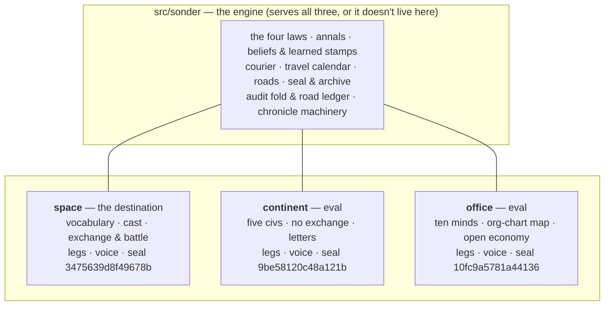

# Whatever That Universe May Be

*Post 0013 · code pinned at tag `post/0013` · Lua 5.4 + SQLite ·
this post's universes: seeds `1893` and `7`, three of them ·
~13 min read · plain-language version: [simple](./simple.md)*

*Previously: twelve posts built one universe — two civilizations,
one grain market, wars nobody planned, news and goods that travel.
This card asked an impolite question about all of it: was any of
that actually about space?*

---

Three chronicle lines, three universes, one engine:

```
tick   83 · khedrun-holds · a khedrun war party rides out against the vessari (force 12)
tick   14 · ivo           · a client tells ivo no, quietly
tick    1 · vale-bright   · a letter rides from the valebright to the korrag: 10 grain at 60¢ apiece
```

The first is the space sim — the destination, the world this whole
project exists to grow. The second is Bellwether & Co., an office
of ten people building a business. The third is Harrow, a continent
of five civilizations who cannot move away from one another. All
three run on `src/sonder` unmodified: same annals, same beliefs,
same courier, same travel calendars, same audit machinery, same
seals. Three golden seals now stand guard — space
`3475639d8f49678b`, office `10fc9a5781a44136`, continent
`9be58120c48a121b` — and between the first world and the third, the
engine did not change. It only got smaller.

This card began as a devil's-advocate question: are we at the Quake
point, where the engine and the game separate? The first answer was
the industry's — engines crystallize out of repeated games; don't
extract from one consumer — and it survived exactly until Mike
reframed the project in one sentence: **we are not building a game.
We are building a system of systems, and games and observability
are the outcomes.** If the system is the product, the eval suite
has to match the thesis — and every mechanic we had ever shipped
had been evaluated against exactly one universe's stories.

So the deliverable was two more universes, built as evals. Not
products: the destination is and remains the universal space sim.
The office and the continent exist to keep the engine honest —
worlds that think at the person level and the continent level,
standing guard on the road to the one that thinks at the level of
galaxies. It does not matter whether the universe is a spacefaring
civilization or an office building. We are trying to simulate a
universe, whatever that universe may be.

## The litmus and the interface

One rule became law the day the card was cut, in Mike's words:
what we build must serve all three universes. If it cannot, it is
game-specific. If it can — like the random number generator — it is
a framework-level addition.

Applied retroactively, the litmus sorted the engine in an
afternoon. The four laws, the annals, belief stores, the courier,
the travel calendar, the seal, the archive: framework, untouched.
Four things failed it, each pretending to be engine while carrying
one world's fingerprints — the vocabulary's kind list, the audit's
ledger legs, the chronicle's sentences, and main.lua's hardwired
world. ADR 0004 wrote the boundary down as an interface: a world
supplies its vocabulary, its cast, its systems, its map, its
sentences, its audit legs and conservation identities, and its own
golden seal. The engine supplies everything else and demands
exactly one thing of every vocabulary: `universe.genesis`, because
the engine itself emits it. Every universe begins. Everything else
is somebody's world.



The extractions ran on one discipline, borrowed from the travel
scheduler's birth: never extract speculatively — build the new
worlds, and every place they cannot be built without touching
`src/sonder` is a leak, fixed when hit, with the space world's
golden seal as the regression anchor throughout. The first game
protects the engine while the new games generalize it. Four leaks,
four extractions, four unmoved seals.

## The office: distance without geometry

Bellwether & Co. is ten minds — a founder, two managers, ops, two
sellers, four makers — and every one is a faction in the engine's
sense: a belief store, a private chronology, a place on the map.
The constitution has promised a notable-figures zoom tier since
day one; it arrived here, early, through a side door, and required
no new machinery, because a faction was never architecturally an
empire. It was always "a decision-maker with a belief store," and a
person qualifies exactly as well.

The map is the strange part. Office distance isn't meters — it's
the org chart: same team adjacent, a shared manager two hops,
cross-department news climbing the chart's spine and coming back
down. `distance(from, to, tick)` was already a world-supplied
function, so the org chart simply *is* the map, and everything
built for interstellar distances — the courier, loudness, travel
calendars, the road ledger — runs on it unchanged. The chartered
KPI fired on the first seed tried: a client says no, quietly, at
one seller's desk; pitching stops org-wide within two days; the
make-team, four hops out, keeps producing at full rate, dimming
only when the news reaches them. The company's behavior visibly
changed before the company collectively knew why. Only social
distance can produce that shape, and we didn't have to build
anything to get it.

The office also taught the engine's test suite its first genuinely
new lesson. Its economy is the project's first *open* system —
revenue in from clients, daily living and rent out — so the
conservation identities became world-declared: the space world's
"money has no doors" and the office's "founded + revenue − spent =
held + riding" are both just legs now, and the audit machinery
neither knows nor cares that one economy breathes.

## The continent: no exchange anywhere

Harrow is the spatial stress: five civilizations on an adjacency
graph with interior. The Korrag's grain lifeline runs through the
Ashfold's pass or the Selm's tolls; all-pairs shortest paths are
computed once at load (Floyd–Warshall, integers, sorted arrays);
and for the first time, `distance(a, b)` violates naive
expectations — around versus through — which the distance seam was
built to carry and had never yet had to.

There is no exchange on Harrow, deliberately. Trade is bilateral:
an offer rides to a neighbor at road speed, an acceptance rides
back, and only then do the goods and the payment take to the roads
— four events, four journeys, and a deal between the valley and
the mountains takes most of two weeks to settle end to end. Books
run four columns — grain, iron, salt, cents — which is the
multi-commodity case the audit's generalization existed for, and
the 400-day acceptance run balances all four to zero violations,
zero mismatches, zero unexplained, through fourteen hunger wars.

Those wars are the chartered KPI: the lean season thins the
valley's harvests, the mountains eat more than they grow, and four
hungry days at a time the Korrag reach for knives — war declared at
`korrag-height`, every raid landing at `vale-bright` exactly four
days behind its march, the pass route priced by the map. And the
ecology is already telling a story nobody wrote: the Korrag are
sliding toward ruin atop fifteen hundred ingots of iron nobody
wants, because the valley's demand saturated and nothing on Harrow
consumes metal yet. A mountain kingdom with worthless ore, starving
between raids. The death doctrine stands ready; this world may be
the first to test it.

## Three window bugs, one principle

Every world so far has broken belief bookkeeping in the same place,
and the third break finally taught the lesson properly.

The space world's `recent()` windows were sized for two
civilizations. The office's payday emits nine payments in one
burst, and a window of eight silently evicted sef's salary from
mara's fold every single week — 113 phantom mismatches, each
exactly 150¢. (The first theory — a general tally flood — was
plausible, earned a confident comment, and was wrong: the count
didn't move. The comment was replaced with the true story; both
live in the notebook.) The fix was to size windows to the crowd,
and the lesson was that belief windows are *content*, tuned to a
world's event density.

Then Harrow broke the same thing from the other side. Bilateral
settlement needs exactly-once semantics — ship once per acceptance,
pay once — and the first draft did it the distributed-systems
textbook way: scan recent memory for a receipt ("have I already
shipped for this?"), dedup by cause id. But an acceptance's window
outlived the shipment-memory's window, and one old yes shipped
twice — caught by a spec that walks the annals holding every
acceptance to at most one settlement each way. The fix deleted the
memory scan entirely: **act the morning you learn.** The courier
delivers each event into a store exactly once, so `learned == tick`
is an exactly-once trigger the minds get for free — no receipts, no
windows, no scan. If the single morning finds the seller short or
the buyer broke, the deal defaults half-settled, which is chartered
settlement risk in a world without recourse (debt and courts are a
future card, by name). Third time's the charm: never scan for
memory when the stamp already gives you exactly-once.

## What we got wrong

The window theory that earned a confident comment before being
disproven by an unmoving number. A sed script that rewrote its own
freshly-inserted wrapper into infinite recursion and hung the test
suite (caught, killed, repaired by hand — automation that edits
what it just wrote deserves suspicion). The charter promised the
famine-war chain "legible across three civilizations' territories,"
and the delivered chain touches two capitals with the third party's
pass merely *traversed* — the route is priced through Ashfold land
but no event marks the crossing; tolls and interceptions are future
cards, and the softening is on the record. And the office's ops
role is chartered as "the books amity keeps versus the books the
founder believes" and shipped as a person who mostly pays rent —
the eval worlds are deliberately shallow, but that one's a story
we owe.

## What this buys

Every mechanic from here on is designed against three universes
from birth. The next card is the carriers research — what carries
things, and how fast — and it now has to answer for hulls between
stars, caravans through passes, and email between desks in the
same breath, which is precisely how a mechanism taxonomy finds its
general shape instead of being hulls with the serial numbers filed
off. Mike's own example set the bar before the card existed:
payment as credits in a hull takes seven days; payment as an
electronic transfer takes seconds; the vocabulary tells the same
story either way, because the speed belongs to the civilization's
technology, not to the grammar.

And the constitution now says what the card proved. Sonder's
opening line still reads "a universe simulator you read" — followed
now by the sentence this card was built on: we are not building a
game; we are building a system of systems, and games and
observability are the outcomes. The universal space sim is the
destination. The office and the continent are the standard it must
clear on the way — one universe that thinks at the level of a
person, one at the level of a continent, waiting for the one that
holds both inside a single sky.

*Suite at close: 162 specs green across three worlds. The engine
got smaller with every world it gained, which is how you know the
worlds are working.*
