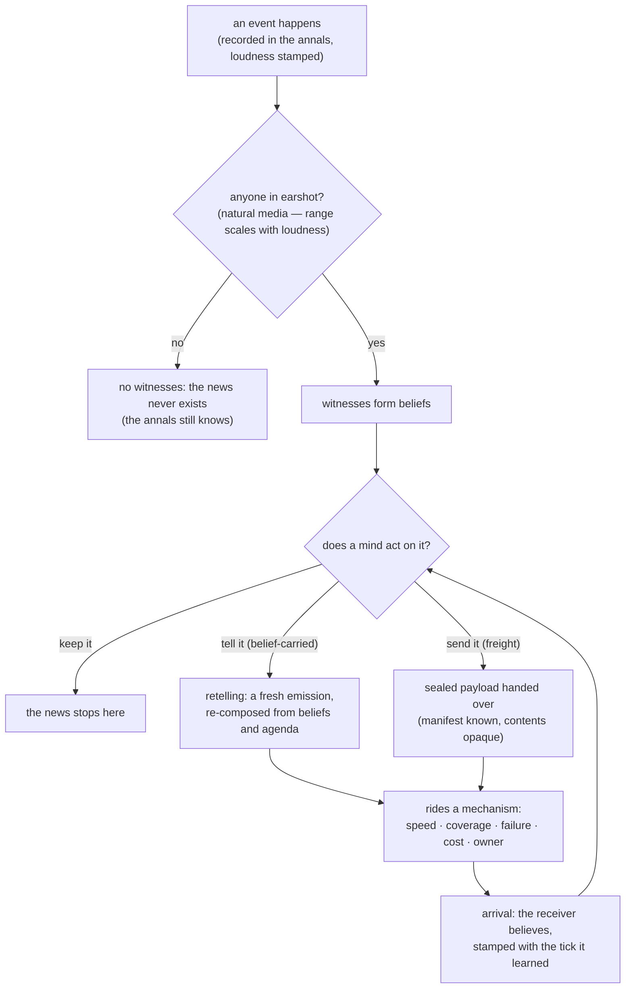

# The Witness Rule

*Post 0014 · pinned at tag `post/0014` · zero lines of code, on
purpose · ~13 min read · plain-language version:
[simple](./simple.md)*

*Previously: post 0011 let news travel at ship speed by licensing a
shortcut — the field, one speed for everything, no vehicle, no
failure. Post 0012 put goods and payment on the roads. Post 0013
made one engine host three worlds. This card designs the field's
replacement, on paper, for all three at once.*

---

The whole card turned on one exchange, so that exchange is the
front door. Claude had proposed that beyond the range of natural
media — sound, light, the hum of conductive rock — news should
travel only when somebody carries it, and asked who chooses the
mechanism when nobody deliberately sends. Mike's verdict, verbatim
from the notebook:

> I say we take the tactic of "if a tree falls in the forest but no
> one is there to hear it, does anyone hear the sound?" If there is
> not someone — an individual, a faction, a persona — to carry the
> information, then is it real?

That is the witness rule, and the rest of this post is what it
costs and what it buys. Card 161 was a research card: no code, no
new seeds, no seal moved. The deliverable is a taxonomy on paper —
what carries things, and how fast — plus a map of which future card
builds which piece, plus this post. It joins post 0003 in the small
club of increments that shipped zero lines of code and some of the
project's most consequential decisions.

## Why now

This section exists because Mike asked, mid-card, why our posts
never say why — why this work, in this moment, instead of anything
else. Fair. Backfilling for this card, and chartering the question
for every post after:

**The debt is on the record.** Post 0011 bought its delay machinery
with a licensed shortcut. The field model — news radiating at one
uniform speed with no emitter and no failure modes — was stamped an
engineering placeholder the day it shipped, with Mike's doctrine
attached: *nothing arrives that nothing carried.* Licensed debts
compound. Every mechanic built on top of the field inherits its
physics; the longer it stands, the more cards would need rework
when it falls.

**Eight cards are queued behind this design.** Cards 150 through
159 — carriers, degradation, interpretation, plural exchanges,
counterfeiting, reception, in-flight actors, grown-up money — all
build on whatever this taxonomy says. Building card 150 first and
designing in its shadow would grow one world's technology zoo:
hulls with special cases, and nothing Harrow's caravans or
Bellwether's email could inhabit.

**The doctrine needed its first field test.** Post 0013 made the
litmus law: every mechanic is designed against three universes from
birth — ADR 0004 even names this card's subject as the example, "a
carrier is a hull, a caravan, and an email before its card is even
cut." This is the first mechanic born under that law, so the card
tests the workflow as much as the design.

**And the lore is waiting.** The Marrow Fleet's entry — the
civilization that *is* the news infrastructure of its galaxy — ends
with an honest note: its full eval runs when news learns to ride in
hulls. The stories are ahead of the systems. This card is the
systems catching up on paper before they catch up in code.

## Movement is a system

The design conversation opened with a question that flopped —
"one ontology or two?" — and only landed when restated plainly: do
goods and news need one design for moving, or two separate designs?
Mike's answer set the frame for everything after:

> When I think about a good or money or anything moving from one
> place to another, that movement is a system. The system itself
> defines how quickly it moves, or how accurately it moves, or the
> risk associated with it. And then the clear distinction is
> whether an asset is actually moving net zero versus whether it is
> copyable and reproducible, like information or intelligence.

One taxonomy. The split between matter and information is a fact
about the *cargo*, never about the system: **net-zero** payloads
are conserved — grain leaving the granary is gone from the granary,
and the audit's road ledger watches every unit — while **copyable**
payloads reproduce, because telling a rumor doesn't remove it from
the teller. The standing acceptance test, Mike's own: payment as
credits in a hull (seven days) versus payment wired electronically
(seconds) must be the same two events at different gaps. If matter
and information lived in separate taxonomies, that sentence could
not be written.

Every way of moving anything is a **mechanism**: a row in one
table. Five columns:

| Column | The question it answers | Hull / caravan / email |
|---|---|---|
| speed | how fast does it cross distance? | days between stars / passes per week / effectively instant |
| coverage | who can it reach, named how, available *when*? | port to port, twice a year / town to town, weekly / anyone with an inbox, now |
| failure profile | what goes wrong in flight, and what does "attack" even mean here? | sunk, boarded / robbed in the pass / bounced, hacked |
| cost | who pays, in what, when? | the Fleet's invoice / coin per trip / free |
| owner | who *is* the mechanism? | the Fleet / a caravan house / the IT department |

Speed composes with any world's map exactly as post 0011 left
things: distance belongs to the universe, speed to the mover, and
time-to-deliver is derived at departure, never stored. The failure
column carries a lesson from Mike's pirates: the same credits face
pirates on a hull and hackers on a wire, and neither attacker can
work the other's lane — so a mechanism's threat surface is
*declared, qualitative, its own* — not a loss percentage. And cost
is what keeps the whole design honest: if carriage were free,
every faction would always pick the fastest row, and the one-speed
field would sneak back in wearing a different hat. With one
correction Mike made immediately: a faction picks the fastest,
cheapest, safest mechanism *it is aware of*. The menu is a belief,
like everything else in law 3's universe.

Three structural rules bind the table. **Rows are state, not
constants** — the Vess cut their own connectivity on purpose, the
Ashfold close their pass, jamming cuts a radio's coverage; every
cell is mutable by events, and the row set itself is history, since
mechanisms get invented (news of the new mechanism travels on the
old ones). **Mechanisms are data, never code** — one carriage code
path in the engine, every mechanism a configuration of it, which is
the lore shelf's "species are data" principle pointed at
infrastructure, and the only structural guarantee against the
technology zoo. **No universal fallback** — the union of all
coverages need not cover the world, or the shellsea civilization
under its ice (which has never seen a star, and must be able to
never learn one exists) becomes impossible to host.

## A rumor is one plus shipments

Delivery has exactly two shapes. **Addressed**: the sender names a
destination, and the name is anything the world's map can price —
including a name that moves, because an address can sail.
**Radiated**: the sender emits into a neighborhood of the map, and
"neighborhood" means whatever the map means by nearness — hops up
an org chart, adjacency on a continent, distance in the void.

The candidate third shape — the rumor, the relay, the gossip chain
— turned out not to be a shape at all. Mike's ruling:

> A rumor is not point A to B. A rumor is point A to B to C to D to
> E to F, and C, D, E all probably influence that a little bit. A
> rumor is not one shipment. A rumor is one plus shipments.

A retelling is a *fresh emission*: a mind receives news, decides —
on its beliefs, per its agenda — to tell someone, and the telling
rides an addressed or radiated mechanism like any other emission,
cause-linked to the belief that prompted it. The engine never needs
a rumor code path. Degradation across retellings (card 151's
future) falls out as compounding: each hop re-composes the story
from beliefs that may already be worn, twisted by what that
particular stop wants to be true.

## The witness rule

So who chooses the mechanism? For deliberate sendings, the sender's
mind, from its believed menu — the war order pays for the fast
channel, gossip takes the cheap one, and a faction can choose a
mechanism that no longer exists, because the gate closed last week
and they haven't heard. But a battle on a border has no sender.
The field used to hand its news to everyone, invisibly. The
witness rule replaces that machinery with almost nothing:

Natural media — sound in air, light in vacuum, the hum in
conductive rock; the world library already had the axis — are
radiated mechanisms owned by nobody, their range scaled by the
event's loudness stamp. Whoever is in range *at that moment*, with
the instruments to notice, witnesses. And that is all. Physics
offers; minds catch; everything afterward is somebody carrying.
If no individual, faction, or persona caught it, the news does not
exist — not delayed, not degraded: nonexistent, forever.

The guard matters as much as the rule: **law 2 is untouched.** The
tree falls and the annals hears it — the event is recorded, sealed,
and visible to any chronicle. What needs a witness is the
*propagating copy*. The universe keeps truths no civilization will
ever hold, which is this project's namesake feeling pointed at
epistemology: complete inner histories nobody has heard of.

Consequences, banked for the successor cards: early warning becomes
a differential phenomenon with three legs — speed, price, and
knowledge of channels — which is what card 150 must honor so that a
warning can finally outrun the sword. Espionage gets physics: being
the only witness is an asset, and counterintelligence is beliefs
about who else was in earshot. And silent loss becomes first-class:
a ship that dies beyond every witness produces exactly what the
Continuance's vanished armada produces — *nothing, so far.*

## Custody, manifests, and the rogue carrier

When the mechanism is somebody, three obligations attach. Hiring a
carrier is ordinary trade — the same offer/accept/settle grammar
grain already uses. The payload sits in the carrier's **custody**
while carried; the audit's road ledger has had an on-road column
since post 0012, and custody names whose hands that column means.
And the carrier always knows *what* it hauls — the manifest — but
for copyable cargo the manifest stops at the envelope. Mike:

> Letters, copyable things, should certainly be on the manifest,
> but it would come down to civilization behavior as to whether
> they open up the mail and read it or not.

Whether a carrier reads the mail is temperament — a lore-facing
knob in the threat surface, not a schema default. The distinction
pays off in Mike's own test scenario: civilization A contracts
carrier C to haul goods to B, and C goes rogue. With grain, the
betrayal is *visible* — arrival day comes and nothing arrives; a
hole in the world. With a letter, C reads it and delivers on time —
B receives exactly what was sent, nothing looks wrong, and a copy
lives somewhere A never sent it. Stolen freight leaves a hole;
leaked information leaves none. That asymmetry is the
net-zero/copyable split doing real work.

And the witness rule turns the grain theft into a genre: on an
empty road, the theft has one witness, and he isn't telling. A
learns only that B says nothing came. Was it C? Bandits? The pass?
The annals knows; the factions get a whodunnit built from inference
instead of news; the observer gets to watch A accuse the wrong
neighbor. Nobody scripted any of that — it falls out of rules this
card wrote down.

## The ladder and the map

Nothing above changes running code. The three worlds re-read, rung
zero of a migration ladder: today's courier is one degenerate row —
the **field row**, a natural medium with infinite range, no owner,
no failure, no cost — and today's journeys are addressed mechanisms
owned by their senders. Card 150 lands the row schema and
re-expresses current behavior as data, proven the way post 0012
proved the travel extraction: three golden seals, bit-identical.
Then each world retires its field row for real mechanisms on its
own schedule — independent worlds, one engine; each retirement
re-cuts that one world's seal once, loudly, with a ledger entry.
The witness rule is enforceable in a world only after that.

The build map — the card's actual deliverable — assigns every piece
designed here to the card that builds it: the row schema, shapes,
witness-set computation, and menu-as-belief to 150; wear (freight
physics versus retelling re-composition) to 151; the agenda half of
the twist to 152; off-exchange and illegal trade to 154; exchanges
as civ-owned institutions to 155; forgery to 156; detection floors
and the loudness re-judgment to 157; owners addressable mid-flight
to 158; ledger-money — the wire side of the acceptance test — to
159. Insurance, which will someday price the failure column, is
card 162, parked in the Maybe pile the day it was coined.

## The CS underneath: networks that cannot assume a wire

Everything this card designed has been built, deployed, and run in
production — by people networking the actual solar system. The
field we kept trying not to reinvent is called **delay-tolerant
networking** (DTN), and the resemblance is not loose.

Terrestrial internet protocols assume a continuous end-to-end path:
when you fetch a page, every link in the chain is up at once. Deep
space breaks that assumption — planets rotate away, orbiters pass
behind moons, light-lag makes chatty handshakes absurd. The
architecture NASA and others built instead (Vint Cerf is a
co-author; RFC 4838 lays out the architecture, and the Bundle
Protocol it carries is RFC 5050, revised as RFC 9171) is
**store-and-forward**: a node holds the whole message — the bundle
— until the next contact opportunity, then hands it on. Nothing
arrives that nothing carried, as a protocol spec.

The vocabulary maps almost embarrassingly well. DTN's **custody
transfer** — a node formally accepting responsibility for a bundle
— is our custody while carried, same word, same meaning. DTN
routing works from a **contact plan**: a schedule of which links
exist when, which is our coverage column's "available when," the
Fleet's port calls as an RFC. A DTN node routes on the contact plan
it *has* — local, possibly stale knowledge, our menu-as-belief.
Even our rumor has a pedigree: **epidemic routing** spreads copies
opportunistically to every encountered node, and the classic paper
under that family — Demers et al., "Epidemic Algorithms for
Replicated Database Maintenance" (1987) — names one of its modes
*rumor mongering*. The Bundle Protocol has flown on the ISS, on
deep-space missions, and is the backbone plan for lunar-network
designs; when Earth's engineers had to move information across a
network with no permanent connections, they built hulls that carry
news and ports that remember. We are, reassuringly, in good
company.

One honest difference: DTN is engineered to *defeat* the
disconnection — retries, redundancy, delivery guarantees. Sonder
wants the disconnection as content. A dropped bundle is DTN's
failure; a sunk hull carrying the only copy of the news is our
story. Same physics, opposite loyalties.

## What we got wrong

**Jargon, twice.** "One ontology or two?" earned a blank stare and
deserved it; the question only worked as "one design for everything
that moves, or two?" Later, "per-world versus big-bang migration"
collided with actual cosmology — in a project where worlds *have*
big bangs, the software idiom lost. Both lessons are now standing
rules: plain words first, terms of art after the idea lands. The
deeper pattern: Mike's plain coinages — net-zero, copyable, one
plus shipments — beat the terms of art they replaced. The plain
words weren't dumbed down; they were *better*.

**The field's third hat.** Claude's draft of dissemination had
natural media quietly "delivering" news to whoever they reached — a
residue of the exact machinery being retired. Mike's tree-in-forest
verdict caught it: there is no delivery without a deliverer. The
recommendation was field-flavored; the rule that shipped is
stricter and stranger and produces better history.

**Coverage without a clock.** The first draft of the row said
*which destinations* and stopped. The eval sweep caught it: the
Fleet calls at a port twice a year, payday is weekly, and a rogue
world crossing your system is a ferry with one departure ever.
Coverage grew its third part — available *when* — before any code
was written, which is what the eval shelf is for.

**And this post's own section.** "Why now" exists because Mike
asked why our posts never answer it. Twelve posts shipped without
one; the thirteenth version of the question finally got asked out
loud. Chartered now, for every post after.

Next: card 150 climbs to rung one — the row schema in the engine,
three worlds re-described as data, three seals standing still.
