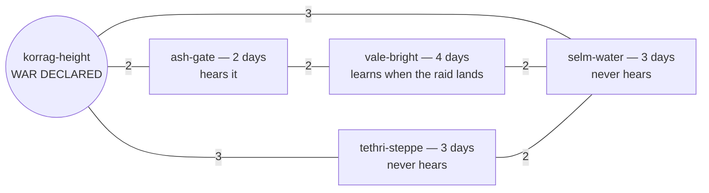

# The Seal That Didn't Move

*Post 0015 · pinned at tag `post/0015` · Lua 5.4 + SQLite · this
post's universe: Harrow, seed `7` · ~10 min read · plain-language
version: [simple](./simple.md)*

*Previously: post 0014 designed the carrier taxonomy on paper —
movement as a system, five columns per mechanism, and the witness
rule: an event's news exists only in the minds that caught it. This
card builds the first rung, and pilots the second.*

---

The tethri are horse people on Harrow's eastern steppe. Here is
their entire knowledge of the world, twelve days into universe 7 —
the feed as they received it, left-hand dates marking when the news
landed:

```
the feed as the tethri received it
tick    1 ← tick    0 · the-void      · a continent wakes (seed 7)
tick    1 ← tick    0 · tethri-steppe · the tethri enter history: 50 grain, 4 iron, 5 salt, 8000¢
tick    2 ← tick    0 · selm-water    · the selm enter history: 40 grain, 6 iron, 6 salt, 15000¢
tick    2 ← tick    1 · tethri-steppe · the day's books: +4 grown +0 mined +0 gathered, −5 eaten — 49 grain, ...
tick    6 ← tick    1 · ash-gate      · a letter rides from the ashfold to the tethri: 4 salt at 90¢ apiece
tick    7 ← tick    6 · tethri-steppe · the tethri say yes to the ashfold: 4 salt for 360¢
```

Look at what is *missing*. The valebright — the continent's granary,
the richest civilization on the map — entered history at tick 0,
and the tethri do not know they exist. Neither the korrag in their
mountains nor the ashfold at their gate appear as foundings, ever.
Before this card, that feed contained everything that happened
anywhere on Harrow, arriving politely late. Now it contains exactly
three kinds of thing: what happened at the steppe, what happened
within earshot of it, and what somebody addressed to the tethri by
name. Everything else reaches no one, because nothing carries it.

And the golden seal of this universe — the rolling hash that answers
"same history?" — is `9be58120c48a121b`, which is the same sixteen
hex digits it was before we did any of this. We retired the physics
of news on an entire continent and history did not flinch. This
post is about why that happened, why we didn't predict it, and what
it teaches about replacing load-bearing machinery.

## Why now

Post 0014's build map assigned this card the first move: land the
mechanism row schema in the engine, re-express every world's current
behavior as declared rows, and prove nothing changed — then retire
the field for real somewhere small. Everything behind it in the
queue — degradation, reception, in-flight actors, grown-up money —
builds on whatever carries the news, so the carrier had to stop
being an assumption before any of them could start. And the debt
was already two cards old: the field model — news radiating at one
uniform speed with no emitter and no failure — was licensed at card
122 as a placeholder, with *nothing arrives that nothing carried*
attached as its retirement clause. Mike's scope verdict for this
card: rung 1 for all three worlds, plus the rung-2 pilot, in
Harrow — the smallest world with real geography, where trade
already traveled by letter and the charter's stories were waiting
for honest ignorance.

## Rows land in the engine

The courier, before this card, was four lines of arithmetic inside
the tick loop: every event reaches every faction
`ceil(distance ÷ channel_speed)` ticks after it happens. That *is*
the field model — a universal broadcast, hardwired.

Now the courier asks a new module, `sonder/carriage.lua`, and the
module answers from rows the world declared. A row is data, never
code — ADR 0005's five columns, of which the engine currently
consumes the two today's worlds exercise: speed, and coverage in
one of exactly two shapes. A **radiated** row reaches every faction
whose home lies within `range[loudness]` of the event — range
`"everywhere"` for the field, or a table like Harrow's earshot:

```lua
{ name = "earshot", shape = "radiated", speed = 1,
   range = { loud = 2, ["local"] = 0, quiet = 0 } },
{ name = "letters", shape = "addressed", speed = 1,
   to = { ["continent.offer"]  = "buyer",
          ["continent.accept"] = "seller" } },
```

An **addressed** row declares, per event kind, which payload field
names the recipient: an offer rides to its buyer, an acceptance
back to its seller, at road pace, and reaches nobody else. The
earliest arrival across reaching rows wins; ties break by
declaration order; and when no row reaches a faction, the answer is
nil — which the courier honors by never delivering. Not delayed.
Never. That nil is the witness rule as one branch of an if.

Three details carry more weight than their size suggests. Range 0
still reaches the event's own location, so a civilization's quiet
bookkeeping lands in its own store with no actor-identity machinery
at all — your own acts at your own gates are always in earshot.
A world that declares nothing gets `Carriage.field(channel_speed)`,
the old arithmetic as one honest row, so every bare spec universe
keeps the pass-through era unchanged. And space and the office now
declare that field row *explicitly* — rung 1 of the ladder: the
placeholder is still standing in two worlds, but it stands as data
the world admits to, not physics the engine assumes.

## The seal that didn't move

We expected the pilot to cost a seal. The plan said so: retiring
the field in a world re-cuts that world's golden master — once,
loudly, with a ledger entry — because changing who-knows-what-when
changes decisions, and changed decisions are changed history.

Then we read Harrow's minds carefully, looking for what they
actually consume. Every input to every decide() on the continent is
one of two things: *self-located* — your own tally, your own
hunger, your own war office's declaration, all events at your own
home, distance zero — or *addressed* — offers where you are the
named buyer, acceptances where you are the named seller, read the
morning they land. That's the whole list. No Harrow mind ever read
a distant civilization's tally, a stranger's founding, or news of a
war it wasn't in. The field had been delivering all of it, every
event to every store, for the entire life of the world — and no
decision ever touched the excess.

So the pilot changed no mind's inputs; unchanged inputs mean
unchanged intents; unchanged intents mean a bit-identical annals;
and the seal — `9be58120c48a121b`, first cut at card 160 — stands.
All 176 specs pass, three golden seals among them. What changed is
everything the seal deliberately does not cover: the belief stores.
The tethri's private chronology shrank from a copy of world history
to the feed at the top of this post. The selm — everyone's neighbor
by water, middlemen by charter — no longer read everyone's mail for
free, and a new spec holds them to it: no letter between two other
civilizations ever lands on their table again.

One beat from the new world order is worth savoring. When the
korrag declare war in their mountains, the declaration is loud —
and loud carries two days on Harrow, one cheap pass. The valley is
four days of territory away. So the valebright never hear the
declaration at all; the first they learn of the war is the raid
arriving at their own gates, witnessed as it lands. The warning
arrives *with* the sword now — not because news travels exactly as
fast as raiders, as the old field model had it, but because nobody
who was in earshot chose to carry the warning onward. The ashfold,
two days from the mountains, heard everything. The pass-keeper
knows, and the valley doesn't, and the gap between those two facts
is a spy network, an alliance, or a betrayal — future content, and
now the physics is ready for it.



## Observation is a radiated row

A question from Mike, after the build: we've handled goods and
letters — but what about *knowledge*? A star dies, and a
civilization simply observes the fact. Can the radiated shape
accommodate that?

It can, and the star death is its purest case. Nobody sends a
star's death; per the witness rule it travels only on natural
media, and space's natural medium is light — a radiated row with
owner nobody, speed set to whatever light does in map units, loud
range set very far. Every civilization in range *witnesses* the
death at `tick + ceil(distance ÷ c)`: astronomy falls out of the
taxonomy as **delayed witnessing**. Looking at the sky is receiving
very old news on a very fast medium, and the `learned` stamp
carries the gap. After the witnessing, the knowledge behaves like
knowledge: retellable, sellable, sit-on-able — the observatory
becomes a source, and instrument differentials become
belief-freshness differentials. Declaring that row is the space
world's own rung-2 decision, when its migration card comes; the
eval costs a row, not a mechanic, which is the three-universes
litmus paying off exactly as promised.

Two honest edges, both already owned by card 157: three loudness
levels are coarse for astronomy (a supernova and a shouted
declaration are both "loud"; magnitude-scaled range or the
kind-by-kind re-judgment fixes the range column's input, not the
shape), and witnessing currently needs no instruments — reception
is omniscient within range, the licensed simplification 157
retires, after which a kilometer of ice is a boundary in the medium
and the shellsea never sees the star die.

## The CS underneath: flooding, TTL, and the tests you cut in metal

Two ideas from real systems are load-bearing here.

The first is that our two shapes are the network layer's two
ancient delivery modes wearing lore. An addressed row is
**unicast**: one named recipient, routed. A radiated row is
**scoped broadcast**: delivery to everyone within a boundary — and
the range column is doing exactly the job of the IP header's **TTL
field**, a number that says how far a packet may spread before it
stops existing. Harrow's earshot is broadcast with TTL 2. And the
field model we retired has a network name too: **flooding** — every
node forwards everything to everyone, correct and unscalable, the
thing real protocols exist to avoid. Ethernet switches flood only
when they don't know where a destination lives; the moment they
learn, they stop. Our worlds just learned.

The second is the discipline that made the pilot safe:
**characterization testing** — pinning a system's observed behavior
in tests *before* changing its internals, so the tests describe
what the system does rather than what anyone hopes it does. Michael
Feathers gave the technique its name in *Working Effectively with
Legacy Code* (2004); our golden seals are characterization tests
cut in metal — one hash characterizing five hundred ticks of
behavior, bit for bit. The refactor rode them: extract the delay
arithmetic into a module (seals must not move — they didn't),
declare the same arithmetic as data (seals must not move — they
didn't), then change the data in one world and *watch what the
seal says*. We predicted it would move. It didn't, and the
unmoved seal was the discovery: it told us Harrow's history had
never depended on the field at all, something no amount of reading
the code had made obvious in advance. A characterization test that
surprises you is telling you what the system actually was.

## What we got wrong

**We predicted a re-cut that never happened.** The scope verdict,
the notebook, and the ledger discipline all braced for Harrow's
seal to move — the pilot was framed as "one seal re-cuts, once,
loudly." The seal stood. The error was reasoning from the mechanism
(delivery changed, so surely decisions change) instead of from the
consumers (which deliveries do decisions actually read?). The
drama was never in the annals; it was in the stores. We keep the
mistaken prediction on the record precisely because the surprise is
the lesson: verification instruments exist to out-argue intuition,
and this one did.

**"The first event nobody learned about" overclaimed.** Q1's
framing promised the pilot would produce events *no one* ever
learns of. On Harrow, it can't: every event the world currently
emits happens at somebody's home, so someone is always in earshot.
What the pilot actually produces is events *most* factions never
learn of — ignorance per faction, not oblivion. True oblivion — the
event at a location beyond every home's earshot — is expressible
(the carriage specs prove it with a synthetic beacon) but does not
yet occur in any world's content. The distinction matters; the post
you are reading almost blurred it.

**The interrogation found a stray.** A lint directive for a linter
this project doesn't use shipped in the first draft of the courier
change — tool-noise in a file whose comments otherwise carry the
argument. Caught and cut. Small, but the standard is the standard.

Next: the successor cards inherit a working seam — degradation
(151) now has a mechanism to be a property *of*, reception (157)
has a witness set to gate, and the space world's own migration
waits for a card that will have to answer for the Fleet.
