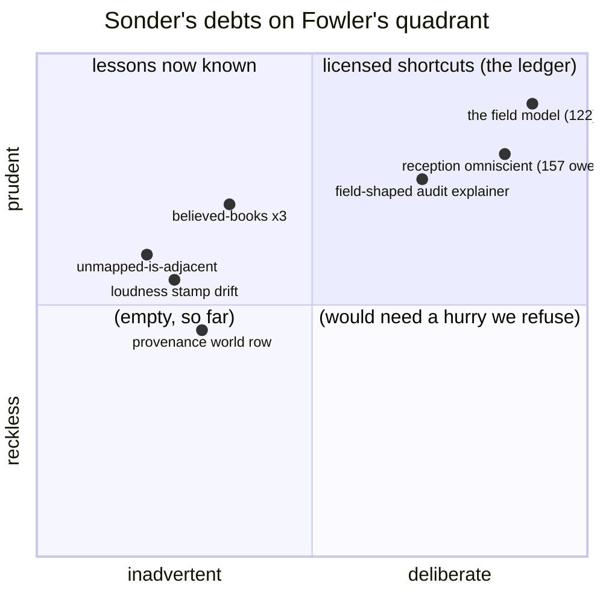

# Success Debt

*Post 0017 · pinned at tag `post/0017` · zero engine changes, on
purpose · ~9 min read · plain-language version:
[simple](./simple.md)*

*Previously: seven cards in five weeks — the audit, news at ship
speed, nothing teleports, three worlds on one engine, the carrier
taxonomy, the witness rule, roads that lose letters. This card is
the pause: nobody had looked at the whole since.*

---

Here is the finding that best justifies the pause. ADR 0004 —
accepted, published, tagged — says: *"Provenance grows one
requirement: every universe file records which world wrote it.
Three worlds' archives must never be confusable."* That sentence
is eleven weeks old. It was never implemented. Today, a Harrow
universe and a space universe run from the same seed produce
database files whose provenance differs in nothing that identifies
them — the exact confusion provenance exists to prevent, required
by an accepted architecture decision, sitting undone while five
subsequent cards shipped cleanly around it.

Nobody did anything wrong, which is the interesting part. Every
card since has been disciplined: designed, questioned, specced,
sealed, essayed. The debt accumulated *because* the cards kept
landing — each one exercised the seams a little harder than the
extractions kept up. Card 166 was Mike's call to take a beat: a
comprehensive review with two hats — Principal Engineer over the
structure, Product Manager over the documentation — with a firm
split between them: the engineering half **identifies** and Mike
decides; the documentation half **applies**, immediately.

## Why now

Because review debt compounds quietly and this was the cheapest
moment to pay it down. Seven cards had landed since the v0.1 cut;
the successor queue (152–159) is about to build on the carriage
for years; and the project had crossed a threshold nobody marked:
the posts — seventeen excellent essays — had become the *only*
systemic documentation, and posts are era artifacts, pinned at
their tags, narrating history rather than describing now. A strong
engineer arriving fresh could learn how every piece was earned and
still not find a map of what stands.

## What the review found

Three reviewers went out in parallel — one over the engine's
fourteen modules, one over the twelve world files, one over the
hundred-and-two documentation files — and came back with thirty
findings that corroborate each other from independent directions
(the worlds reviewer found the same field-shaped audit arithmetic
the engine reviewer flagged; the docs reviewer found the
unimplemented ADR requirement that explains the engine reviewer's
provenance finding).

The full ranked report lives in the notebook. The shape of it:

**Five findings should become cards.** Extract the courier from
the tick loop before degradation's second half has to cut through
the heartbeat. Give provenance its `world` row (the finding
above). Extract the believed-books cluster — the watermark fold,
the catch_up cursor, and the four road kinds are each written
three times, once per world, and two of the three vocabularies
*predict this extraction in their own comments*; the rule of three
is cashed thrice over. Put the road-day arithmetic in one place —
`ceil(distance ÷ speed)` exists five times — and retire
`channel_speed`, a concept doctrine already retired but code still
consumes. And give the vocabulary a module: it is a four-way
contract validated four partial ways.

**Four findings ride cards that already exist.** The audit's
in-flight explainer still speaks field arithmetic (card 163's
docket, now confirmed by two reviewers). Loudness stamps diverge
across worlds — space stamps its books a notch louder than the
younger worlds, cosmetic today, *behavior* the day space gets
earshot (cards 157/163). The unmapped-is-adjacent leak the
continent fixed at card 151 lives on in the other two worlds
(their migration cards fix it deliberately, since each fix moves a
seal). And belief.lua's card-152 seam comment points at a door
that isn't built.

**Twelve findings make one hygiene sweep** — a `beliefs(name)`
accessor to retire five copies of the same scan, the `--why`
ladder that renders in envelope fallback while the world's
templates sit in scope four lines up, a war-kind payload that
quietly diverged between worlds, window disciplines that learned a
lesson in one world and not the others, and friends.

And two things the reviewers praised, kept for balance: the spec
fixture world is a genuinely clean fourth instance of the litmus,
and there is no dead vocabulary anywhere — every declared kind in
all three worlds is emitted, templated, and audit-classified.

## The debt, named honestly

The findings are not mess. Ward Cunningham coined the debt
metaphor in 1992 for exactly this: shipping with a simplification
you understand is *borrowing* — you move faster now and pay
interest until the principal is repaid. Martin Fowler later drew
the quadrant that separates the honorable version from the other
kind: debt can be deliberate or inadvertent, prudent or reckless.

Sonder's licensed-shortcut practice — the field model, omniscient
reception, each recorded with its retirement clause the day it
shipped — is deliberate-prudent debt with the loan paperwork
filed. The review's real catch is the *other* column: inadvertent
debt, the kind no one decides. The believed-books triplication
happened because three worlds arrived faster than one extraction.
The provenance gap happened because an ADR recorded a decision and
nothing tracked the decision into code. That is **success debt**:
interest charged not on corners cut but on ground gained. The only
treatment is what this card is — periodic beats where someone
reads the whole and writes down what velocity outran discipline.

## The documentation half, applied

The docs reviewer's verdict compressed: the documentation *of
increments* is excellent; the documentation *of the system* did
not exist. No architecture overview, no API reference, no schema
documentation for the database every run writes (the only DDL
anywhere in docs showed a column renamed two epochs ago), a README
that never mentioned `--world` in a three-world project, and a
"v0.1 complete" headline contradicting the 0.2.0 in every
provenance table it ships.

So now there is a second kind of documentation, and the split is
explicit doctrine: **posts are pinned; references are living.**

- [`docs/architecture.md`](../../architecture.md) — the map:
  modules, the tick sequence, the life of an event from emission
  to belief, each as inline Mermaid, plus a per-world status
  table.
- [`docs/universe-file.md`](../../universe-file.md) — the database:
  all four tables' DDL, the eight provenance rows and who writes
  each, checkpoint semantics, the honest caveats (no world row
  yet; no secondary indexes; foreign keys are connection-scoped),
  and a seven-query cookbook.
- [`docs/api.md`](../../api.md) — the engine's public surface: the
  Universe options table, the decide contract, the carriage row
  schema, the belief store's queries, the audit legs contract.
- [`docs/verification.md`](../../verification.md) — the three
  golden seals in one table at last, and the procedure for
  verifying a universe file against its own final checkpoint.
- [`docs/README.md`](../../README.md) — the index that says which
  of the seven kinds of writing to read when, and states the
  pinned-versus-living rule.

Plus the staleness fixes the audit demanded: the glossary's
duplicate `world` entries merged (it violated its own
one-definition rule), provenance corrected to eight rows, the
re-cut ledger generalized to three worlds, the audit entry brought
past card 153, *determinism epoch* added as a term, the README's
headline reconciled with 0.2.0 and its CLI section finally
teaching `--world`, `--believes`, and `--as-of`, and both eval
charters gaining a living "current state" section. The docs sweep
checklist in CLAUDE.md now names the living pages explicitly, so
they can never rot the way the posts index did.

## What we got wrong

**The posts index went missing for four consecutive sweeps** — and
when card 150's final review caught it, we fixed the symptom and
not the system. The sweep checklist said "fix stale docs" without
naming which docs are load-bearing; unnamed obligations don't
survive contact with a Friday. Named now.

**The simple track lost its diagrams after post 0006** and nobody
noticed for ten posts — backwards, since simple.md exists for the
readers who most benefit from a picture. Now a sweep item.

**An accepted ADR is not an implemented ADR.** 0004's provenance
requirement sat in a merged, tagged document for eleven weeks
while everyone, this project's Claude very much included, treated
"decided" as "done." Decisions need either code or a card the day
they're accepted; this one now has a card.

**And the glossary broke its own law** — one definition per term,
except *world*, which had two. The canonical vocabulary drifted
precisely because it was the one document nobody's card ever owned.
Living documents need owners; the sweep checklist is now that
owner.

Next: Mike reads the findings and picks — the believed-books
extraction is the biggest clarity win, the provenance card is the
most urgent, and the hygiene sweep is a quiet afternoon. The
engine didn't change this card, and that's the point: you cannot
refactor what you haven't read, and now we've read it.
