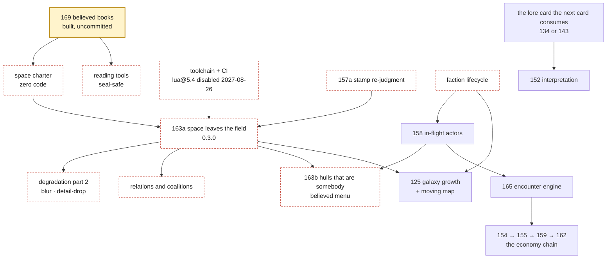

# The Return — the state of Sonder, 2026-09-24

*A re-grounding review for Mike, written on his return after 45 days
without a commit. It covers where the project stands, what it is for,
what to do next, and a candid critique of the plan, the code and the
architecture. It was drafted by a model seeing the repo for the first
time, and it is an era artifact, like the posts and notebooks: true
about today and never corrected later. The living reference
(`docs/architecture.md` and its siblings) describes what the project is
now; this page describes what one reviewer saw on one day. Evidence
sits beside it in [`2026-09-24-probes/`](2026-09-24-probes/).*

> ```
> tick   90 ← tick   82 · khedrun-holds · the khedrun declare war on the vessari — 4 hungry days were the last insult
> tick   91 ← tick   91 · vessar-reaches · a khedrun war party falls on the vessari granaries (force 12)
> …        (a raid every day, 91 through 99)
> tick  100 ← tick   92 · khedrun-holds · the khedrun sheathe — grain at 55¢ buys more than blood
> tick  105 ← tick   97 · khedrun-holds · the khedrun declare war on the vessari — 4 hungry days were the last insult
> ```
> `./lua src/main.lua --seed 1893 --ticks 110 --db none --believes vessari | grep -E 'declare war|sheathe|falls on'`

This is the Vessari's private newspaper (the glossary calls it their
*private chronology*), double-dated: *when I learned it ← when it
happened.* They learn on day 100 that the war ended on day 92. Seven of
the raids that hit them came after it was over. By then the Khedrun had
already declared a second war, on day 97, which the Vessari won't hear
of until day 105. Nobody wrote that; it falls out of the four laws, and
it is the best thing in the repo.

It also carries this review's argument in miniature. The peace sentence
gives a reason that isn't true: every war measured ended on weariness,
not cheap grain. And the same pair of declarations recurs about every
97 days, on every seed tried. The machinery that decides *who knows
what* is real and good. What the minds *do* with what they know is
still thin, and the destination world is where that shows most.

---

## How to read this

- **§0** is the short version, ten lines.
- **§1, §2 and §5** are the re-grounding and the plan (twenty minutes).
- **§3** is the critique, five findings, each with its best
  counter-argument. **§4** is where the review argues against itself.
- **The appendices** hold the reading kit, the latent-defect table,
  the status of card 166's findings, and the method. The claim-by-claim
  verification ledger is in
  [`2026-09-24-probes/verification-ledger.md`](2026-09-24-probes/verification-ledger.md).

The review is a **menu, not a queue**. Its reviewers produced 88
recommendations and 59 questions; this page boils them down to one plan
(§5.3) and ten decisions (§5.2).

---

## 0. The short version

1. **The engine is sound, and proven sound.** 188/188 specs, three seals reproduced, a reversed-`pairs()` adversary survived; card 169 is bit-identical across 42 separate-process runs.
2. **Card 169 exists only on this laptop.** It has been uncommitted for 26 days, and the Mac has no backup destination. Back it up first (§5.1).
3. **Auto-postpone swept the board.** All 35 open cards, 169 included, sit in Not Now. Little was lost: the board stopped holding the plan after v0.1.
4. **The front door is stale.** CLAUDE.md's Status ends at card 167 and lists merged cards as "next"; the README says engine 0.2.0 (it is 0.2.5, or 0.2.6 in the working tree).
5. **The worlds are metronomes.** Every war is a hunger war that runs exactly 10 days (space) or 8 (Harrow) and ends on weariness; the seed moves *when*, never *what*.
6. **The chronicle misleads.** Every peace sentence gives a false reason, 74–98% of lines are bookkeeping, and `--why` prints the same ancestors over and over (one question can write ~20 GB).
7. **The thesis is running, in Harrow.** The Valebright never hear a declaration of war; the rim never hears of any war. In space everyone knows everything, a few days late.
8. **The destination was parked by your rulings, and nothing un-parks it.** There is no space charter; card 163 has absorbed nine obligations; "allying" and "scheming" have no card.
9. **Verification lags building, at exactly the seams the next cards cut.** Beliefs are unpinned, routing is unaudited, there is no CI, and Homebrew disables `lua@5.4` on 2027-08-26.
10. **The ownership gate went unrecorded.** Claude committed four cards in a 20-minute burst with no gutter pass on record, drafted posts with inflated elapsed times, and left eleven decisions for you across four notebooks.

**The plan in one line:** back up and land 169, write the space charter
together, fix the reading tools, put a second machine on the seals, then
let space leave the field. Change the process by *subtracting*.

---

## 1. Where you left off

### 1.1 The timeline

| when | what |
|---|---|
| 07-25 → 07-28 | Cards 112–120, 129, 147, 148 and 122 (parts 1–4): toolchain, ticks, event log, lore shelf, history book, tamper seal, beliefs, the toy economy, two-track posts, eval notes, v0.1, double entry, ship speed begins. Posts 0000–0010. |
| 08-03 → 08-05 | 122 lands; 153 (nothing teleports); 160 (three worlds, ADR 0004); 161 (carrier taxonomy, ADR 0005); 150 (carriage). Posts 0011–0015. |
| 08-07 | 151, the roads are not safe: **engine 0.2.0**, the version convention's first minor bump and the continent's first deliberate re-cut. 166, the beat: thirty findings curated into 21, plus the living reference. 167, provenance's world row. Posts 0016–0018. |
| 08-08, 00:12–00:28 | Cards 168, 170, 171 and 172 are committed (0.2.2 → 0.2.5), with posts 0019–0022. |
| 08-10 | All four merge, with a repair after GitHub auto-closed the stacked PRs. Branch `169-books` cut. **Last commit.** |
| 08-11 | Card 169, session 2: the plain-words pass. Asked what you'd expect, you described the continent's column design independently. |
| 08-24 → 09-07 | Auto-postpone sweeps every open card into Not Now. |
| 08-29 | Card 169, session 3: "Let's go with option A". Implementation, a 37-agent review, five forks for you. Nothing committed. |
| 09-24 | This review. |

The commit calendar holds 98 commits (71 non-merge) on 10 active days,
and 23 posts. More than half the commits (53) landed in the first three
days. The calendar says sprint, then pause. The pause is in the charter
("we are never in a rush"). §3.5 argues that the sprint is what strained
the process.

### 1.2 What exists

**The engine** (`src/sonder/`, 16 modules, 2,443 lines including the
uncommitted `books.lua`) is world-blind. It knows nothing about grain,
salaries or war.

| layer | modules | one line each |
|---|---|---|
| heartbeat | `universe` · `rng` · `annals` · `vocabulary` | ticks, systems, factions · named streams · the append-only log, validated · the contract, checked once, and the framework road grammar |
| knowledge | `courier` · `carriage` · `belief` · `travel` · `roads` · `books` *(new, uncommitted)* | news becomes belief: delivery, dice, losses · mechanism rows: who news reaches, and when · one mind's private memory · the shared calendar · freight arrivals · the believed-books fold and the truth-side ledger |
| persistence | `byteform` · `archive` · `seal` · `fnv` | one canonical byte form · the universe-file writer · the rolling hash · the hash fold |
| viewers | `chronicle` · `audit` | events into sentences · the double-entry projection |

**The worlds** (`src/worlds/`, 12 files, 2,910 lines) are content.

| | space (the destination) | the continent, *Harrow* | the office, *Bellwether & Co.* |
|---|---|---|---|
| cast | Vessari, Khedrun | Valebright, Korrag, Selm, Tethri, Ashfold | mara (founder); sef, tobin (managers); amity (ops); ivo, prue (sellers); dane, okka, lish, vern (makers) |
| map | named distances, 3 places | adjacency graph with interior | the org chart |
| news | field row (rung 1): everyone hears, late | earshot + letters (rung 2): the witness rule | field row (rung 1) |
| roads | safe | letters lost 1 in 50 per rider-day | safe |
| economy | closed; one exchange | closed; bilateral letters | open: revenue in, spend and rent out |
| golden seal | `3475639d8f49678b` (1893 × 500) | `c6dc5ef5b428aa85` (7 × 200) | `10fc9a5781a44136` (7 × 200) |

**The numbers.** 188 specs in 3,293 test lines, about 5 seconds. Under
`docs/`, 176,916 words, of which 67,304 are posts and 52,401 notebooks,
against 3,911 non-blank lines of source code. Engine 0.2.5 on main, 0.2.6
in the working tree; post tags 0000–0022; one version tag, v0.1.0.

### 1.3 Card 169, precisely

**What it is, in plain words.** Every mind works out *what do I hold
this morning?* from its last self-report plus every delivery it has
heard of since. That is a balance sheet, not a shipping manifest (your
own distinction, from session 2). Each world wrote that sum by hand,
once per world, and wrote its truth-side twin (the ledger that follows
the annals) by hand too. Card 169 moves those six copies into one engine
module, `src/sonder/books.lua` (262 lines). The audit keeps its own
seventh copy on purpose.

**How it was proven.** All three seals stand. The card's own run of 30
seed×world comparisons came out byte-identical, and this review's
determinism reviewer widened it to 42 separate-process runs (14 seeds ×
3 worlds, including seeds 0, −7 and 2⁶³−1). Seals, feed fingerprints and
audit lines all match between HEAD and the working tree.

**What is still owed:**
- your interrogation of the code
- your rulings on five forks (§5.2, D3)
- a `books_spec.lua` (the module has no direct spec, and none of its error paths ever runs)
- the `tools/setup.sh:115` rockspec name
- post 0023
- the docs sweep
- a notebook correction (the world diff is −43 lines net, not −68)

**Where it lives.** Only in this working tree: two untracked files,
four modified files and a staged rename. There is no stash, no remote
branch and no PR.

### 1.4 The board

61 cards: 26 Done, 35 Not Now, nothing anywhere else. All 35 got there
through the same system comment, *"Moved to Not Now due to inactivity"*,
dated between 08-24 and 09-07. None was parked by hand, and card 169
carries only that comment: none of its three sessions left a trace on
the board.

The fairer reading: the board held a real queue exactly once, on 07-25,
when 112–119 went into Up Next together. After that, Up Next meant
"started today", and the overnight cards skipped it entirely. So the
timer erased triage state, not a plan. The plan was living in three
other places, none of them current:
- CLAUDE.md's "Next up", four merged cards stale
- notebook 161's build map, frozen by the era-artifact rule
- notebook 166's findings menu, now nearly paid

The board is public and linked from the README.

---

## 2. What Sonder is for

This restates the charter, from CLAUDE.md, the README and ADRs 0004 and
0005, so the critique has something to measure against.

**The thesis.** A universe simulator you *read*. Many civilizations with
distinct proclivities trade, scheme, ally and war. None acts on the
truth, only on what has reached it: news that is late, partial and bent
by culture. The small civilization on the rim has a complete inner
history even if it has never heard of the empires.

**The four laws** (which the code keeps; §3.1):
1. **Determinism.** "A `(code version, seed, intervention log)` triple defines exactly one universe, bit-for-bit, on every machine."
2. **Everything is an event.**
3. **Agents act on beliefs, never truth.**
4. **The core is headless.**

**The three-universes litmus.** A mechanism belongs in the engine only
if it serves space, the continent *and* the office. Otherwise it is one
world's content. The two eval worlds are "deliberately shallow"; space
is the destination.

**The mission.** Educational first: every increment ships a two-track
post, and nothing merges that you can't defend without Claude in the
room.

**What "working" would look like**, as five things a reader could do:

| a reader can… | today |
|---|---|
| hand a friend a seed and have them replay it bit for bit | **Yes, on one machine.** Never checked on a second; a fresh install now gets a Lua patch the seals have never seen (§3.4). |
| read any civilization's private chronology beside the truth | **Partly.** `--believes` and `--as-of` work, and Harrow shows real divergence; space shows only delay. |
| ask *why* and follow causes across borders and years | **Broken twice.** `--why` reprints shared ancestors (§3.2), and no war declaration's causes leave the aggressor's territory. |
| pick a seed and get a history nobody wrote | **No.** Casts, maps and temperaments are hand-authored; the seed moves timing, not story. |
| zoom from universe to civilization to a named figure | **No.** Nothing exists between faction and universe (card 126 is Not Now). |

---

## 3. The critique

Five findings, in the order they matter. Each gives the evidence, the
best counter-argument, and a pointer to what to do.

### 3.1 The engine is sound; its debt is at the edges the roadmap is about to use

**What held up under adversarial checking:**
- 188/188 specs, and all three seals reproduce on HEAD and on the working tree.
- A bytecode scan of all 29 source files finds no float division, no float constants and no global writes.
- The whole suite passes with every `pairs()` walk reversed, so "never let `pairs()` near an outcome" really is followed.
- The annals reject floats, unknown fields and uncaused events at the door.

The modules are small and deliberate. Card 168's courier extraction
means the fixes below are local edits, not heartbeat surgery.

**The debt.** Several assumptions hold only because today's worlds are
small, spread out and fixed. Every item below was reproduced by a
verifier and is *unreachable in current worlds*. Most are reachable by
a card already on the board.

- **Zero-day freight disappears, and the audit calls it balanced.** A shipment priced at 0 days goes onto a calendar page that was already drained that dawn. The sender is debited and the recipient never credited; the goods sit "on the road" forever while the audit reports zero violations.
  - Triggered by: `api.md`'s documented `distance = nil` default, for every shipment.
  - Also blocks your own ADR 0005 acceptance test, a wire payment that lands in seconds.
  - The courier already guards the same hazard (`courier.lua:120`); `roads.lua` doesn't.
  - *Reached by co-located polities (136, 139), in-flight actors (158), the Fleet in port (163), and the office's "off the chart is adjacent" freight.*
- **A latecomer believes the whole past on its first morning.** `Courier:enroll` starts every cursor at 0. A faction added at tick 201 in space instantly believes everything delivered so far, all stamped "learned today". There is also no way to retire a faction, so a dead civilization would keep deciding forever. *Reached by 158, 125 and 163.*
- **At distance 0, registration order hands one neighbor an information advantage.** The later-registered faction learns its neighbor's deed the same tick, *before the doer does* (self-knowledge lags a tick). The earlier-registered faction learns it a day late. *Reached by any co-location.*
- **Misspelled options are silently ignored.** `Universe.new{ mechanism = … }` (missing the *s*) quietly runs the field row and never validates the misspelled rows. Harrow's specs would catch it; a new world might not. The engine also emits loudness words it never asks the vocabulary for ("loud", "quiet", "local"), so card 171's "one voice, checked once" has three holes.
- **Law 3 is enforced against accidents, not authors.** The architecture page says no expression inside `decide()` can reach truth. In fact `debug.getlocal(2,1)` returns the universe, and a mind can plant beliefs through the live store it is handed. No world does either: every `decide` closes over constants only. The fix is honest wording plus a spec that walks each decide's upvalues, not a sandbox.

**Scale, measured.**
- **Memory.** Every field-row mind deep-copies every event. The office carries 10 copies per event, and its live heap grows ~155 MiB per 1,000 days (a century extrapolates to ~5.5 GiB). Harrow, under the witness rule, holds 1.09 copies per event, so the rung-2 migrations (163, 164) are the memory fix as well as doctrine.
- **CPU.** The courier costs O(F²) per tick: fine for thirty species, not for a grown galaxy. Keep the benchmark; don't optimize yet.

**Card 169's design.** It is a good extraction with one inherited flaw:
the fold reads *count* windows, `recent(kind, window)` with windows
sized at 3–4 × cast. If more deliveries arrive than the window holds, it
silently under-counts. If an owner's own tally is pushed out, it
silently re-anchors on its founding and cites the wrong cause. The
count heuristic has already produced window bugs in two worlds (the
office's "113 phantom mismatches", and `continent.lua:226`). Margins are
wide today (space 1/6, continent 1/20, office 9/30), but they shrink with
every civilization added.

The engine reviewer prototyped the exact alternative, scanning back to
the anchor's `learned` stamp:
- 188/188 specs, and 18/18 runs byte-identical in seal, fingerprint and audit
- the office's 5,000-day run drops from ~14 s to 5.8 s
- a 47-line change, saved as [`watermark-scan.patch`](2026-09-24-probes/watermark-scan.patch)

Its exactness depends on the courier being the only writer to
`Belief:receive`; one assert makes that structural.

**The counter:** none of this is live. That's true, and the engine
reviewer agrees. *What to do:* Appendix B lists each edge with the card
that should pull it, shipped as that card's first commit. Only the
two-line zero-day clamp and the option-key check are cheap enough to
land sooner.

### 3.2 The worlds are metronomes, and the reading tools hide what is good

**The repetition**, measured over five seeds × 2,000 days in each war
world:

- **Space.** 39–40 wars per seed.
  - Every one is a Khedrun hunger war on the Vessari, runs exactly 10 days (the weariness constant) with 9 marches, and ends on weariness.
  - Declarations come in pairs 15 days apart, every 72–101 days.
  - The first war lands on day 78–86 across the eight seeds tried.
  - Grain peaks at 129¢ against a 150¢ price fuse, so the price war the Khedrun's lore eval is built on has not fired since card 122.
- **Harrow.** 68–71 wars per seed, all Korrag on Valebright, all exactly 8 days, all ending on weariness. The aggressor and target are hard-coded, so this is guaranteed, not emergent.
- **The office.** No wars, and no feedback either. tobin's backlog grows linearly to ~3,600 units by day 3,000, the sellers stockpile too, and mara's treasury grows 6.6–7.2×. Nothing in the code notices either.

**What the chronicle says:**
- **Every peace sentence gives a false reason.** `war.peace` records no reason, so the templates assert one: "grain at 55¢ buys more than blood" (at 55¢ no grain is for sale), or "0 sacks in the granary buy more than blood". All 547 wars measured ended on weariness. The chronicle *is* the product, and here it misreports.
- **It is mostly ledger.** At seed 1893 × 1,000 days, bookkeeping lines are 77% of space, 74% of Harrow and 98% of the office (94% if deal legs don't count). Story events (declarations, peaces, lost letters, lost deals) are 0.9%, 1.5% and 0.24%. Lines carry no event ids, so a reader can't find the N that `--why N` wants.
- **`--why` walks a graph as if it were a tree.** It reprints shared ancestors once per path, so on space's price-and-order diamond the first ladder over 10,000 lines comes at tick 36, and `--why 678` at tick 150 would print 158.7 million lines, about 20.6 GB. Elsewhere it is linear but long: a late Harrow war runs 3,846 lines.

**Why it's a metronome.** There are two roots, both visible in the code.

1. **The minds are thin.** The Vessari have one decision; the Khedrun read seven prices and eight hunger events; Harrow runs one decide for five civilizations; office minds never read their random streams. Memory is short windows wiped at each peace. No mind models another faction: "is a war on" is one global yes/no.
2. **Each day's books cite only the previous day's books**, never the caravans, raids and payments they absorbed.
   - Consequence chains do cross borders: raids cite marches, trades cite orders, peaces cite prices.
   - But no war declaration's ancestry ever leaves the aggressor's home: 20 of 20 in space, 34 of 34 in Harrow. `--why` can prove the Khedrun were hungry. It can never show that the Vessari's price floor starved them.
   - So Harrow's charter goal, a famine chain "legible in cause links across at least three civilizations' territories", is unmet by construction. The charter's living "Current state" line overstates it.

**What is genuinely good**, and hidden. Under the witness rule Harrow is
the thesis, running (seed 7, 1,000 days):
- **The Valebright** hear 4 of 73 loud events and none of the 34 declarations, while raids land at their own gate.
- **The rim.** The Selm and Tethri learn ~13.6% of what happens and never hold a single war belief. Their last *decision* comes between day 13 and day 31, depending on seed; after that their history is near-identical tallies and about 120 ignored salt offers.
- **Sixty events are known to nobody.**

That is the README's small civilization on the rim. `--believes` makes
it readable (Appendix A), but it changes nobody's behavior: the
Valebright keep shipping grain to the raiders.

**The counter**, and it is a good one: the eval worlds are deliberately
shallow. Post 0007 named the cycle a relaxation oscillator in public.
The civ-death ruling forbids tuning the cast to survive, and notebook
160 says "v1 minds may be simple, but nothing may structurally
preclude." What it doesn't cover:
- Space isn't an eval world; it is the destination, and the most metronomic of the three.
- The README invites seed reports ("go look at seed 40412"), and today two seeds differ in timing, not in story, so there is little to report.

*What to do:* fix `--why` and the peace templates now, since neither
can move a seal. Settle the seal-moving fixes (tallies that cite what
they absorbed, a `reason` on `war.peace`) and mind depth in the space
charter (§5.3).

### 3.3 The destination was parked by ruling, and nothing un-parks it

**The facts.**
- Space's golden seal has been `3475639d8f49678b` since card 153 on 08-03.
- Of the nine cards after 161 (150, 151, 166–172), exactly one changed any history: 151, in Harrow only.
- On 08-03, notebook 160 recorded: *"Effort re-balances toward the space sim the moment this card lands."* It didn't.

**The counter gets this one mostly right.** Space standing still was
your explicit, recorded choice, three times:
- Harrow pilots rung 2; "space stays on the field row (the destination, migrated carefully later)" (notebook 150).
- You declined pulling 163 forward: "Let's continue pushing forward with your original plan" (notebook 151).
- "Each world adopts when its content is ready" (notebook 161).

`docs/worlds/README.md` even makes the unmoved space seal the goal of
the generalization phase. The refactor run afterwards was also yours
("queue everything, start doing it"). It was bounded, and it took about
four calendar days.

**What is true anyway.** Nothing on the record *ends* the deferral, so
"effort re-balances toward space" had no mechanism to come true. Four
gaps keep it parked:

1. **There is no space charter.** Both eval worlds have one, with a headline story and a list of stories they must host; space has neither. Card 166 rightly refused to write one without you, and then no card was made. Work flows toward whatever has stories to prove.
2. **Card 163 is a debt magnet.** It is the only queued card that moves the destination, and it has absorbed at least nine obligations from six cards: a light row; hulls as carriers who are somebody; the audit's in-flight explainer; the unmapped-adjacent leak; the stamp re-judgment from 157; menu-as-belief; space's window discipline; the `stock`→`grain` rename; and mid-history factions. With two civilizations it also can't deliver the promise that retiring the field was for (your card-150 caution): a warning that outruns the sword needs a third party in earshot.
3. **Pieces of ADR 0005's build map are orphaned.**
   - Card 151 closed having shipped only loss, so blur, detail-drop and the second audit relaxation have no owner.
   - So do carriage rows as event-mutable state (ADR 0005's rule 1) and freight choosing a mechanism.
   - The moving map is assigned to card 125 in code comments and post 0020, but not in the card's own text.
4. **Half the pitch has no card.** Both eval charters demand coalitions ("trading, scheming, allying, and warring"), and there is no code, card or model for them. A treaty is a belief about a future act, which is what the witness rule exists to carry. The faction lifecycle (birth, death, forks, hiring) has only partial owners in 158, 163 and 143, and four lore evals need it.

**No next milestone is stated.** The only declared milestone ever was
v0.1. Card 150 ruled that the minor version counts determinism epochs
and must not be rationed, so a version number can't name a goal, and
nothing else does. CLAUDE.md also uses "destination" in two senses five
lines apart (lines 8 and 13): space is "the destination", and the
project has "no destination". Worth a reword.

*What to do:* the space charter is the next card after 169 (§5.3), and
it names a horizon with a done-when list. Split 163 into 163a (space
leaves the field) and 163b (hulls that are somebody, after 158), and
give each orphan a home.

### 3.4 Verification lags building, exactly where the next cards cut

The project's strongest habit is *proving* things: seals, the audit,
bit-identity batteries. The gaps sit exactly where the next cards will
need proof.

- **Beliefs are unpinned.** The seal hashes only the annals. Three courier mutants pass 188/188 with every seal unmoved: drop all 762 market-order deliveries, delay war marches a day, delay office hirings a day.
  - *The counter, which is right:* these touch kinds no mind reads. Mutants on kinds minds do read (prices, declarations) are caught, and delivery has property specs in every world.
  - Still, it is the exact layer 152, 157 and 158 change first. Pin a belief digest beside each golden seal: cheap, off the sim path, with its own re-cut ledger.
- **The audit checks amounts, not addresses.** A delivery that teleports (arrives before the road allows) audits clean in all three worlds, and one naming the wrong sender audits clean in both worlds tested. A misroute is caught only indirectly, as hundreds of unexplained mismatches. That is inside the audit's chartered remit (conservation), but "violations mean tampered history" isn't yet true for roads. Record parties and tick at departure before cards 156 (counterfeiting) and 154 (illegal trade).
- **The tests are weaker than their count.**
  - 58 of 66 `has_error` assertions accept *any* error; deleting the annals' location check leaves all 188 green.
  - The continent and office specs run seed 7 only.
  - Lua seeds its string hashing per process, so every "run it twice in one process" test is blind to `pairs()`-order leaks; only the three pinned seals would catch one.
  - The KPIs hold on 30 of 30 seeds, so multi-seed specs won't flake.
- **Law 1 has been observed on one machine.**
  - There is no CI, and card 112's done-when ("a fresh clone on a second machine") was closed unmet.
  - Provenance records "Lua 5.4", because pure Lua can't see the patch level.
  - ADR 0001 promised an lsqlite3 version row that doesn't exist.
  - `rocks.lock` pins versions without hashes.
  - **New, and time-boxed:** Homebrew deprecated `lua@5.4` on 2026-08-26 and will disable it on 2027-08-26. A fresh install today gets 5.4.9; the seals were only ever observed on 5.4.8. The README's install path has a year to live, and moving to 5.5 is a lineage event by ADR 0001's own terms. `setup.sh` already builds LuaRocks from a SHA-pinned tarball, and it can build Lua the same way.
- **A locale trap waits for non-ASCII names.** byteform escapes with `%c`, which follows `LC_CTYPE`: under a UTF-8 locale, bytes 0x80–0x9F and 0xAD escape differently, and the seal moves. Nothing sets a locale today and every string is ASCII, but card 131's phonology will change the second half. The one-line fix is seal-identical.
- **Smaller gaps:**
  - `verification.md` promises a check from the file's rows alone and a binary search to the first divergent tick; no tool does either. A 31-line rows-alone verifier is in the probes folder.
  - A crashed run's file looks finished.
  - `config` is still hard-coded `"{}"`.

**The counter:** the audit is doing its job, delivery *is* tested, and
none of this is live. All true. *What to do:* one card (§5.3, card 4)
for CI, the Lua build and the provenance rows. The belief digest and
the routing audit ride in with the cards that consume them.

### 3.5 Process: the record-keeping slipped, and the ownership gate went unrecorded

**What the process demonstrably buys**, and should keep:
- **Your interrogations produced the best designs in the repo.** At 116 you spotted FNV-1a written three times (now `fnv.lua`). At 118 you asked "where does a world live?" (now `src/worlds/`, and later ADR 0004). At 161, "if a tree falls" became the witness rule.
- **Drafting posts caught real bugs** (notebooks 113 and 117).
- **The notebooks work as resume points.** On 08-29 you went from "where do we need to look back and return to?" to a design decision in three minutes.

**Where it slipped:**

- **The front door went stale, starting at card 167.**
  - Card 167 left the README headline at 0.2.0 and never touched api.md.
  - The four overnight cards touched none of README, CLAUDE.md or the glossary.
  - The architecture page's tick diagram predates the courier.
  - api.md tells world authors provenance needs four keys; the archive refuses files without a fifth (`world`).
  - The glossary has about ten stale entries and none for two of the three worlds.

  Tags are immutable, so the README is wrong at `post/0018` through `post/0022` forever, and CLAUDE.md at 0019–0022. That is the card-113 lesson the docs sweep exists to prevent.
- **History is told four times** (CLAUDE.md Status, README's story, the posts index, the board), and the copies are what rot. Only the posts index, a table, stayed current. CLAUDE.md's Status is 1,258 words, 43% of the file every session reads first, and most of it is one run-on sentence.
- **Pinned posts carry invented elapsed times.** Claude drafted all of these, on monitored cards as well as overnight ones, so the gap is a missing step (check every number against git), not the overnight run:

  | post | says | actually |
  |---|---|---|
  | 0022 | "eight months from its first commit" | 13 days 17 hours |
  | 0017, 0018 | "eleven weeks" | 3.8–4.1 days |
  | 0017 | "seven cards in five weeks" | 11 days |
  | 0021 | "five days later" | 14 hours |
  | 0014, 0015 | "for months" / "months ago" | 8–10 days |
  | 0019 (simple) | "unchanged in months" | 2 weeks |

  Post 0022 also claims "the working agreement now knows" about the periodic review; CLAUDE.md doesn't. With no errata channel, these stay permanent and unmarked.
- **The ownership gate has no record for four cards.** Claude committed cards 168, 170, 171 and 172 (code and posts) in about twenty minutes on 08-08 (00:12–00:28).
  - Their PRs have zero reviews and resolved within 12 seconds of each other on 08-10.
  - Notebooks 168, 170, 171 and 172 contain no interrogation and don't list one as owed; notebook 169 does.
  - Card 122's overnight precedent was the opposite: "left UNCOMMITTED for gutter review… the post [is] ours to do together."
  - The recorded authorization ("queue it up and start doing it; nothing merges unmonitored") bounds merging, and that bound held: the merges came 62 hours later, in daytime.
  - But committing code with no gutter pass contradicts the rule in Claude's own memory ("code changes always get a gutter pass before their commit"), unless you gave a go-ahead the repo doesn't record. The working session lives in a claude.ai/code transcript that is in neither the repo nor this machine.

  So the gate is *undocumented*, not provably skipped. The consequence is concrete all the same: card 169's top fork (framework-kind collisions) descends directly from card 171's "the world wins on collision", a design choice Claude made in the unattended run that no notebook records you ruling on.
- **The notebooks, which Claude keeps, record your voice less after card 151**, in every kind of session. By broad markers ("Decision (Mike)", "Mike's review", "> Mike") the pre-166 notebooks record you about 1.75 times per thousand words; 166–172 record you 0.16 times, and the four overnight notebooks not at all. Across 169's three sessions the notebook holds one ruling in your words and one design you described when asked. Claude then built 262 lines and three migrations and ran a 37-agent review. Part of this drop is Claude's record-keeping, not you saying less.
- **Decisions pile up faster than one person clears them.** Eleven decisions owed to you sit in four notebooks (166, 169, 170, 172), none with a card. Review intensity compounds: 3 reviewers at 166, 37 agents at 169, and 20 across this review's three passes. Each review is cheap in compute and expensive in your attention, the one resource the project can't scale. That is why this page ends with ten decisions, not fifty-nine questions.
- **The rules that govern the work live off-repo.** The commit rule, the stacked-PR merge lesson, the plain-branch review flow and the plain-words rule exist only in Claude's `~/.claude` memory. They are unversioned, invisible to a collaborator, and on a machine with no backup. CLAUDE.md says mistakes are "jointly owned and published"; these aren't published.
- **The two-track format is straining under small cards.** Posts 0018–0022 run about 700 words per track, and 0022's simple track is longer than its complete one. The tracks still differ by 2–3 reading grades in three of those five posts. The sharper finding is that recent simple tracks read at about grade 10–12, above ADR 0003's middle-school target, so the question may be *register*, not length. That is your call (D8); keeping the post is not in question.
- **Housekeeping.**
  - GitHub reports the license as "Other", because the CC BY note is appended to the MIT file, and no CC BY text exists anywhere.
  - Ten stale remote-tracking refs linger locally (`git fetch --prune`; origin itself is clean).
  - `out/` holds 12 July universe files that can't be replayed (all pre-0.2 with no world row, 10 of them from dirty commits).
  - `post/0021` is the one post tag on a non-merge commit, because card 171 never got a merge of its own; it is still the exact code the post describes.

---

## 4. Where this review is probably wrong

- **"Stuck in a refactor loop" overstates it.** The run was requested, bounded, and ordered by card 166's own ranking. Tier 1 is paid once 169 lands, tier 3 is paid except findings 15, 16 and 19, and tier 2 rides feature cards. Card 167 paid a day-one requirement; it wasn't a refactor. What remains true is narrower: *this review* is the thing most likely to become the next menu. Don't let it.
- **The thesis can be seen.** `--believes` shows it. Only `--why`, the tool that answers why, is broken.
- **"Causes never cross borders" was a reviewer's headline, and it was false.** Consequences cross constantly; only the chain *into* a declaration stays home.
- **The eval worlds are shallow by charter.** Content cards for Harrow or the office would re-litigate your ruling. So this page recommends marking each chartered story as hosted, unhosted or blocked, and landing mind depth in space first.
- **"Observed on one machine" is absence of evidence**, not evidence of drift. The Homebrew deadline is what turns it from hygiene into a task.
- **Every latent defect is latent.** Appendix B's labels say so, and the memory figures are live heap; peak RSS varies from 1.1 to 1.6 GB by seed.
- **Two reviewer claims died in verification** and aren't repeated here: that "ten merged branches sit on origin" (origin holds only `main`), and that "no card owns the moving map" (card 125 does, in code comments).
- **Not checked:** whether `lsqlite3` builds on Linux multiarch (the risk is inferred), GitHub traffic, and anything said in conversations outside the repo.

---

## 5. What to do next

### 5.1 The first session back (about two hours)

1. **Pin the interpreter** (one minute): `brew pin lua@5.4` before any `brew upgrade`. The seals were observed on this machine's 5.4.8; an upgrade to 5.4.9 should be a deliberate cross-patch test, not an accident.
2. **Back up card 169** (five minutes; needs your word). This builds a snapshot commit from a *throwaway* index, so HEAD, the real index and your gutter highlights stay as they are:
   ```sh
   (
     set -e
     tmpidx=$(mktemp -u)
     trap 'rm -f "$tmpidx"' EXIT
     GIT_INDEX_FILE=$tmpidx git read-tree HEAD
     GIT_INDEX_FILE=$tmpidx git add -A -- . ':!docs/reviews'
     tree=$(GIT_INDEX_FILE=$tmpidx git write-tree)
     commit=$(git commit-tree "$tree" -p HEAD -m "WIP: card 169 snapshot, not for merge")
     git push origin "${commit}:refs/heads/wip/169-books"
     echo "snapshot $commit pushed as wip/169-books"
   )
   ```
   - It was tested under zsh in an isolated clone (with the push replaced): HEAD, the index and `git status` were unchanged, and the snapshot held exactly card 169's seven files.
   - The braces in `${commit}` matter: zsh reads `$commit:r…` as a modifier and drops the colon.
   - **Origin is public**, so this publishes the work in progress, and it deliberately leaves out this review (`docs/reviews/`).
   - For a private copy instead, replace the `git push` line with `git update-ref refs/wip/169-books "${commit}"`, run `git bundle create ~/169-books.bundle refs/wip/169-books`, and copy the bundle off this disk. Drop the `':!docs/reviews'` exclusion if you want the review in it too.
   - Separately, the Mac has no Time Machine destination, so Claude's `~/.claude` memory and any uncommitted work are single copies.
3. **Board** (five minutes): turn auto-postpone off if Fizzy allows it, otherwise set the longest period. Move 169 into Up Next with a comment pointing at notebook 169's "For Mike" list.
4. **Read** (about 60 minutes):
   - the rest of §0–§2 here
   - notebook 169 in full (2,129 words; your forks are at the end)
   - the *simple* tracks of posts 0019–0022 (about 12 minutes), which doubles as the interrogation of the overnight cards; put a sentence or two per card in notebook 169 as "> Mike" lines
   - `docs/architecture.md`: the module map and the tick
5. **Read the universe** (15 minutes): Appendix A's kit, especially commands 1, 2, 3 and 6. Don't ask `--why` about anything late yet.
6. **Rule on 169** with §5.2 open.

### 5.2 Decisions only you can make

Ten decisions, seven of them with a recommended default and its reason.
Rule after reading, and record your reasons in the notebook as "> Mike"
lines. That is D4's rule, applied here first.

| # | decision | recommendation and reason |
|---|---|---|
| D1 | **What pace do you want now?** | *Open.* The plan below assumes about one card a week, with you deciding; everything else depends on this. |
| D2 | How to back up 169 | The snapshot in §5.1. Also make "uncommitted work older than about a week gets a snapshot" a standing exception to the commit rule, because the gutter review survives it. |
| D3 | Card 169's forks | See the fork list below the table. |
| D4 | What an unattended run may do | Restore the card-122 precedent, written into CLAUDE.md: unattended work stays uncommitted (or goes to a side ref); drafts are fine and marked as drafts; merge and tag need a recorded "> Mike" defense in the notebook. It is the rule that was in force the last time an overnight run went well. |
| D5 | Auto-postpone | Off, or the longest period Fizzy allows. A project with no deadline shouldn't lose its triage to a timer. |
| D6 | The card after 169 | The space charter (§5.3): zero code, and it is the thing that un-parks the destination. |
| D7 | Where status lives | One living page, `docs/now.md`: now, next five, decisions owed, unowned items. CLAUDE.md's Status and the README's status become pointers to it. Three drifting changelogs become one. |
| D8 | Posts for small cards | *Your call.* Keep both tracks and hold the simple one to its register; allow a single track under about 1,000 words; or write one post per arc (post 0023 could close the 166–172 arc). Every option keeps the post. |
| D9 | Does a world-only seal move spend the engine's minor version? | Card 150 said "no rationing". So versions are free, and this page **bundles by story, not by scarcity**. A clarifying line in the convention would settle it. |
| D10 | Are new read-only views "interface work"? (`--help`, ids, a headlines filter, a side-by-side "who knew what") | Your standing ruling defers interface work. The `--why` fix is a bug fix either way; the new views are the open question. |

**D3, the forks, plain words first:**
- **(0, new) Should the fold count back a fixed number of events, or read back exactly to the last self-report?** Today it counts, and can silently miss deliveries. *Default: exact* (the watermark patch). The count heuristic has produced window bugs in two worlds already, and Books.check shouldn't be designed around a `window` field that is about to go.
- **(1) What happens if a world re-declares one of the four road kinds with its own meaning?** Today the truth side silently ignores the world's version and the belief side counts it twice. *Default: refuse loudly when the world loads*, before card 163 walks into it.
- **(2) Should the fold's declaration be checked once at load, like the vocabulary?** Today it is never checked, and errors surface mid-tick. *Default: one `Books.check(decl, vocabulary)` at world file scope* (hoist the vocabulary `require`). It carries forks 1 and 5 with it.
- **(3) What should the truth-side table be called?** Today it is `rows`, which collides with mechanism rows and with the audit's own word for the same thing, `books`. *Default: `books`*, renamed now while nothing has shipped.
- **(4) Is a faction's `seat` different from its `home`?** Today no: it is the same value everywhere, and `home` is the public word. *Default: `home`.*
- **(5) If the office's hiring event someday gains a `work` field, should everyone's opening books silently change?** Today yes. *Default: no*: `Books.check` fails if a defaulted column appears in the anchor's payload. The notebook's option B (`fields = { col = false }`) would be silently ignored by today's code.

**Decisions that can wait** (default: defer):
- a shared war-content library for the two worlds that fight (the litmus has no word for "two of three")
- the Khedrun eval's price half (restate it, retire it as a bad test, or force it with a spec)
- `channel_speed` → `road_speed`
- the minds' own memory windows (with 163a)

### 5.3 The next five cards

1. **169, landed tight.** Everything in D3, plus `books_spec.lua`, the `setup.sh` fix (glob the rockspec rather than naming it), and the docs sweep it already owes:
   - README headline and story, and CLAUDE.md → pointer
   - api.md: the version, the `world` key, a Books section, road kinds
   - the universe-file header
   - architecture.md's tick diagram, module map and "six folds"
   - the glossary and the posts index

   Then post 0023. No seal moves.
2. **The space charter.** Zero code, co-written, full rhythm, and a post: the destination's founding document. It must decide:
   - the cast (two civilizations can't warn a third or form a coalition)
   - the headline story. The strongest candidate is already running in Harrow: a rim civilization that never hears of the war, and two empires with contradictory accounts of it
   - commodities, and whether a Fleet-shaped carrier appears at 0.3
   - whether tallies that cite what they absorbed, and a `war.peace` that says why, are part of the horizon
   - the done-when for "0.3: the destination leaves the field"
   - the sentence that ends the generalization phase
3. **The reading tools** (small; nothing here can move a seal):
   - `--why` prints each ancestor once, with a depth cap
   - `--help` lists flags, worlds, and each world's faction names
   - `--believes` is validated before the simulation runs
   - peace templates stop asserting a reason
   - audit summaries print the founding stock and what's on the road, so the books balance by eye

   This can swap places with card 2: the charter conversation goes better if you can read the worlds well.
4. **The day another machine agreed** (toolchain and CI). `setup.sh` builds Lua 5.4.x from a pinned tarball. CI on Ubuntu and macOS runs the suite, the three seals and the reversed-`pairs()` pass. Provenance records the Lua patch and lsqlite3. One version-consistency spec checks ENGINE_VERSION against the rockspec, `setup.sh` and the living-page headers. The Homebrew deadline forces it, and it is law 1's first real proof.
5. **163a — space leaves the field**, scoped by the charter: earshot or light rows, the unmapped-adjacent fix, the stamp re-judgment (split out of 157), the audit's explainer learning the carriage, and a third civilization with per-pair war state if the charter says so. Its first commits are the engine fixes it pulls in: the zero-day clamp, the enrollment cursor, the belief digest. One deliberate epoch, 0.3.0, with staged commits and intermediate seals recorded in the notebook.

**Two honest caveats about this list:**
- **No card before the fifth changes what a mind decides.** If that is too long to wait, put per-pair war state and one adaptive dial per culture into the charter's done-when, and pull them forward.
- **Counting the orphans below, this page adds about eighteen items to the board.** If that is too many, collapse the orphans to one line on the now page and card nothing else.

**A credible alternative: continent-first.** Run 158 (war parties that
hear the peace) on Harrow, then 165 and 152 there, as Harrow piloted
rung 2. It gives stories sooner and is safer. The cost: the destination
waits four more cards, and the deliberately shallow world becomes the
deep one, which re-litigates a ruling.

**Orphans that need a home:**
- blur, detail-drop, and the second audit relaxation (151, part 2)
- carriage rows as event-mutable state, and freight choosing a mechanism
- relations and coalitions: a belief-side fold like `Books.believed`, plausibly the next three-universes engine piece
- the faction lifecycle
- splitting 157 (stamps vs detection floors) and 123 (the within-version forensic mode helps 163a's re-cut; the cross-version mode stays parked with 124)
- card 125's text naming the moving map
- lore cards 131, 132, 133, 140 and 142, whose stated motivation is card 118, closed since July


*Yellow: in flight. Red dashed: not yet on the board as its own card.
Plain: on the board today. Parked by your rulings, and left out: 121,
124, and 123's cross-version mode.*

### 5.4 Process: change by subtraction

The reviewers collectively proposed five new living pages, two dozen
specs and twenty-five rules. That would answer "five living pages
drifted in four cards" with twelve. Instead:

1. **One living page** (D7). Errata for pinned posts become a short section of `docs/posts/README.md`, the one list that stayed current.
2. **One restored rule** (D4) in CLAUDE.md. The process rules that live only in Claude's memory (commit and gutter, the snapshot exception, stacked-PR merging) get promoted beside it.
3. **One guard spec** for version and documentation consistency. It would have caught the 0.2.0 headers and `setup.sh`. Guards beat discipline; cards 167 and 172 already proved it.
4. **One sweep item:** every duration, count and "first" in a post cites, in the notebook, the command that produced it.
5. **One habit at session end:** a resume line in the notebook, a board comment, and a snapshot if the work is uncommitted.

**And one thing not to do:** another review lap. This is the third.
What remains of its findings rides the cards that consume them.

---

## Appendix A — The reading kit

Every command was run on 2026-09-24 from the repo root, reproduces on
HEAD, and writes no universe files (`--db none`).

```sh
# 1. The war the valley never heard of (Harrow, days 295–309)
./lua src/main.lua --world continent --seed 1893 --ticks 310 --db none \
  | awk '$2>=295 && $2<=309' | grep -v -E "day's books|letter rides|come up"
#    The day-297 caravan fills a deal accepted on day 293; it is not a reaction to the war.

# 2. The same days from inside two minds
./lua src/main.lua --world continent --seed 1893 --ticks 310 --db none --believes valebright | grep 'declare war' | wc -l   # 0
./lua src/main.lua --world continent --seed 1893 --ticks 310 --db none --believes ashfold | grep 'declare war' | tail -2

# 3. The payment that bought nothing (a lost letter, days 19–22)
./lua src/main.lua --world continent --seed 1893 --ticks 30 --db none | awk '$2>=19 && $2<=22' \
  | grep -E 'ashfold say yes|strongbox leaves the ashfold for the vale|ash-gate to vale-bright|from the ashfold reaches the valebright'

# 4. Harrow on day 1000, at a glance
./lua src/main.lua --world continent --seed 1893 --ticks 1000 --db none | grep "^tick 1000 .*day's books"

# 5. Space's first war
./lua src/main.lua --seed 1893 --ticks 110 --db none | awk '$2>=78 && $2<=100' | grep -v -E "day's books|sacks on offer|a bid for"

# 6. The Vessari's private chronology (this page's opening)
./lua src/main.lua --seed 1893 --ticks 110 --db none --believes vessari | grep -E 'declare war|sheathe|falls on'

# 7. The office's rumor cascade (it shows up as missing "works the phones" lines)
./lua src/main.lua --world office --seed 1893 --ticks 32 --db none | awk '$2>=22' | grep -E 'no, quietly|works the phones|says yes|dane +· the day'

# 8. A short why (the full ladder is 79 lines; don't try late events yet)
./lua src/main.lua --world continent --seed 1893 --ticks 20 --db none --why 185 | sed -n '/why event/,$p' | head -4

# 9. The books. The summary omits the founding stock (300 grain) and what's on
#    the road (28), so it won't add up by eye.
./lua src/main.lua --world continent --seed 1893 --ticks 1000 --db none --audit | tail -2
```

## Appendix B — Latent defects, and the card that should pull each

| defect | reachable when | fix | seal impact | pulled by |
|---|---|---|---|---|
| zero-day freight strands; the audit balances | co-located actors, nil distance, office off-chart freight | Travel refuses drained pages; Roads clamps to next dawn; spec | none | any engine card (two lines); 163a or 158 at the latest |
| latecomer believes the past; no retirement | any mid-history faction (158, 125, 163) | `enroll` takes a start cursor; `retire` | none | lifecycle card, or 158 |
| same-tick advantage at distance 0 | co-located polities (136, 139), 158 | decide the doctrine; scan only the start-of-phase annals | Harrow re-cut | doctrine in 163a, code later |
| misspelled `Universe.new` keys ignored | any world-author typo | reject unknown keys | none | next engine card |
| hidden loudness and genesis-payload demands | a world with its own loudness words | `Vocabulary.check` requires them | none | next engine card |
| law-3 wording overclaims; the live store is writable | careless or adversarial world code | read-only facade, upvalue spec, honest wording | none | anytime (small) |
| beliefs pinned by no seal | 152, 157, 158 change delivery | an end-of-run belief digest per world | none (a new pinned value) | 163a or 152, first commit |
| the audit ignores routing, timing and sender | 154, 156 | departure records parties and tick; checked on arrival | none | before 156 |
| `Books.believed` windows fail silently | bigger casts (125, the lore road) | the watermark scan, or a guard | none | **169** |
| byteform `%c` depends on locale | non-ASCII names (131) in a host that sets a locale | explicit byte class | none | before 131 |
| `--why` tree walk | **today** | print each ancestor once; depth cap | none (viewer) | the reading-tools card |
| belief memory is F × events | century runs of field-row worlds | rung 2, or shared immutable rows | none | 163a, 164 |
| courier cost O(F²) | galaxy scale | fan each event out once | Harrow re-cut | 125 |
| provenance gaps (Lua patch, lsqlite3, config, clean close) | verification, lineage | record them | none | the CI card |

## Appendix C — Card 166's findings, now

- **Paid:** 1 (courier, 168); 2 (provenance's world row, 167, though `config` is still `"{}"` and api.md was never updated); 4 (road-day arithmetic, 170, with the `road_speed` rename awaiting you); 5 (vocabulary, 171, with the hidden demands in Appendix B); 10–13, 17, 20 (172; one old loop survives in `main.lua`); 21 (168). Mostly paid: 14, 18.
- **In flight:** 3, the believed books (169).
- **Open, riding feature cards:** 6 (audit explainer, 163; untested, because no world produces drift), 7 (loudness stamps, 157/163), 8 (unmapped means adjacent, 163/164), 9 (belief.lua's seam, 152).
- **Deferred to you, with no card:** 15 (window discipline; the watermark scan settles its bookkeeping half), 16 (`war.peace`: add a `reason`), 19 (constructor conventions), and the space charter, which is now the next card.
- **New since:** 11's `--why` has a new defect (the tree walk).

## Appendix D — Method and evidence

- **Three passes, twenty agents.**
  - Eight independent reviewers (engine; worlds and minds; determinism and toolchain; running and reading the worlds; documentation; plan and board; process; vision and lore) worked read-only and produced 129 findings.
  - Seven skeptics tried to refute the 38 claims everything else rests on: 31 held, 7 held in part, and none fell outright (two sub-claims inside partial verdicts did). A completeness critic added the Homebrew deadline, licensing, backups and the version-convention question; a steelman argued the plan's side (§4).
  - A final pass fact-checked this page, read it as you would, and ran every command in it, including the backup recipe in an isolated clone.
- **Evidence.** The scripts behind the headline numbers, the watermark-scan patch (it applies cleanly to the current working tree) and the claim-by-claim [verification ledger](2026-09-24-probes/verification-ledger.md) are in [`2026-09-24-probes/`](2026-09-24-probes/). The full reviewer reports stayed in session scratch space and won't survive it; this page is their distillation.
- **Snapshots.** The board was read through its API on 2026-09-24. Specs and seals were run against the working tree (0.2.6, uncommitted) and against HEAD (0.2.5); every number holds on both unless it says otherwise.
- **Loose objects**, for the record, since the review promised to be read-only:
  - Seven unreferenced blobs matching card 169's files sit in `.git/objects`. They were created on 09-01 at 08:56, two minutes before GitLens last wrote `.git/gk/config`, so they came from the editor, not the review.
  - Their timestamps on review day are git "freshening" (mtime bumps on objects that already exist). One of those bumps was caused by the final command check's local `git clone`, which hardlinks objects.
  - No object was created or changed, HEAD and the index were untouched, and `git gc` will prune them. Future scratch clones should use `git clone --no-local`.
- **Placement.** This page sits under `docs/reviews/`, a new home for point-in-time state-of-the-project reviews (card 166's beat lived in its card's notebook). If you keep it, `docs/README.md`'s map wants one more row. If you would rather it became a card's notebook, the post obligation would follow it. This page recommends neither: let its decisions flow into card 169's session and the now page.
